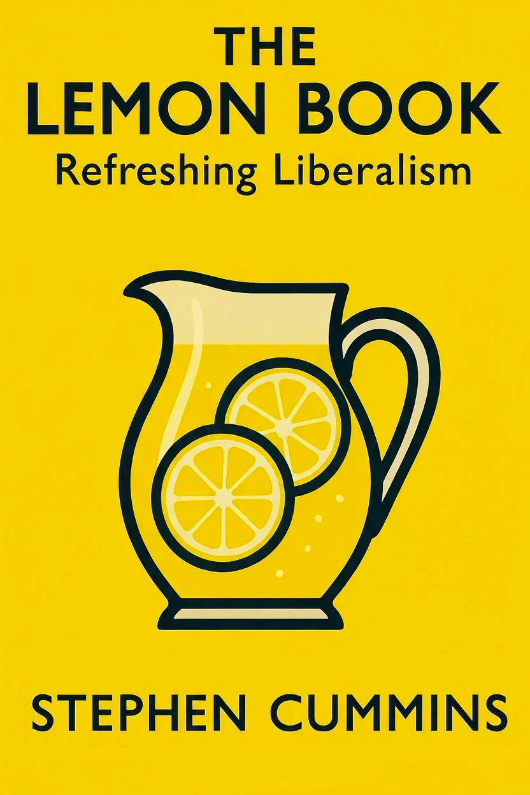

{width=80%}

---

## Dedication

*To my darling wife Jane, for her constant support while I wrote this book and in everything else I've ever done. She has always backed me, often, I suspect, against her much better judgement.*

---

## About the Author

{width=50%}

The author is a passionate advocate for liberal democracy and evidence-based policy. With a background spanning politics, policy analysis, and public service, they bring both theoretical knowledge and practical experience to the challenges facing modern liberalism.

Having witnessed firsthand the erosion of liberal institutions and the rise of authoritarian populism, the author felt compelled to write this book as both a diagnosis of liberalism's current crisis and a roadmap for its renewal. They believe that liberalism, properly understood and courageously applied, remains humanity's best hope for creating societies that are both free and fair.

The author lives in Essex and remains actively engaged in political and policy debates. This book represents their contribution to the vital conversation about liberalism's future in the 21st century.

## Acknowledgements

This book would not have been possible without the contributions of many people who have shaped the author's thinking over the years. Special thanks go to the countless activists, politicians, academics, and citizens who continue to fight for liberal values in an increasingly illiberal world.

The author is particularly grateful to the Liberal Democrat party members and supporters who provided insights and feedback during the writing process, and to the many scholars and practitioners whose work is cited throughout these pages. Any errors or omissions remain the author's responsibility alone.

---
