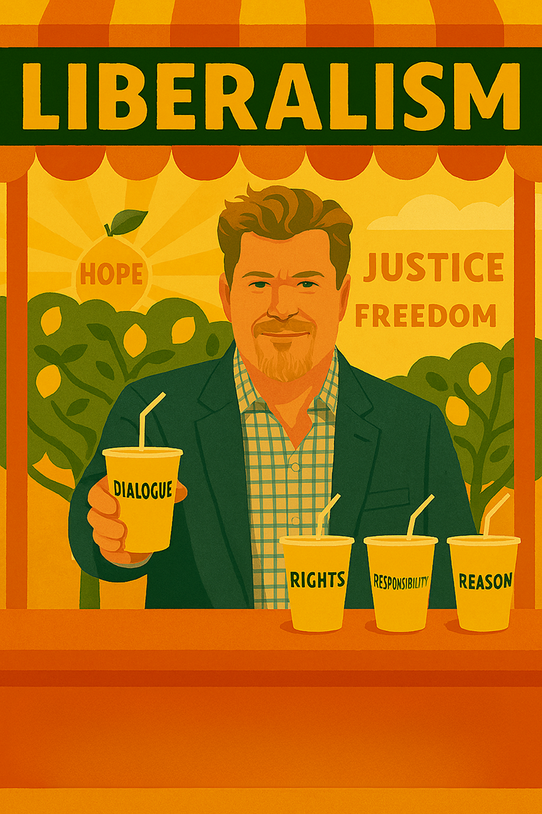

# Introduction

## Why Britian needs liberal answers

They say when life gives you lemons, make lemonade. Well, life has certainly given British politics plenty of lemons lately: Brexit chaos, economic uncertainty, democratic dysfunction, and a political system that seems increasingly stale and unresponsive to the challenges of the 21st century. The familiar rhythm of Labour versus Conservative, a dance that has largely dictated the nation's political landscape for generations, increasingly feels like a trap—a binary choice that stifles nuanced debate and limits the scope of potential solutions to complex modern challenges.

So here I am, setting up my lemonade stand. Not the kind that sells sugary drinks to passing motorists, but one that offers something far more refreshing: a new, zesty approach to liberalism for the second quarter of the 21st century. This book is my attempt to squeeze the best from liberal thought—both its historical wisdom and its contemporary potential—whilst discarding what has gone sour.

The choice of "lemon" as a title is deliberate and multi-layered. Lemons are fresh, zesty, and invigorating—exactly what British politics needs. They're also sharp enough to cut through the bland, processed political offerings we've become accustomed to. In the citrus family of political books, this follows in the tradition of "The Orange Book: Reclaiming Liberalism" (2004), but where that influential collection focused primarily on economic liberalism for its era, The Lemon Book seeks to refresh and broaden the liberal agenda for our very different times.

There's also an honesty in the lemon metaphor that appeals to me. In British slang, a "lemon" can mean something defective or unsatisfactory—and much of contemporary liberalism has indeed become exactly that. Co-opted by corporate interests, hollowed out by technocratic managerialism, and corrupted by those who use liberal language to justify illiberal ends, modern liberalism often feels like a lemon in the worst sense. But here's the thing about lemons: even when they're sour, they contain the essential ingredients for something refreshing. You just need to know how to extract the good stuff.

---

This blend of pragmatic policy and relatable leadership is precisely why Britain needs liberal answers now more than ever. But it's also why we need to refresh our understanding of what liberalism means in practice. The old recipes aren't working. The political establishment has given us plenty of lemons—from the chaos of Brexit to the dysfunction of Westminster, from the housing crisis to the mental health epidemic, from democratic backsliding to the rise of techno-fascism.

So welcome to my lemonade stand. The product I'm selling is a refreshed liberalism: one that learns from the past whilst adapting to present challenges, one that combines the zest of fresh thinking with the substance of proven principles, one that is both critical of liberalism's failures and constructive about its potential. This isn't just another political book—it's a recipe for making something refreshing from the sour circumstances we find ourselves in.

The lemons are already here. The question is: are you ready for some lemonade?

---
