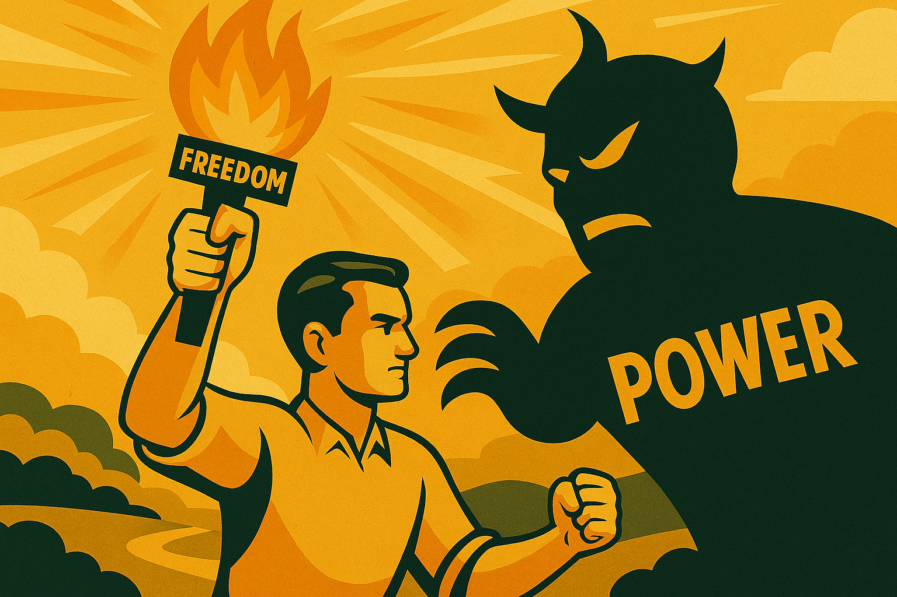

# Chapter 2

Classical Liberalism and its Evolution

*From Individual Freedom to Social Justice*

The story of liberalism is fundamentally a story about power. From its earliest origins in the struggle against absolute monarchy to its contemporary battles against fascism, liberalism has always been about challenging concentrated power and redistributing it in ways that serve human dignity and freedom. Understanding this central truth is essential for grasping both the historical development of liberal thought and its continued relevance in the 21st century.

The evolution from classical to social liberalism was not merely an intellectual exercise or philosophical refinement – it was a response to changing configurations of power in society. As new forms of economic and social power emerged with industrialisation, urbanisation, and technological change, liberal thinkers and activists had to develop new strategies and concepts to address these challenges while remaining true to their core commitment to human freedom and equality.

## The Original Liberal Challenge to Power

Classical liberalism emerged in the 17th and 18th centuries as a direct challenge to the absolute power of monarchs and the hereditary privileges of aristocracy. The liberal philosophers we examined in the previous chapter – Hobbes, Locke, Hume, and Mill – were all grappling with fundamental questions about the legitimate sources and limits of political power.

Locke's theory of government by consent was revolutionary precisely because it challenged the divine right of kings and asserted that political power must derive from the people it governs. His argument that governments exist to protect natural rights, and that people have the right to overthrow governments that fail in this duty, provided the intellectual foundation for the American and French revolutions.

The liberal emphasis on individual rights – freedom of speech, religion, assembly, and the press – was not abstract philosophical speculation but a concrete political programme for limiting the power of the state to control people's lives. These rights were weapons in the struggle against authoritarian power, tools for protecting dissent and enabling political opposition.

Similarly, the liberal advocacy for free markets was originally a challenge to the mercantilist system that concentrated economic power in the hands of monarchs and their favoured merchants. Adam Smith's critique of monopolies and his argument for competitive markets was fundamentally about breaking up concentrations of economic power that served the few at the expense of the many.

### The Industrial Challenge to Liberal Assumptions

The Industrial Revolution of the 19th century created new forms of power that classical liberal theory had not anticipated. The rise of industrial capitalism concentrated enormous economic power in the hands of factory owners and financiers, while reducing millions of workers to conditions of dependence and exploitation that made a mockery of liberal ideals of freedom and equality.

The formal freedom to enter into contracts meant little when workers had no choice but to accept whatever terms employers offered or face starvation. The right to property became a tool for the wealthy to accumulate ever more wealth while denying others access to the means of production. The political equality promised by liberal democracy was undermined by economic inequality that gave the rich vastly more influence over political outcomes than the poor.

These contradictions within classical liberalism became increasingly apparent as industrial capitalism developed. The very market freedoms that liberals had championed as tools for breaking up old forms of power were creating new forms of power that were equally oppressive. The question facing liberal thinkers was whether liberalism could adapt to address these new realities or whether it would become an ideology that served only the interests of the wealthy.

### The Emergence of Social Liberalism

The answer came in the form of social liberalism, which emerged in the late 19th and early 20th centuries as liberal thinkers grappled with the social consequences of industrial capitalism. Figures like T.H. Green, L.T. Hobhouse, and John Maynard Keynes recognised that genuine freedom required not just the absence of government interference, but also access to the resources and opportunities necessary for self-development and self-determination.

This insight represented a fundamental shift in liberal thinking about power. Classical liberals had focused primarily on limiting the power of the state, assuming that this would automatically lead to greater individual freedom. Social liberals recognised that power could be concentrated in private hands as well as public ones, and that sometimes state power was necessary to check private power and create genuine opportunities for all.

T.H. Green's concept of "positive freedom" was particularly important in this regard. Green argued that true freedom was not just the absence of external constraints, but the presence of the power and resources necessary to realise one's potential. A person who was formally free but lacked education, healthcare, or economic security was not truly free in any meaningful sense.

This reconceptualisation of freedom had profound implications for liberal politics. It meant that the state had a positive role to play in creating the conditions for individual liberty, not just a negative role in avoiding interference with it. It justified government intervention in the economy to regulate working conditions, provide social insurance, and ensure that everyone had access to basic necessities.

### The Battle Over Economic Power

The evolution of liberal thinking about economic power has been one of the central themes in the development of liberal thought. Classical liberals like Adam Smith had argued that competitive markets would naturally limit the power of any individual or firm, as competition would prevent anyone from accumulating excessive market power.

However, the reality of industrial capitalism proved more complex. Markets had a tendency toward monopolisation, as successful firms used their profits to buy out competitors or drive them out of business. The result was often not competitive markets but oligopolies or monopolies that could exploit consumers and workers with impunity.

Liberal responses to this challenge evolved over time. Some liberals, particularly in America, focused on antitrust legislation and regulation to maintain competitive markets. Others, particularly in Europe, moved toward more direct forms of government intervention, including public ownership of key industries and comprehensive welfare states.

The debate over economic power reached its peak during the Great Depression of the 1930s, when the failure of unregulated capitalism led to mass unemployment and social upheaval. John Maynard Keynes's response to this crisis represented a fundamental rethinking of the relationship between markets and government within liberal thought.

Keynes argued that markets, left to themselves, could become trapped in equilibria of high unemployment and low growth. Government intervention was necessary not to replace markets, but to ensure that they functioned effectively. This required active fiscal and monetary policy to maintain full employment, as well as social insurance to protect people from the inevitable fluctuations of market economies.

### The Welfare State as Liberal Achievement

The creation of the welfare state in the mid-20th century represented the culmination of social liberal thinking about power and freedom. The welfare state was not, as its critics often claim, an abandonment of liberal principles, but rather their fullest expression in the context of industrial society.

The Beveridge Report of 1942, which laid the foundation for Britain's post-war welfare state, was explicitly grounded in liberal principles. William Beveridge argued that the "five giant evils" of want, disease, ignorance, squalor, and idleness were barriers to individual freedom that could only be overcome through collective action.

The National Health Service, comprehensive education, social security, and public housing were all designed to ensure that everyone had access to the basic requirements for a free and dignified life. These institutions redistributed power from those who had inherited wealth or market advantages to those who had been excluded from opportunity by accident of birth or circumstance.

The welfare state also represented a new understanding of the relationship between individual and collective responsibility. Social liberals recognised that individual success or failure was not simply a matter of personal virtue or vice, but was heavily influenced by social structures and institutions. Creating fair institutions was therefore a collective responsibility that required collective action through democratic government.

### The Neoliberal Counter-Revolution

The success of social liberalism in creating more equal and prosperous societies inevitably provoked a counter-reaction from those whose power and privilege were threatened by these changes. The neoliberal movement that emerged in the 1970s and 1980s represented a systematic attempt to roll back social liberal achievements and restore the power of capital over labour.

Neoliberalism appropriated the language of classical liberalism while fundamentally distorting its meaning. "Freedom" was redefined to mean only market freedom, ignoring the social conditions necessary for genuine choice. "Individual responsibility" became a justification for abandoning collective responsibilities and leaving people to face market forces alone.

The neoliberal project was fundamentally about power – specifically, about shifting power from democratic institutions accountable to the public toward market institutions accountable only to shareholders and creditors. Privatisation, deregulation, and austerity were not technical economic policies but political strategies for redistributing power upward from ordinary citizens to wealthy elites.

This counter-revolution was remarkably successful, at least in the short term. By the 1990s, even nominally social democratic parties had largely accepted neoliberal assumptions about the primacy of markets and the limits of government action. The result was a form of politics that maintained the formal structures of democracy while hollowing out their substance.

### The Crisis of Neoliberal Hegemony

The 2008 financial crisis marked the beginning of the end of neoliberal hegemony, though its political consequences are still playing out. The crisis demonstrated the fundamental instability and injustice of an economic system based on the unchecked power of financial markets. The response to the crisis – bailing out banks while imposing austerity on ordinary people – revealed whose interests the system really served.

The political consequences of this crisis have been profound. The rise of authoritarian populism, the Brexit vote, the election of Donald Trump, and the growth of far-right parties across Europe all reflect, in different ways, popular anger at a political and economic system that has failed to deliver on its promises of prosperity and opportunity for all.

However, the crisis of neoliberalism has not automatically led to a revival of social liberalism. Instead, it has opened up space for various forms of authoritarianism that promise simple solutions to complex problems. The challenge for contemporary liberals is to develop new approaches that can address the legitimate grievances that fuel populist anger while defending democratic institutions and liberal values.

### Technology and the New Concentration of Power

The digital revolution has created new forms of concentrated power that pose unprecedented challenges to liberal democracy. Tech giants like Google, Facebook, Amazon, and Apple have accumulated market power that rivals or exceeds that of the great industrial monopolies of the early 20th century. Their control over information flows, communication networks, and digital infrastructure gives them enormous influence over political and social life.

These new concentrations of power operate through different mechanisms than traditional forms of economic or political power. They rely on network effects, data advantages, and algorithmic manipulation rather than physical coercion or legal authority. This makes them more difficult to regulate through traditional liberal tools like antitrust law or constitutional rights.

The challenge for contemporary liberalism is to develop new strategies for addressing these new forms of power while preserving the benefits that digital technologies can provide. This requires both regulatory innovation and institutional creativity, as well as a renewed commitment to the fundamental liberal principle that power must be accountable to those it affects.

### Climate Change and Intergenerational Power

Climate change represents another fundamental challenge to liberal thinking about power and responsibility. The climate crisis is fundamentally about the power of current generations to impose costs on future generations who cannot defend themselves. It is also about the power of wealthy countries and individuals to consume resources and emit greenhouse gases at levels that threaten the survival of poorer and more vulnerable populations.

Addressing climate change requires forms of collective action and long-term thinking that challenge some of the assumptions of classical liberalism. It requires accepting limits on individual freedom in the present to preserve freedom for future generations. It requires global cooperation and coordination that transcends national sovereignty and market mechanisms.

However, climate action is also fundamentally liberal in its commitment to protecting human dignity and expanding human opportunity. The transition to a sustainable economy can create millions of new jobs, improve public health, and reduce inequality if it is managed properly. The question is whether liberal institutions can adapt quickly enough to address the urgency of the climate crisis.

### The Continuing Relevance of Liberal Power Analysis

Throughout its evolution, liberalism has maintained its core insight that the distribution of power in society determines the distribution of freedom and opportunity. This insight remains as relevant today as it was in the 17th century, even though the forms of power have changed dramatically.

Contemporary challenges like inequality, authoritarianism, technological disruption, and climate change all fundamentally involve questions about power – who has it, how it is exercised, and how it can be redistributed to serve human flourishing rather than narrow interests. Liberal responses to these challenges must be grounded in this understanding of power dynamics.

This means that contemporary liberalism cannot be content with defending existing institutions or returning to some imagined golden age of classical liberalism. It must be willing to challenge existing concentrations of power and develop new institutions and practices that can ensure that power serves democratic purposes.

## Democracy as Power Distribution

One of the most important insights of social liberalism is that democracy is not just a method for selecting leaders, but a way of distributing power throughout society. Democratic institutions – elections, parliaments, courts, free press, civil society organisations – all serve to check concentrated power and ensure that different voices and interests are represented in political decision-making.

However, democracy is always fragile and must be constantly defended and renewed. Concentrated economic power can undermine democratic institutions by buying political influence, controlling media narratives, and shaping the options available to voters. Technological power can manipulate democratic processes through surveillance, disinformation, and algorithmic manipulation.

Defending democracy therefore requires more than just protecting formal democratic procedures. It requires addressing the underlying power imbalances that can make democratic institutions ineffective or illegitimate. This includes economic reforms to reduce inequality, media reforms to ensure diverse and independent sources of information, and technological reforms to prevent manipulation and surveillance.

## The Liberal Tradition of Institutional Innovation

Throughout its history, liberalism has shown a remarkable capacity for institutional innovation in response to new challenges and changing circumstances. The development of constitutional government, the expansion of suffrage, the creation of the welfare state, and the establishment of international human rights law all represent liberal responses to new forms of power and new threats to human dignity.

This tradition of innovation continues today as liberals grapple with contemporary challenges. Proposals for universal basic income, participatory budgeting, citizens' assemblies, and digital rights legislation all represent attempts to adapt liberal principles to new circumstances and new forms of power.

The key insight that drives this innovation is that institutions are not neutral technical arrangements, but embody particular distributions of power and particular conceptions of human flourishing. Creating more liberal institutions requires conscious effort to design them in ways that serve liberal values of freedom, equality, and democracy.

## Power, Responsibility, and Liberal Values

The liberal understanding of power is closely connected to liberal ideas about responsibility. Power brings responsibility – those who have the ability to affect others' lives have obligations to use that power in ways that respect human dignity and promote human flourishing. This applies to governments, corporations, and individuals alike.

This understanding of responsibility provides a framework for thinking about contemporary challenges. Tech companies that control information flows have responsibilities to prevent the spread of harmful misinformation while protecting free speech. Wealthy individuals and countries that contribute disproportionately to climate change have responsibilities to lead efforts to address it. Democratic citizens have responsibilities to participate in polit
ical life and hold their representatives accountable.

However, responsibility must be matched with capability. It is unfair to hold people responsible for outcomes they cannot influence or to expect them to solve problems that require collective action. This is why liberal approaches to social problems typically combine individual responsibility with collective institutions that enable people to exercise that responsibility effectively.

## The Future of Liberal Power Analysis

As we look toward the future, the liberal analysis of power remains as relevant as ever. New technologies like artificial intelligence and genetic engineering are creating new forms of power that could either enhance human freedom or create new forms of domination. Global challenges like climate change and inequality require new forms of collective action that transcend traditional boundaries.

The question facing contemporary liberals is whether they can develop new strategies and institutions adequate to these challenges while remaining true to their core commitments to human dignity, individual freedom, and democratic governance. This will require both intellectual innovation and political mobilisation, as well as a willingness to challenge existing power structures that benefit from the status quo.

The evolution of liberalism from its classical origins to its contemporary forms shows that liberal thought is not static or dogmatic, but adaptive and creative. Each generation of liberals has faced the challenge of applying liberal principles to new circumstances and new forms of power. Our generation faces the same challenge, and we have the same opportunity to contribute to the ongoing development of the liberal tradition.

## Conclusion: The Eternal Liberal Struggle

The story of liberalism's evolution reveals that the struggle for human freedom and dignity is never complete. Each victory against one form of oppression or concentration of power creates new possibilities but also new challenges. The abolition of slavery led to new forms of racial oppression. The achievement of political democracy was undermined by economic inequality. The creation of the welfare state was followed by neoliberal attempts to dismantle it.

This does not mean that progress is impossible or that liberal achievements are meaningless. Rather, it means that the defence of liberal values requires constant vigilance and adaptation. Power has a tendency to concentrate and to corrupt, and liberal institutions must be constantly renewed and reformed to prevent this concentration and corruption.

The evolution from classical to social liberalism shows that this renewal is possible. Liberal thought has proven capable of adapting to new circumstances while maintaining its core commitments. The challenge for contemporary liberals is to continue this tradition of adaptation and renewal in response to the challenges of the 21st century.

Understanding liberalism as fundamentally about power – its distribution, its exercise, and its accountability – provides a framework for this ongoing work. It helps us see the connections between seemingly disparate issues like inequality, authoritarianism, technological disruption, and climate change. It also helps us understand why liberal responses to these challenges must be both principled and pragmatic, both idealistic and realistic.

The battle for power that has defined liberalism from its origins continues today. The question is not whether this battle will be won once and for all – it will not – but whether each generation will have the wisdom and courage to fight it in ways that advance rather than retreat from liberal values. The future of human freedom depends on our answer to this question.

---