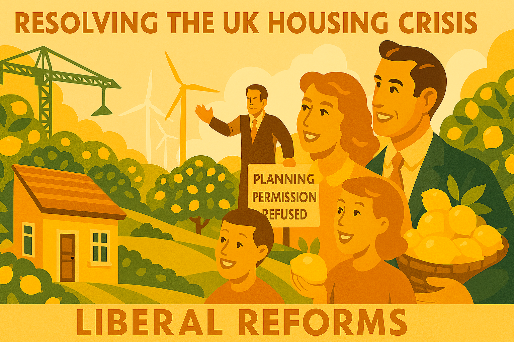

# Chapter 3

Actually, We Can Build Houses

*Why Britain's housing crisis isn't inevitable*

The housing crisis in Britain is not a natural disaster; it is a man-made catastrophe, the result of decades of policy failure, ideological blindness, and a collective failure of imagination. For too long, we have been told that soaring house prices are inevitable, that young people will simply have to accept living with their parents well into their thirties, and that the dream of homeownership is a luxury that only the wealthy can afford. This is not just wrong; it is a betrayal of the liberal promise that everyone should have the opportunity to build a secure and prosperous life.

The statistics are stark and shameful. The average house price in England is now more than eight times the average salary, compared to just over three times in the 1990s. Homeownership among young adults has plummeted, with many trapped in expensive, insecure rental accommodation. The human cost is immense: families crammed into overcrowded flats, young professionals spending half their income on rent, and an entire generation locked out of the stability and security that homeownership provides.

But here's the thing: we can build houses. We have the land, we have the skills, and we have the technology. What we lack is the political will to challenge the vested interests that benefit from the current broken system. The liberal answer is not to tinker at the edges, but to fundamentally reform how we approach housing in this country.

## Land Value Capture and Planning Reform

At the heart of Britain's housing crisis lies a fundamental problem: the artificial scarcity of developable land. Our planning system, designed in the 1940s for a very different world, has become a barrier to development rather than a tool for creating sustainable communities. It hands enormous windfalls to landowners while making it prohibitively expensive and time-consuming for developers to build the homes we desperately need.

A liberal government would implement comprehensive planning reform, streamlining the process while maintaining strong environmental protections. This means:

- **Zoning Reform**: Moving towards a more flexible, American-style zoning system that allows for mixed-use development and reduces the need for lengthy planning applications
- **Land Value Capture**: Ensuring that the community captures a fair share of the increase in land values that result from planning permission, funding infrastructure and affordable housing
- **Green Belt Reform**: Reviewing Green Belt boundaries to identify land that could be developed without harming the environment, while strengthening protections for genuinely valuable green spaces

### Public Housing Renaissance

The decline of social housing has been one of the great policy disasters of recent decades. The Right to Buy scheme, while well-intentioned, was never properly replaced with new supply, leading to a chronic shortage of affordable homes. A liberal government would launch a massive programme of public housebuilding, creating beautiful, sustainable communities that people are proud to call home.

This isn't about going back to the failed tower blocks of the 1960s. Modern social housing can be architecturally excellent, environmentally sustainable, and socially mixed. Countries like Austria and Singapore have shown that public housing can be a source of national pride, not shame.

### Supporting First-Time Buyers

While we build for the long term, we must also help those trapped in the current system. A liberal government would:

- **Expand Shared Ownership**: Making it easier for people to get on the housing ladder through part-buy, part-rent schemes
- **Reform Stamp Duty**: Abolishing stamp duty for first-time buyers and replacing it with a more progressive system that doesn't penalise mobility
- **Support Community Land Trusts**: Empowering local communities to develop affordable housing that remains affordable in perpetuity

### The International Perspective: Learning from Success

Britain's housing crisis is not unique, but neither is it inevitable. Countries across Europe have managed to maintain affordable housing while preserving quality of life and economic dynamism. Austria's social housing programme houses 60% of Vienna's population in high-quality, mixed-income developments. Singapore has achieved 90% homeownership through innovative public-private partnerships. The Netherlands has maintained housing affordability through strategic land use planning and cooperative housing models.

These examples demonstrate that different policy choices lead to different outcomes. The question is not whether we can solve the housing crisis, but whether we have the political will to learn from international best practice and adapt successful models to British circumstances.

### The Economics of Housing: Breaking the Speculation Cycle

At the heart of Britain's housing dysfunction lies a fundamental misunderstanding of what housing should be. Housing has been treated as a financial asset first and a home second, leading to a speculative bubble that prices out ordinary families while enriching property investors and developers.

A liberal housing policy would rebalance this equation by:

- **Speculation Tax**: Implementing higher taxes on second homes and buy-to-let properties to discourage speculative investment
- **Foreign Buyer Levy**: Following examples from Canada and New Zealand in taxing foreign property investment that inflates local prices
- **Empty Homes Tax**: Penalising properties left vacant for extended periods, encouraging productive use of existing stock
- **Community Land Trusts**: Supporting models where communities own land collectively, keeping housing affordable in perpetuity

### Transport and Infrastructure: Building Connected Communities

Housing cannot be separated from transport and infrastructure. The reason London house prices are so high is not just planning restrictions, but the concentration of economic opportunities in a small geographic area. A comprehensive liberal housing strategy would include:

- **High-Speed Rail**: Connecting northern cities to London and each other, spreading economic opportunities more evenly
- **Local Transport Investment**: Ensuring new housing developments are connected by reliable public transport
- **Digital Infrastructure**: Enabling remote work through universal high-speed broadband, reducing pressure on expensive urban areas
- **Regional Development**: Supporting job creation outside London through targeted investment and tax incentives

### Environmental Sustainability: Green Homes for a Green Future

The housing we build today will last for decades or centuries. A liberal approach ensures that new housing contributes to rather than undermines our climate goals:

- **Zero Carbon Standards**: Requiring all new homes to be carbon neutral, with renewable energy and high insulation standards
- **Retrofit Programme**: Massive investment in improving the energy efficiency of existing housing stock
- **Sustainable Materials**: Promoting construction methods that use renewable materials and minimise environmental impact
- **Green Spaces**: Ensuring all new developments include adequate green space for biodiversity and community wellbeing

### Social Housing Renaissance: Pride, Not Stigma

The decline of social housing has been one of the great policy disasters of recent decades. The Right to Buy scheme, while well-intentioned in giving tenants ownership opportunities, was never properly replaced with new supply. The result has been a chronic shortage of affordable homes and the stigmatisation of remaining social housing.

A liberal government would launch a massive programme of social housebuilding, but this would not mean returning to the failed tower blocks of the 1960s. Modern social housing can be:

- **Architecturally Excellent**: Beautiful, well-designed homes that enhance rather than detract from their neighbourhoods
- **Environmentally Sustainable**: Leading the way in energy efficiency and renewable energy
- **Socially Mixed**: Integrated with private housing to create diverse, cohesive communities
- **Tenure Flexible**: Offering a range of options from rental to shared ownership to full ownership

### Addressing Homelessness: Housing First

No discussion of housing policy can ignore the scandal of homelessness in one of the world's wealthiest countries. The liberal approach recognises that homelessness is not primarily about individual failings but about systemic failures in housing, healthcare, and social support.

The "Housing First" model, successfully implemented in Finland and other countries, provides permanent housing as the foundation for addressing other issues like mental health, addiction, and unemployment. This approach is not only more humane but also more cost-effective than the current system of temporary accommodation and crisis intervention.

### Regional Variation: Different Solutions for Different Places

Britain's housing challenges vary significantly between regions. London faces acute affordability problems, while some northern towns struggle with low demand and declining populations. A liberal housing policy would recognise these differences and tailor solutions accordingly:

- **London and the South East**: Focus on increasing supply through planning reform and public housebuilding
- **Northern Cities**: Investment in regeneration and transport links to attract residents and businesses
- **Rural Areas**: Support for affordable housing that maintains community character while meeting local needs
- **Coastal Towns**: Addressing the specific challenges of seasonal economies and aging populations

## The Political Economy of Housing Reform

Housing reform faces powerful vested interests that benefit from the current broken system. Landowners profit from artificial scarcity. Property developers benefit from high prices. Buy-to-let landlords extract wealth from housing need. Financial institutions treat housing as an investment vehicle rather than a social good.

Overcoming these interests requires building a broad coalition for change that includes:

- **Young People**: Who are locked out of homeownership and trapped in expensive rental accommodation
- **Families**: Who struggle to find suitable, affordable housing in good school catchment areas
- **Key Workers**: Teachers, nurses, police officers, and others who cannot afford to live in the communities they serve
- **Businesses**: Who struggle to recruit and retain staff due to housing costs
- **Local Authorities**: Who face increasing pressure to house homeless families in expensive temporary accommodation

## Technology and Innovation: Building Better, Faster, Cheaper

Modern construction technology offers opportunities to build homes faster, cheaper, and to higher standards than traditional methods. A liberal government would embrace innovation while ensuring quality and safety:

- **Modular Construction**: Factory-built homes that can be assembled quickly on site with consistent quality
- **3D Printing**: Experimental technology that could revolutionise construction speed and cost
- **Smart Homes**: Integration of technology to improve energy efficiency and quality of life
- **Building Information Modelling**: Digital tools that improve design coordination and reduce construction waste

## Community Engagement: Building with, Not for

Too often, new housing developments are imposed on communities without adequate consultation or consideration of local needs. A liberal approach would ensure that communities are genuine partners in shaping their future:

- **Neighbourhood Planning**: Giving communities real power to influence development in their areas
- **Community Benefits**: Ensuring that new developments contribute to local infrastructure and services
- **Design Quality**: Requiring high standards of architecture and urban design that enhance local character
- **Affordable Housing**: Ensuring that new developments include homes for local people, not just wealthy incomers

## The Economic Benefits of Housing Reform

Solving the housing crisis would not just improve quality of life – it would also boost economic growth and productivity:

- **Labour Mobility**: Workers could move more easily to where jobs are available
- **Consumer Spending**: Families would have more money to spend on goods and services rather than housing costs
- **Business Investment**: Companies would find it easier to recruit and retain staff
- **Innovation**: A more dynamic housing market would encourage innovation in construction and design

## Conclusion: From Crisis to Opportunity

The housing crisis is not inevitable. It is the result of political choices, and it can be solved by making different choices. We can build houses, we can make them affordable, and we can create communities where everyone has the chance to thrive.

But this requires more than just technical solutions. It requires the political will to challenge vested interests, the imagination to learn from international best practice, and the commitment to put the needs of families and communities ahead of the profits of speculators and developers.

The choice is ours. We can continue with a housing system that serves the few at the expense of the many, or we can build a system that provides everyone with a decent, affordable home in a thriving community. The liberal vision is clear: housing is a human right, not a commodity. It's time to make that vision a reality.

---
