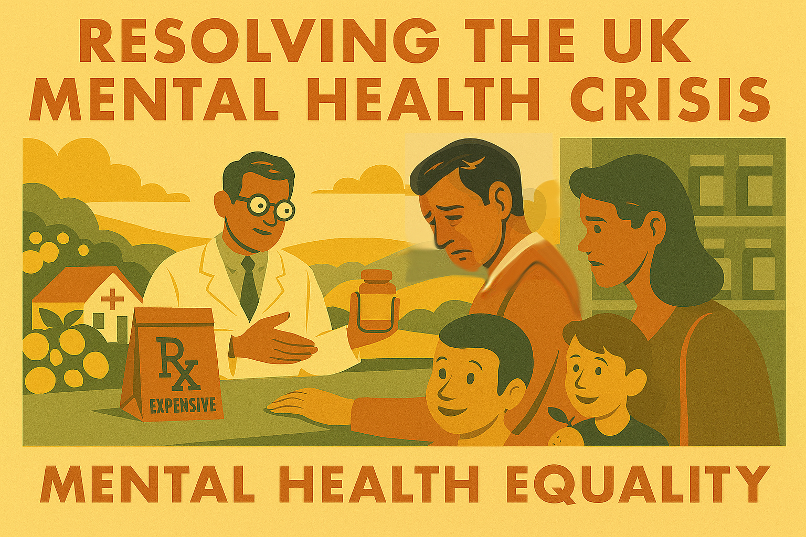

# Chapter 4 - Part I

A Healthy Mind in a Healthy Body

*mens sana in corpore sano - Juvenal*

Mental health is not a luxury; it is a fundamental component of human well-being, as essential as physical health, yet for too long it has been treated as a secondary concern, shrouded in stigma and starved of resources. The current state of mental healthcare in Britain is nothing short of a scandal: long waiting lists, inadequate funding, and a system that intervenes only when people are in crisis rather than providing the early support that could prevent that crisis in the first place.

The statistics paint a grim picture. One in four people will experience a mental health problem each year, yet many struggle to access the help they need. Young people are particularly affected, with rates of anxiety and depression soaring, yet Child and Adolescent Mental Health Services (CAMHS) are overwhelmed and underfunded. The economic cost is enormous too – mental health problems cost the UK economy over £100 billion per year in lost productivity, healthcare costs, and social care.

But perhaps most shamefully of all, we still charge people for the very medications they need to stay mentally well. While physical ailments are treated free at the point of use through the NHS, many mental health medications come with prescription charges – a Victorian relic that creates a two-tier system where your ability to pay determines your access to treatment.

## Parity of Esteem: Mental Health = Physical Health

The liberal vision is simple: mental healthcare should be treated with exactly the same priority, funding, and accessibility as physical healthcare. This means:

- **Free Prescriptions**: Abolishing prescription charges for all mental health medications, just as we do for diabetes, cancer, and other chronic conditions
- **Timely Access**: Ensuring that people can access mental health support within weeks, not months, with a guarantee that no one waits longer than four weeks for treatment
- **Preventive Care**: Investing in early intervention and prevention, including mental health support in schools, workplaces, and communities

### A Community-Centred Approach

The current system is too focused on crisis intervention and not enough on prevention and community support. A liberal government would:

- **Expand Talking Therapies**: Massively increase funding for counselling and psychotherapy, making these treatments as accessible as seeing your GP
- **Peer Support Networks**: Fund peer support programmes where people with lived experience help others going through similar challenges
- **Mental Health in Every Community**: Ensure every community has access to mental health services, ending the postcode lottery that currently exists

### Breaking the 18-Year Cliff Edge

One of the most heartbreaking aspects of the current system is the '18-year cliff edge' that young people face. As they transition from child and adolescent mental health services (CAMHS) to adult services, many young people find themselves in a perilous gap, often losing vital support at a critical juncture in their lives.

A liberal government would commit to breaking this cliff edge, ensuring a seamless transition between services and providing continuous support tailored to the evolving needs of young adults. This means investing in integrated services that recognise the unique challenges of adolescence and early adulthood.

### Digital Innovation and Human Connection

The modern age offers new opportunities to expand access to mental health support. Digital platforms can provide flexible, anonymous, and immediate resources for those who might otherwise struggle to find help. Online cognitive behavioural therapy (CBT), mental health apps, and virtual support groups can all play a vital role.

However, these digital tools must complement, not replace, the invaluable role of human connection. Face-to-face counselling, peer support networks, and community mental health teams remain indispensable for complex cases and for fostering the deep, empathetic relationships that are often crucial for recovery.

## The Social Determinants of Mental Health

Mental health does not exist in a vacuum. It is profoundly shaped by social, economic, and environmental factors that are often beyond individual control. A truly liberal approach to mental health must address these underlying determinants, not just treat the symptoms.

Research consistently shows that mental health problems are more common among people experiencing:

- **Economic Insecurity**: Unemployment, poverty, and debt create chronic stress that undermines psychological wellbeing
- **Housing Problems**: Overcrowding, poor conditions, and housing insecurity contribute to anxiety and depression
- **Social Isolation**: Loneliness and lack of community connections are major risk factors for mental illness
- **Discrimination**: Racism, sexism, homophobia, and other forms of prejudice cause psychological harm
- **Trauma**: Childhood abuse, domestic violence, and other traumatic experiences have lasting mental health impacts

A liberal mental health strategy would address these root causes through:

- **Economic Security**: Universal basic income, job guarantees, and progressive taxation to reduce inequality
- **Housing Policy**: Ensuring everyone has access to decent, affordable housing
- **Community Building**: Investment in public spaces, community centres, and social programmes
- **Anti-Discrimination**: Strong equality laws and cultural change to combat prejudice
- **Trauma-Informed Services**: Training all public services to recognise and respond to trauma

### Workplace Mental Health: Changing the Culture

The modern workplace is often a source of mental health problems rather than a support for wellbeing. Long hours, job insecurity, workplace bullying, and unrealistic performance targets all contribute to stress, anxiety, and depression.

A liberal approach would transform workplace culture through:

- **Right to Disconnect**: Legal protections for workers' time outside office hours
- **Mental Health Days**: Statutory entitlement to time off for mental health, just as for physical illness
- **Workplace Wellbeing**: Requirements for employers to assess and address mental health risks
- **Flexible Working**: Default right to flexible hours and remote working where possible
- **Employee Voice**: Stronger trade unions and worker representation to address workplace stress

### Education and Early Intervention

Mental health problems often begin in childhood and adolescence, yet our education system does little to promote psychological wellbeing or identify problems early. A liberal government would make mental health a core part of education:

- **Mental Health Curriculum**: Teaching children about emotions, relationships, and coping strategies
- **School Counsellors**: Qualified mental health professionals in every school
- **Teacher Training**: Ensuring all teachers can recognise signs of mental distress
- **Peer Support**: Training young people to support each other's mental health
- **Family Support**: Helping parents understand and support their children's mental health

### The Role of Technology: Promise and Peril

Digital technology offers both opportunities and threats for mental health. On one hand, apps and online platforms can provide accessible support and connect people with help. On the other hand, social media and digital addiction can worsen mental health problems.

A liberal approach would harness technology's benefits while mitigating its harms:

- **Digital Therapeutics**: NHS-approved apps and online programmes for common mental health problems
- **Telehealth**: Remote consultations to improve access, especially in rural areas
- **AI Support**: Chatbots and AI systems to provide 7 crisis support and triage
- **Platform Regulation**: Rules to prevent social media companies from exploiting psychological vulnerabilities
- **Digital Literacy**: Education about healthy technology use and recognising online manipulation

### Mental Health and Criminal Justice

The criminalisation of mental illness is one of the great scandals of our time. People experiencing mental health crises are often arrested rather than helped, and prisons have become de facto mental health institutions. This approach is both inhumane and ineffective.

A liberal criminal justice system would:

- **Divert from Prison**: Mental health courts and treatment programmes instead of incarceration
- **Crisis Intervention**: Trained mental health professionals responding to mental health emergencies, not police
- **Prison Reform**: Proper mental health care for those who are incarcerated
- **Community Sentences**: Therapeutic community service instead of punishment for mental health-related offences
- **Victim Support**: Mental health support for victims of crime and their families

### Addressing Stigma: Changing Hearts and Minds

Despite progress in recent years, stigma remains a major barrier to mental health treatment. People fear discrimination in employment, relationships, and social situations if they seek help for mental health problems.

Combating stigma requires:

- **Public Education**: Campaigns to increase understanding of mental health
- **Media Responsibility**: Guidelines for reporting on mental health and suicide
- **Workplace Policies**: Legal protections against mental health discrimination
- **Positive Role Models**: Public figures sharing their mental health experiences
- **Language Change**: Moving away from stigmatising language and towards person-first terminology

## International Perspectives: Learning from Success

Other countries have made significant progress in mental health care that Britain can learn from:

- **Australia**: Comprehensive mental health reform with increased funding and community-based care
- **Norway**: Integration of mental health services with primary care
- **New Zealand**: Wellbeing budgets that prioritise mental health alongside economic indicators
- **Finland**: Successful suicide prevention programmes that have dramatically reduced rates
- **Canada**: Mental health first aid training for the general public

## The Economics of Mental Health Investment

Investing in mental health is not just morally right – it makes economic sense. The current cost of mental illness to the UK economy is estimated at over £100 billion per year through:

- **Lost Productivity**: Absenteeism and reduced performance at work
- **Healthcare Costs**: Emergency interventions and long-term treatment
- **Social Care**: Support for people unable to live independently
- **Criminal Justice**: Costs of policing, courts, and prisons
- **Welfare**: Benefits for people unable to work due to mental illness

Proper investment in mental health prevention and early intervention would:

- **Reduce Healthcare Costs**: Preventing expensive crisis interventions
- **Increase Productivity**: Helping people stay in work and perform better
- **Reduce Crime**: Addressing mental health factors in offending
- **Improve Education**: Helping children learn and achieve their potential
- **Strengthen Communities**: Creating more cohesive and supportive societies

## Research and Innovation: Advancing Understanding

Mental health research has been chronically underfunded compared to physical health research, despite the enormous burden of mental illness. A liberal government would:

- **Increase Research Funding**: Matching mental health research investment to the burden of disease
- **Support Innovation**: Encouraging new treatments and technologies
- **Improve Data**: Better collection and analysis of mental health data
- **International Collaboration**: Working with other countries to share knowledge and best practices
- **Patient Involvement**: Ensuring people with lived experience shape research priorities

## Cultural and Community Approaches

Mental health is not just an individual medical issue – it is also a cultural and community concern. Different communities have different understandings of mental health and different approaches to healing.

A liberal mental health system would:

- **Cultural Competence**: Training professionals to work effectively with diverse communities
- **Community Healing**: Supporting traditional and cultural approaches to mental health
- **Faith-Based Support**: Working with religious communities to provide mental health support
- **Peer Support**: Training people with lived experience to support others
- **Community Resilience**: Building social connections and community capacity

## The Future of Mental Health Care

Looking ahead, mental health care will be transformed by new technologies, treatments, and understanding. A liberal approach would embrace innovation while maintaining focus on human dignity and social justice:

- **Personalised Medicine**: Treatments tailored to individual genetic and psychological profiles
- **Virtual Reality**: Immersive therapies for phobias, PTSD, and other conditions
- **Brain Stimulation**: Non-invasive treatments for depression and other disorders
- **Psychedelic Therapy**: Carefully regulated use of substances like psilocybin for treatment-resistant conditions
- **Preventive Approaches**: Focus on building resilience and preventing mental health problems

## Conclusion: A Society That Cares

Mental health is not a luxury or an afterthought – it is fundamental to human flourishing and social progress. A society that neglects the mental health of its citizens is not just cruel but also economically and socially self-defeating.

The liberal vision is of a society where mental health is treated with the same seriousness as physical health, where seeking help is seen as a sign of strength rather than weakness, and where everyone has access to the support they need to thrive.

This is not just about healthcare – it is about creating a society that promotes wellbeing rather than undermining it, that builds people up rather than breaking them down, that recognises our common humanity and mutual interdependence.

Your mental health matters, and in a liberal Britain, the bill for its care would be borne by society, not by those already struggling. We can create a system where seeking help for your mental health is as normal and accessible as going to the dentist – and just as free.

But more than that, we can create a society where mental health problems are less likely to occur in the first place, where communities support their members, where workplaces promote wellbeing, and where everyone has the opportunity to live a fulfilling and meaningful life.

The choice is ours. We can continue with a system that treats mental health as a personal failing and a private problem, or we can build a system that recognises mental health as a shared responsibility and a public good. The liberal path is clear – it's time to take it.

---
