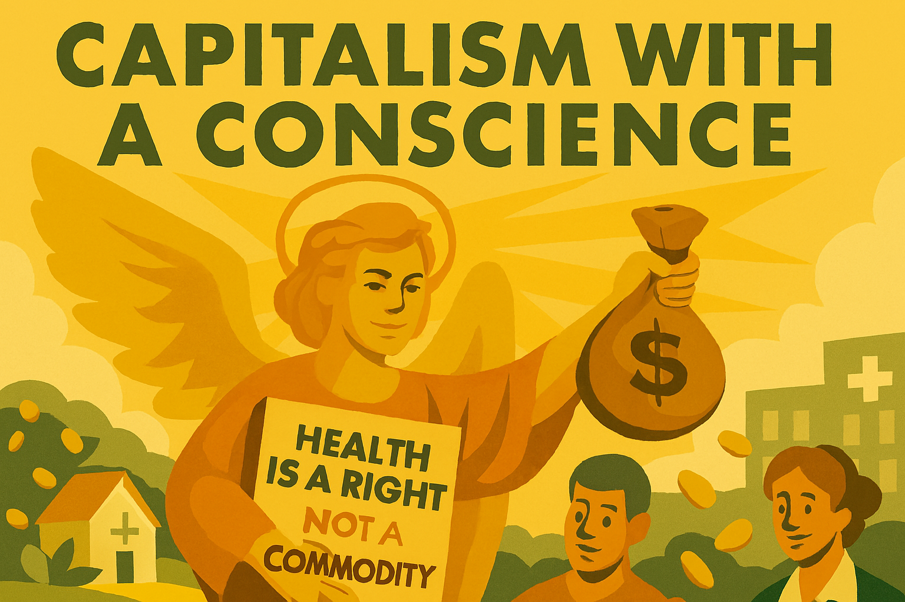

# Chapter 5

Capitalism with a Conscience

*Harnessing the market for social good, not just private profit*

## Introduction: Beyond the Invisible Hand

Capitalism, for all its undeniable power to generate wealth and innovation, has a public relations problem. For many, it conjures images of unchecked greed, widening inequality, and environmental degradation. The liberal answer is not to abandon capitalism, but to reclaim it from the ideologies that have twisted it into a tool for the powerful. This chapter argues for a **capitalism with a conscience**, not as a soft appeal to corporate charity, but as a robust political project to re-embed the market in a framework of democratic accountability and social justice. 

The struggle for a just economy is a core part of the liberal tradition, extending the fight against concentrated power from the political to the economic sphere. Just as early liberals challenged the divine right of kings (Chapter 1), and later liberals fought the totalitarianisms of the 20th century (Chapter 2), contemporary liberalism must confront the concentration of economic power that threatens to undermine democracy itself. The idea of a 'free market' operating according to natural, immutable laws is a dangerous fiction. Markets are human creations, shaped by political choices, legal frameworks, and, most importantly, by power. The question is not *whether* the market should be regulated, but *in whose interest* it is regulated. The Norman land grab, which established a permanent link between property and power (Chapter 3), was a form of market regulation, just as the dismantling of financial safeguards in the late 20th century was. 

This chapter will explore how the ideology of market fundamentalism, often associated with the Chicago School of Economics, was not a neutral academic theory but a political project designed to shift power upwards. We will then examine how fascist movements exploit the economic anxieties created by unregulated capitalism, promising a false salvation while advancing an agenda of extraction and control. Finally, we will outline a practical liberal vision for a democratic economy—one that harnesses the dynamism of the market while ensuring it serves the many, not the few. This is not about finding a mythical 'third way' between capitalism and socialism, but about building a better capitalism, one where the invisible hand is guided by a democratic conscience.

## The Chicago School: An Ideological Project for Concentrated Power

To understand our current economic predicament, we must examine the systematic ideological campaign that transformed economic policy from the 1970s onwards. The **Chicago School of Economics**, led by figures like Milton Friedman, was not just an academic school of thought; it was a political project funded by wealthy industrialists and channelled through a network of right-wing think tanks. Their goal was to dismantle the post-war social-democratic consensus and re-establish the primacy of capital over labour and democratic oversight.

This project was remarkably successful. Through a sustained campaign of intellectual production, political lobbying, and strategic placement of personnel, the Chicago School and its allies shifted the **Overton window** of acceptable economic discourse. The core tenets of their ideology—that markets are inherently efficient, regulation is always harmful, and the pursuit of private profit automatically serves the public good—became the new orthodoxy. This was not a victory of superior ideas, but a triumph of power and influence. As detailed in Chapter 2, this mirrors the fascist strategy of creating an entire intellectual ecosystem to legitimize an authoritarian project.

### The International Architecture of Austerity

The ideological project wasn't confined to domestic policy. International financial institutions like the **World Bank** and the **International Monetary Fund (IMF)** became vehicles for imposing free-market orthodoxy globally. The **Washington Consensus**, a set of neoliberal policy prescriptions, was forced upon developing nations as a condition for receiving financial aid. This created a system of neocolonial extraction, where the wealth of the Global South was transferred to the financial centres of the North. This mirrors the historical analysis of power and extraction detailed in Chapter 3's analysis of the Norman Conquest and land ownership.

## The Fascist Economic Model: A Predatory Alliance

Fascist movements often rise to power by exploiting the economic anxieties and resentments created by the failures of unregulated capitalism. They promise to restore national greatness and protect the common person from the ravages of global markets and the machinations of a cosmopolitan elite. However, once in power, fascist regimes do not dismantle capitalism; they fuse it with the state to create a predatory alliance that serves the interests of a ruling clique. This is the ultimate concentration of power, where the distinction between corporate and state power dissolves.

Fascist economics is not a coherent ideology but a pragmatic system of control. It is characterized by:

*   **Cronyism and Corruption:** The state directs contracts and resources to favoured corporations in exchange for political support and personal enrichment for the ruling elite.
*   **Suppression of Labour:** Independent trade unions are destroyed and replaced with state-controlled syndicates that prevent strikes and enforce wage discipline.
*   **Autarky and Protectionism:** While fascists may rail against globalism, their protectionist policies are not designed to protect workers but to shield politically connected industries from competition.
*   **Privatization for the Few:** State assets are privatized not to increase efficiency but to transfer wealth to political allies.

This model was evident in Nazi Germany, where corporations like IG Farben and Krupp became integral parts of the war machine, profiting from slave labour and the expropriation of Jewish property. We see a similar pattern in contemporary authoritarian regimes, where a small group of oligarchs, closely tied to the state, controls vast sectors of the economy. This is the logical endpoint of the concentration of economic and political power, a theme that runs through this book, from the Norman Conquest to the present day.

## The Liberal Response: Building a Democratic Economy

The liberal response to the concentration of economic power and the fascist threat is not to abandon the market but to reclaim it for democratic ends. This requires a clear-eyed understanding that markets are not natural phenomena but political constructs. The challenge is to build an economic system that is not only prosperous but also just, sustainable, and resilient in the face of authoritarian threats. This means moving beyond the false dichotomy of state versus market and instead focusing on how to build a genuinely democratic economy where power is broadly distributed.

A liberal economic agenda for the 21st century must therefore focus on three core principles:

1.  **Deconcentrating Power:** Actively breaking up concentrations of economic power, whether they lie in corporate monopolies, financial institutions, or the hands of a few billionaires.
2.  **Democratising Capital:** Broadening ownership and control over capital, so that the people who create wealth have a stake in its rewards and governance.
3.  **Strengthening Public and Social Goods:** Reinvesting in the public services, social safety nets, and environmental protections that create a just and resilient society, directly countering the fascist politics of austerity and neglect.

### Deconcentrating Power: A Modern Antitrust Agenda

Concentrated economic power is the dry rot in the foundations of a democratic society. It allows a few powerful actors to write the rules in their own favour, corrupt the political process, and extract wealth from the rest of society. A liberal government must therefore pursue an aggressive antitrust agenda to break up monopolies and restore genuine market competition. This is not about punishing success, but about ensuring that the market remains a sphere of open competition, not a private fiefdom. A modern antitrust agenda should include:

*   **Revitalising Competition Law:** For decades, competition law has been interpreted through the narrow lens of consumer welfare, defined almost exclusively as lower prices. This ignores the broader harms of monopoly, including reduced innovation, suppressed wages, and the erosion of democratic accountability. A liberal approach would restore the original intent of antitrust law, which was to prevent the concentration of economic and political power, regardless of its short-term impact on prices.
*   **Breaking Up Big Tech:** The tech giants have amassed power on a scale that rivals that of the old railroad and oil barons. They control the essential infrastructure of modern life, from communication and commerce to information and social connection. This power must be challenged through structural separations, breaking up the largest platforms and preventing them from using their dominance in one market to crush competition in another.
*   **Tackling Institutional Land Ownership:** The logic of the Norman land grab, as detailed in Chapter 3, persists today in the growing concentration of housing in the hands of institutional investors. A liberal government should use tax policy and regulation to discourage the hoarding of residential property by large corporations and private equity firms, ensuring that housing serves its primary purpose as homes for people, not as a financial asset for speculators.

### Democratising Capital: From Wage Labour to Co-ownership

For too long, the dominant model of capitalism has been one where a small minority owns the capital and the vast majority provides the labour. This creates a fundamental imbalance of power and ensures that the rewards of economic activity flow disproportionately to the owners of capital. A liberal vision for a democratic economy must therefore focus on democratising capital, giving workers a genuine stake in the enterprises where they work. This is not about expropriation, but about creating a more dynamic and equitable form of capitalism where ownership and control are broadly shared. This can be achieved through:

*   **Promoting Employee Ownership and Co-operatives:** Employee-owned businesses and co-operatives have repeatedly demonstrated their ability to deliver not only greater economic equality but also higher productivity and resilience. A liberal government should actively support these models through tax incentives, access to finance, and the creation of a legal and regulatory framework that facilitates the transition to employee ownership. The success of models like the John Lewis Partnership in the UK and the Mondragon Corporation in Spain provides a clear blueprint for a more democratic and participatory economy.
*   **Worker Representation on Corporate Boards:** The German model of co-determination, where workers have representation on the supervisory boards of large companies, has been a key factor in that country's economic success. It ensures that corporate decision-making takes into account the long-term interests of workers and the broader community, not just the short-term demands of shareholders. A liberal government should mandate worker representation on the boards of all large companies, giving labour a voice in the governance of the firms they help to create.
*   **A People's Sovereign Wealth Fund:** A portion of the wealth generated by our collective resources should be owned by all citizens. A liberal government should create a sovereign wealth fund, seeded by a tax on corporate profits and capital gains, that would invest on behalf of all citizens. The dividends from this fund could be paid out as a universal basic income or reinvested in public services, providing a direct link between economic growth and shared prosperity.

### Strengthening Public and Social Goods: The Foundations of a Good Society

A democratic economy cannot function without a strong foundation of public and social goods. These are the things that we provide for each other as a society, recognising that they are essential for both individual flourishing and collective prosperity. A liberal government must therefore reject the politics of austerity and reinvest in the public services and social safety nets that create a just and resilient society. This is not just a matter of social justice; it is a vital defence against the fascist politics of despair and resentment. As we saw in Chapter 4, the fascist contempt for human life is most clearly expressed in its attacks on the most vulnerable, particularly the disabled. A society that fails to care for its members is a society that is ripe for fascist exploitation. A liberal agenda for strengthening public and social goods must include:

*   **A National Care Service:** Just as the NHS provides healthcare for all, a National Care Service should provide high-quality social care for all who need it, free at the point of use. This would not only provide dignity and support for the elderly and disabled but also recognise the vital work of caregivers, who are disproportionately women.
*   **Investing in Lifelong Learning:** In a rapidly changing economy, education cannot end at 18 or 21. A liberal government should fund a system of lifelong learning, giving everyone the opportunity to retrain and upskill throughout their lives. This would not only boost productivity but also create a more adaptable and resilient workforce.
*   **A Green New Deal:** The climate crisis is the greatest market failure in history. A liberal government must lead a national mission to decarbonise the economy, investing in renewable energy, green infrastructure, and a just transition for workers in carbon-intensive industries. This is not just an environmental necessity but also a massive economic opportunity to create millions of good jobs and build a more sustainable prosperity.

## Conclusion: A Capitalism Worth Fighting For

The vision of a capitalism with a conscience is not a utopian dream but a practical political project. It requires a clear-eyed understanding of power and a willingness to challenge the vested interests that profit from the current system's failures. The choice is not between a mythical free market and a monolithic state, but between a capitalism that serves the few and a capitalism that serves the many. 

Building a democratic economy is the great liberal challenge of our time. It is the necessary next step in the long struggle against concentrated power, a struggle that runs from the Magna Carta to the civil rights movement. By deconcentrating economic power, democratising capital, and reinvesting in public and social goods, we can build an economy that is not only more prosperous but also more just, more sustainable, and more resilient in the face of the fascist threat. This is a capitalism worth fighting for, a capitalism that reflects the best of the liberal tradition, a capitalism with a conscience.

---
