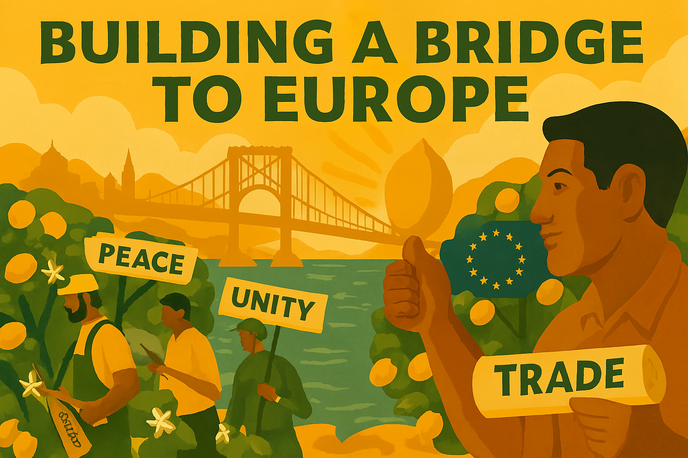

# Chapter 7

Europe: It's Complicated

*Finding a pragmatic path forward after Brexit*

## Introduction: Europe as a Liberal Project Under Threat

Britain's relationship with Europe has always been complicated, but the decision to leave the European Union was more than just another chapter in this long and fraught history. It was a seismic event that struck at the heart of the post-war liberal international order. For liberals, the challenge is not to re-fight the battles of the past, but to understand the present crisis in the context of the book's central theme: the struggle between liberal democracy and the forces of concentrated power, particularly the rising tide of fascism. The European Union, for all its flaws, represents the most ambitious attempt in history to replace the power politics of nationalism with a system of pooled sovereignty, shared rules, and cooperation. It is a fundamentally liberal project, and its weakening is a strategic goal for every authoritarian leader, from Moscow to Beijing.

Brexit was not a singular event but a symptom of a broader populist-nationalist wave that fascists and their allies have skillfully exploited. They sold a fantasy of absolute sovereignty, a concept as meaningless in the modern world as the divine right of kings that early liberals fought against (Chapter 1). They preyed on legitimate economic anxieties, many of which were caused by the failures of the neoliberal economic model (Chapter 5), and channelled them into xenophobia and nationalism. This chapter will argue that a pragmatic and constructive relationship with Europe is not merely an economic imperative for Britain; it is a geopolitical and moral necessity. In an era defined by the return of great power competition and the systematic assault on democratic values, standing alone is not a viable strategy. A liberal Britain must see itself as a key partner in a broader European alliance dedicated to defending the liberal international order against its authoritarian challengers.

## Brexit: A Strategic Victory for Europe's Authoritarian Adversaries

It is no coincidence that Vladimir Putin's Russia was one of the most enthusiastic international cheerleaders for Brexit. The European Union, as a bloc of democratic nations committed to the rule of law and human rights, represents a fundamental ideological and geopolitical obstacle to authoritarian expansionism. The weakening and potential disintegration of the EU has been a primary strategic objective for the Kremlin for decades. Brexit was, from this perspective, a major victory. It removed one of the EU's largest military and economic powers, created deep divisions within the Western alliance, and provided a powerful narrative of democratic decline that authoritarian states could exploit both at home and abroad.

The Russian campaign to support Brexit was not a secret. It involved a sophisticated multi-pronged attack using state-sponsored media, covert social media operations, and financial support for pro-Brexit politicians and movements. This was not about a genuine belief in British sovereignty; it was a cynical act of geopolitical sabotage, designed to weaken the collective power of European democracies. This strategy is a classic example of the fascist technique of exploiting and exacerbating internal divisions within a society to undermine its democratic institutions, a theme explored in detail in Chapter 2. By amplifying narratives of grievance and promoting a politics of identity, they sought to turn citizens against the very institutions that protect their freedoms.

The liberal failure to understand and counter this threat was a critical factor in the Brexit vote. For too long, the debate about Europe was framed in narrow economic terms, ignoring the profound geopolitical and security implications of leaving the EU. The liberal case for Europe was often technocratic and uninspiring, failing to articulate a powerful vision of the EU as a bulwark against authoritarianism and a champion of democratic values. To move forward, liberals must learn this lesson: the argument for European cooperation is not just about trade statistics; it is about the defence of a shared civilisation against those who would see it destroyed.

## The Liberal Response: Rebuilding Bridges as a Geopolitical Imperative

The liberal response to Brexit cannot be to wish it away, but to confront its consequences with a clear-eyed pragmatism rooted in a deep understanding of the geopolitical landscape. Rebuilding a close, constructive relationship with the European Union is not a matter of choice; it is a strategic imperative for the defence of liberal democracy in an increasingly dangerous world. This is not about rejoining the EU tomorrow, but about a patient, step-by-step process of rebuilding trust and cooperation across a range of areas, from trade and security to climate change and research. Each step should be judged not just on its economic merits, but on its contribution to the collective strength and resilience of the European democratic community.

This project of reconstruction must be based on a sober assessment of the damage done. The economic costs of leaving the Single Market and Customs Union have been immense, weakening the British economy and reducing the resources available for public services and national defence. The political costs have been equally severe, diminishing Britain's international standing and creating deep divisions within the United Kingdom itself. A liberal government must be honest with the public about these costs, not to assign blame, but to build a consensus for a more pragmatic and cooperative path forward.

### Economic Rapprochement: Rebuilding the Foundations of Democratic Strength

Economic strength is the foundation of national security and international influence. The self-inflicted economic damage of Brexit has not only impoverished Britain but also weakened its ability to act as a significant player on the world stage. A liberal government must therefore pursue a pragmatic policy of economic rapprochement with the EU, not as an end in itself, but as a means of rebuilding the economic strength required to confront the authoritarian challenge. This means seeking the closest possible trading relationship with the Single Market and Customs Union, systematically dismantling the trade barriers that have harmed British businesses and consumers. The specific model – whether a Swiss-style series of bilateral agreements, a customs union, or full re-entry into the Single Market – is a matter for negotiation, but the strategic goal must be clear: to maximise economic integration with our closest democratic partners.

This is not just about abstract economic statistics; it is about the real-world resilience of our society. A stronger economy can better fund our public services, including the mental health services that are a key battleground against fascist ideology (Chapter 4). It can support a just transition to a green economy, providing an alternative to the fossil-fuel-funded authoritarian states. And it can create the prosperity and opportunity that are the most effective antidote to the politics of despair and resentment that fascists exploit.

### A Democratic Alliance: Security, Defence, and the Rule of Law

The most urgent area for renewed cooperation is in security and defence. The war in Ukraine has been a brutal reminder that military aggression is not a relic of the past but a clear and present danger to the European continent. While Britain remains a leading member of NATO, Brexit has created unnecessary friction and complexity in our security relationship with our European partners. A liberal government would seek to build a new, comprehensive security pact with the EU, covering everything from defence and intelligence sharing to counter-terrorism and the fight against organised crime. This is not about creating a European army, but about ensuring the closest possible coordination between the democratic nations of Europe in the face of a common threat.

This cooperation must also extend to the legal and judicial sphere. Authoritarian states and their proxies use corruption, money laundering, and lawfare to undermine democratic societies from within. By working closely with European partners on law enforcement, asset freezes, and sanctions, Britain can help to close the loopholes that allow dirty money to flow through London and other financial centres. Upholding the rule of law is not just a domestic issue; it is a vital part of the international struggle against kleptocracy and authoritarianism.

### People-to-People Connections: Building a Resilient Democratic Citizenry

The struggle against fascism is not just a military or economic contest; it is a battle of ideas and values. A population that feels connected to its democratic neighbours, that understands and values cultural diversity, and that has personal experience of international cooperation is a population that is far more resilient to the simplistic narratives of nationalist propaganda. This is why rebuilding the people-to-people connections severed by Brexit is not a soft-power luxury, but a hard-headed strategic necessity. A liberal government must therefore prioritise the restoration of cultural and educational ties with Europe.

This means immediately negotiating Britain's re-entry into the **Erasmus+** student exchange programme and the **Horizon Europe** research funding programme. These are not just benefits for the individuals who participate; they are strategic investments in the long-term health of our democratic society. They create a new generation of citizens who are comfortable with international cooperation, who have personal relationships with their European counterparts, and who understand that our shared challenges can only be overcome by working together. They are, in short, an inoculation against the virus of nationalism.

## Conclusion: A Pragmatic Patriotism for a European Nation

For liberals, patriotism is not about a blind allegiance to the nation-state, but a commitment to the democratic values and institutions that allow a diverse and tolerant society to flourish. In the 21st century, a pragmatic patriotism for Britain must recognise that our nation’s security and prosperity are inextricably linked to the security and prosperity of our European neighbours. The choice is not between Britain and Europe, but between a Britain that stands with its democratic allies and a Britain that stands alone in an increasingly dangerous world.

Rebuilding a close and cooperative relationship with the European Union is the great foreign policy challenge of our time. It requires a rejection of the nationalist fantasies that led to Brexit and a return to the hard-headed pragmatism that has always characterised the best of British diplomacy. It means seeing Europe not as a threat to our sovereignty, but as a partner in the defence of our shared democratic values. It is a long and difficult road, but it is a road we must travel. The alternative is a slow slide into irrelevance and a future where the liberal values we hold dear are increasingly under threat. A liberal Britain must be a European Britain, working with our allies to build a future that is safer, more prosperous, and more free.

---
