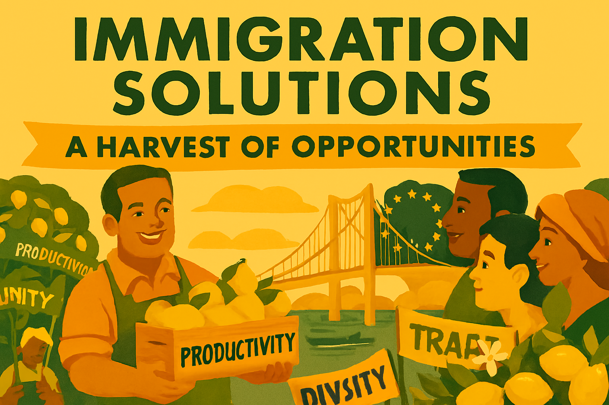

# Chapter 8

Immigration: Honest Conversations

*Moving beyond rhetoric to a fair, effective, and humane system*

## Introduction: Cheddar Man's Children

In 1997, Adrian Targett, a retired history teacher from Somerset, volunteered for a DNA test that would change our understanding of British identity forever. Scientists had extracted DNA from Cheddar Man, a 9,000-year-old skeleton found in Gough's Cave in the Cheddar Gorge, and were looking for living relatives. The results were extraordinary: Targett shared mitochondrial DNA with this ancient Briton, making him a direct descendant through an unbroken maternal line stretching back nearly ten millennia.

This connection is possible because of a remarkable quirk of human biology. Mitochondrial DNA is inherited exclusively from the mother's side. When sperm fertilises an egg, the father's mitochondria are systematically destroyed and replaced by the mother's, ensuring that the immune system functions properly by maintaining genetic consistency in these cellular powerhouses. What this means is that the genetic link between Cheddar Man and Adrian Targett represents not just any ancestral connection, but a continuous line of mothers—grandmothers stretching back through 450 generations of women who survived, thrived, and passed on their genetic heritage.

But here's the crucial point that should humble every politician who rails against immigration: Cheddar Man himself was an immigrant. His ancestors had crossed the land bridge from continental Europe as the ice sheets retreated. He was part of a wave of hunter-gatherers who "invaded" Britain and displaced whatever sparse populations had survived the Ice Age.

But even this understates the complexity of our immigrant heritage. Before Cheddar Man's people arrived, Britain had been home to Neanderthals for hundreds of thousands of years. These earlier inhabitants had themselves been immigrants, arriving in successive waves from Africa via Europe. Archaeological evidence from sites like Pontnewydd Cave in Wales and Swanscombe in Kent shows Neanderthals thriving in Britain during warmer periods, retreating during ice ages, and returning when conditions improved. They were the original Britons, and they too were immigrants.

When modern humans like Cheddar Man's ancestors finally arrived around 45,000 years ago, they didn't simply replace the Neanderthals. Genetic evidence shows that interbreeding occurred—most people of European descent today carry 1-2% Neanderthal DNA. The story of Britain's earliest inhabitants is therefore not one of conquest and replacement, but of integration and assimilation. Even at the dawn of human habitation, our islands were shaped by waves of immigration, intermarriage, and cultural fusion.

Since then, wave after wave of immigrants have continued to shape these islands: Celts, Romans, Anglo-Saxons, Vikings, Normans, Huguenots, Irish, Jews, Commonwealth citizens, and countless others. Each brought new technologies, new ideas, new genes, and new energy. We are all, quite literally, the descendants of immigrants—and not just recent ones, but immigrants stretching back through the entire span of human presence in Britain.

This scientific reality makes the contemporary hysteria about immigration not just morally wrong, but historically absurd. When politicians stoke fear about people crossing the Channel in small boats, they are demonising the very process that created the British people. When they speak of "invasion" and "swarms," they are using language that could have been applied to every single one of our ancestors. The Romans who brought roads, law, and urban civilisation came in boats. The Normans who transformed our language, architecture, and legal system came in boats. Even the Anglo-Saxons, whose cultural legacy some claim to defend, came in boats.

The hypocrisy of modern anti-immigration politics is perhaps most starkly illustrated by the immigrant family histories of its most prominent champions. Donald Trump, whose rhetoric about immigrants has poisoned political discourse on both sides of the Atlantic, is himself the grandson of a German immigrant who arrived in America with nothing. His mother was a Scottish immigrant, and two of his three wives have been immigrants—one from Czechoslovakia, another from Slovenia. His own family story is a testament to the American dream built on immigration, yet he has built his political career on demonising today's immigrants.

Nigel Farage, the architect of Brexit and Britain's most prominent anti-immigration politician, bears a surname that immediately reveals his own immigrant heritage. "Farage" is a Huguenot name, marking him as a descendant of French Protestant refugees who fled religious persecution in the 17th century. These Huguenots were the asylum seekers of their day, arriving with little more than their skills and their faith. They faced suspicion and hostility from some quarters, yet they went on to contribute enormously to British commerce, industry, and culture. Farage's own wife was German, and he has personally benefited from the EU's freedom of movement provisions, yet he has spent his career campaigning to deny similar opportunities to others.

This pattern repeats throughout the ranks of anti-immigration politicians. They are often the beneficiaries of the very processes they now seek to deny to others. Their families' success stories are immigration success stories, yet they have built their careers on the politics of exclusion and fear. This is not just hypocrisy; it is a form of historical amnesia that denies the very foundations of their own prosperity and position.

Indeed, this hypocrisy has deep historical roots in the fascist movements of the 20th century. Adolf Hitler, the architect of the most murderous anti-immigrant and anti-Semitic regime in history, was himself an Austrian immigrant to Germany. Francisco Franco, who ruled Spain with an iron fist while promoting Spanish nationalism, was from Galicia in the far northwest, a region with its own distinct culture and possible Portuguese ancestry. Benito Mussolini, who preached Italian racial purity and imperial destiny, came from the Romagna region, which had been part of the Papal States and had a complex relationship with Italian national identity.

These fascist leaders built their power by defining who belonged and who didn't, yet they themselves were often outsiders to the "pure" national communities they claimed to represent. They understood that the politics of exclusion could be a path to power, even for—or perhaps especially for—those who might themselves be excluded by their own criteria. The pattern is clear: those who most loudly proclaim the need to defend national purity are often those whose own backgrounds would fail their own tests.

By contrast, liberal politicians tend to embrace rather than deny their diverse heritage. Ed Davey, the Liberal Democrat leader, comes from what might be considered a more traditionally "British" background—his father from a mining family, his mother the daughter of domestic servants, his surname Welsh or Cornish in origin. Yet Davey has never built his politics on exclusion or appeals to "pure" British identity. Instead, he champions the liberal tradition of openness, inclusion, and the belief that diversity strengthens rather than threatens our society. This is the fundamental difference: liberals celebrate the immigrant story that made us all, while authoritarians exploit it for political gain while denying their own part in it.

For liberals, the conversation about immigration is therefore not a mere policy debate to be won or lost. It is the frontline in the defence of an open, tolerant, and democratic society against the forces of authoritarian nationalism that would deny the very history that made us who we are. How we talk about and manage immigration is a direct reflection of our commitment to the core liberal principles of universal human dignity and the rule of law. It is also a test of our honesty about our own past and our wisdom about our future.

Fascist and proto-fascist movements understand the power of immigration as a political weapon better than anyone. They do not see it as a complex policy challenge, but as their primary tool for stoking fear, dividing communities, and creating the sense of perpetual crisis that justifies the erosion of democratic norms. As we saw in Chapter 2, the creation of a demonised 'other' is the foundational step in the fascist project of stripping rights and consolidating power. This chapter will argue that a liberal approach to immigration must be more than just a set of pragmatic policies; it must be a conscious and strategic rebuttal of the fascist narrative, grounded in the scientific and historical truth that we are all immigrants' children.

## Fascist Playbook: Weaponise Immigration

To build an effective liberal response, we must first understand that the far-right's approach to immigration is not a good-faith attempt to solve a problem. It is a cynical and calculated strategy to gain power. This playbook, used by authoritarian movements across the world, has several key components:

1.  **Create a Sense of Invasion and Crisis:** The first step is to frame immigration not as a normal, manageable social phenomenon, but as an overwhelming invasion or a crisis out of control. The language is deliberately militaristic: "swarms," "floods," "invasions." This creates a climate of fear in which rational debate becomes impossible and extreme measures seem justified. This tactic is a direct descendant of the Nazi propaganda that portrayed Jews and other minorities as a threat to the German 'body politic', as discussed in Chapter 4's analysis of the 'unworthy life' concept.

2.  **Dehumanise and Demonise:** The next step is to dehumanise the immigrant. They are not presented as individuals with hopes, fears, and families, but as a monolithic, threatening mass. They are portrayed as criminals, terrorists, or parasites who are here to steal jobs, drain public services, and threaten the cultural integrity of the nation. This dehumanisation makes it easier to justify cruel and inhumane policies, from family separations to offshore detention centres.

3.  **Blame Immigrants for Systemic Failures:** The fascist narrative cleverly redirects public anger about systemic problems onto the scapegoat of the immigrant. Are wages stagnating? It's because immigrants are taking jobs and driving down wages (a claim that ignores the real causes related to the decline of unions and the concentration of corporate power, as discussed in Chapter 5). Is the NHS underfunded? It's because it is overwhelmed by immigrants, not because of decades of political choices to underinvest in public services. This is a classic diversionary tactic, designed to protect the powerful from accountability.

4.  **Attack the Rule of Law and Human Rights:** Finally, the fascist playbook attacks the very legal and moral frameworks that protect human dignity. International laws like the Refugee Convention are portrayed as outdated and naive, an obstacle to the nation's will to protect itself. Judges who uphold these laws are branded "enemies of the people." Human rights lawyers are vilified as self-serving activists. This is a direct assault on the liberal international order and the principle of universal human rights that emerged from the ashes of the Second World War (Chapter 2).

The "hostile environment" policy, introduced by a Conservative government, represents a chilling example of how this fascist framing can be absorbed into the political mainstream. It was a policy that, by its own admission, sought to create a climate of fear and suspicion. It turned ordinary citizens—landlords, doctors, teachers—into unwilling agents of the state's immigration enforcement. The Windrush scandal was not an accidental outcome of this policy; it was its logical and inevitable consequence. When you create a system designed to hunt for the "illegal" immigrant, you will inevitably end up persecuting the legal and the legitimate. It is a policy that poisons the well of community trust and corrodes the very fabric of a decent society.

## Liberal Response: Competence & Compassion

A liberal immigration policy must be a direct and strategic rebuttal to the fascist playbook. It is not enough to be morally right; we must also be practically effective. This means building a system that is competent, compassionate, and in control. Such a system would not only be more humane and economically beneficial, but it would also rob the far-right of its most potent political weapon. The liberal response must be built on four pillars:

### 1. Countering the ‘Invasion’ Narrative with Competence and Control

The most effective antidote to the far-right’s narrative of chaos and invasion is a well-managed and orderly immigration system. When the public sees a system that is competent and in control, the politics of fear loses its power. This means investing in a modern, efficient, and properly staffed border force and asylum processing system. It means clear rules, fair procedures, and timely decisions. A liberal government would:

*   **Establish a functioning asylum system:** Decisions on asylum claims should be made within a strict timeframe of six months. This would end the current backlog, which is not only inhumane for applicants but also costly for the taxpayer and a source of public frustration that the far-right exploits.
*   **Create safe and legal routes:** The majority of people crossing the Channel in small boats would not make the dangerous journey if there were safe and legal alternatives. A liberal government would work with international partners to establish such routes, particularly for those with valid asylum claims, which would break the business model of the criminal smuggling gangs.
*   **Negotiate returns agreements:** A fair system must also be a firm one. Those who have no legal right to be in the UK should be returned to their home country or a safe third country. This requires patient diplomacy and the negotiation of effective returns agreements, something the current government has singularly failed to achieve.

### 2. Countering Dehumanisation with a Humane and Dignified System

The fascist strategy of dehumanisation can only be countered by a system that treats every individual with dignity and respect. This is not a matter of sentimentality, but a core liberal principle. A humane system is also a more effective one. When people are treated with dignity, they are more likely to comply with the rules and integrate successfully into society. A liberal government would:

*   **End the ‘Hostile Environment’:** This toxic policy, which has caused immense suffering and injustice, as exemplified by the Windrush scandal, would be scrapped. Public servants like doctors and teachers should not be co-opted as border guards.
*   **Close indefinite detention centres:** The practice of holding people in immigration detention for months or even years without charge is a moral stain on our nation. It should be replaced with a system of community-based alternatives and a strict time limit on all forms of immigration detention.
*   **Allow asylum seekers to work:** It is both absurd and cruel to force people seeking asylum to live in enforced destitution for years on end. Allowing them to work after six months would enable them to support themselves, contribute to the economy, and maintain their skills and dignity.

### 3. Countering the Blame Game with Investment and Integration

The far-right tactic of blaming immigrants for pressure on public services can only be neutralised by honestly acknowledging the challenges and investing in the solutions. A liberal government would recognise that population change, from whatever source, requires investment in public services and infrastructure. This means:

*   **A dedicated integration fund:** A portion of the economic surplus generated by immigration should be ring-fenced for an integration fund, targeted at local authorities to invest in schools, GP surgeries, and housing in areas with higher levels of immigration.
*   **A focus on local leadership:** Integration happens in communities, not in Whitehall. A liberal approach would empower local leaders to develop and lead their own integration strategies, with the support of national government.
*   **Promoting English language learning:** The ability to speak English is the single most important factor in successful integration. A liberal government would ensure that free, high-quality English language classes are available to all who need them.

### 4. Countering the Attack on the Rule of Law by Championing Human Rights

When fascists attack international law and human rights, liberals must be their most passionate defenders. These laws are not a foreign imposition; they are a British achievement, drafted by British lawyers and politicians in the aftermath of a war against fascism. They are the foundation of the liberal international order that has kept the peace in Europe for over 70 years. A liberal government would:

*   **Reaffirm its commitment to the Refugee Convention and the European Convention on Human Rights:** These treaties are not an obstacle to a fair and effective immigration system; they are its essential foundation.
*   **Challenge the far-right narrative:** Liberals must confidently and consistently make the case that these international laws protect us all and are a vital defence against a return to the barbarism of the 1930s.
*   **Lead on the world stage:** Instead of seeking to undermine international law, a liberal Britain would lead efforts to strengthen and reform it, working with our democratic allies to find global solutions to the global challenge of migration.

## Conclusion: An Immigration System for a Confident, Liberal Britain

The liberal approach to immigration is not a choice between compassion and control; it is the recognition that true control is impossible without compassion and competence. A system that is seen as fair, humane, and effective is a system that commands public confidence and starves the politics of fear of its oxygen. By contrast, a system built on performative cruelty, administrative chaos, and the deliberate stoking of division—as we have seen in recent years—is one that fails on every level. It is inhumane, it is ineffective, and it serves only to empower the very extremists who thrive on the narrative of a broken system.

Building a liberal immigration system is therefore a core part of the broader project outlined in this book: the defence of an open, democratic society against the forces of authoritarianism. It requires us to reject the false choices presented by the far-right and to articulate a confident, hopeful vision of a country enriched by, not afraid of, the world. It means having honest conversations, investing in our communities, and building a system that reflects the best of our values. This is not the easy path, but it is the only one that leads to a stronger, more prosperous, and more united United Kingdom.

## We Are All Immigrants: The Slippery Slope of Dehumanisation

The fascist obsession with immigration is not just about foreigners; it is about defining who belongs and who does not, a process that inevitably turns inward. The same logic that is used to strip rights from asylum seekers today can be used to strip rights from citizens tomorrow. This is the slippery slope of dehumanisation, and it is a danger that every liberal must understand. When we allow the government to create a class of people who are outside the protection of the law, we create a precedent that can be used against anyone.

In a nation of immigrants like Britain, the line between ‘us’ and ‘them’ is always arbitrary and politically constructed. From the Romans, Anglo-Saxons, and Vikings to the Huguenots, Irish, Jews, and Commonwealth citizens, Britain has been shaped by successive waves of migration. Scratch the surface, and almost every family has an immigrant story somewhere in its past. The idea of a pure, homogenous British identity is a fascist fantasy. We are a nation of mongrels, and that is the source of our strength, our creativity, and our resilience.

This is why the defence of immigrant rights is not an act of charity; it is an act of self-defence. When we defend the right of an asylum seeker to a fair hearing, we are defending the principle of due process for all. When we challenge the dehumanising language used against migrants, we are challenging the language that can be used to justify the persecution of any minority. When we insist that every person is entitled to basic human dignity, we are building a society where our own dignity is more secure. The fight for immigrant rights is the fight for a liberal society, a society where the rights of all are protected because the rights of the most vulnerable are sacrosanct.

## The Gifts of Immigration

The history of Britain is the history of successful immigration and integration. Each wave of newcomers brought not just people, but ideas, technologies, and innovations that transformed these islands for the better. The Romans gave us roads, law, and the concept of urban civilisation. They introduced writing, advanced engineering, and a sophisticated administrative system. Without Roman immigration, there would be no London, no Bath, no York as we know them. The very concept of Britain as a unified political entity emerged from Roman rule.

The Anglo-Saxon migrations of the 5th and 6th centuries brought new agricultural techniques, metalworking skills, and the foundations of the English language. The Vikings, often portrayed as mere raiders, were also traders and settlers who established thriving commercial centres and introduced new forms of governance. Dublin, York, and many other cities owe their origins to Viking immigrants.

The Norman Conquest of 1066, often seen as the last successful invasion of Britain, is perhaps better understood as the Norman Integration. Yes, William's army conquered the Anglo-Saxon elite, but what followed was not the replacement of one people by another, but a remarkable fusion of cultures. The Normans brought sophisticated administrative systems, revolutionary architectural techniques (those soaring cathedrals and imposing castles), and a legal framework that evolved into English common law. They introduced new agricultural methods, advanced military technology, and connections to European networks of trade and learning.

Most importantly, the Normans brought linguistic innovation. The merger of Norman French with Anglo-Saxon English created the extraordinarily rich and flexible language we speak today. English is uniquely powerful precisely because it is a mongrel tongue, capable of expressing both the earthy directness of Germanic roots and the sophisticated abstractions of Latin-derived vocabulary. Shakespeare's genius was built on this linguistic diversity that immigration created.

Even our fear of immigrants arriving by boat is historically ironic. The very ancestors we claim to defend—Romans, Anglo-Saxons, Vikings, Normans—all arrived by sea. The Channel that we now see as a barrier to be defended was once a highway for the peoples who made us who we are. Our island story is not one of splendid isolation, but of constant connection, exchange, and renewal through immigration.

This pattern continued through the centuries. Huguenot refugees from religious persecution in France brought silk-weaving, banking expertise, and entrepreneurial energy. Jewish immigrants fleeing pogroms in Eastern Europe established businesses, contributed to science and culture, and enriched British intellectual life. Commonwealth immigrants in the post-war period rebuilt our cities, staffed our hospitals, and drove our buses. Each wave faced hostility and suspicion, yet each ultimately strengthened and enriched British society.

The lesson of history is clear: immigration is not a threat to British identity; it is the source of British identity. We are not a pure, homogeneous people defending our ancient homeland against foreign invasion. We are a successful experiment in integration, a demonstration that people from different backgrounds can come together to create something greater than the sum of their parts. This is the liberal vision of Britain: not a fortress, but a beacon; not a closed society, but an open one that grows stronger through diversity.

---
