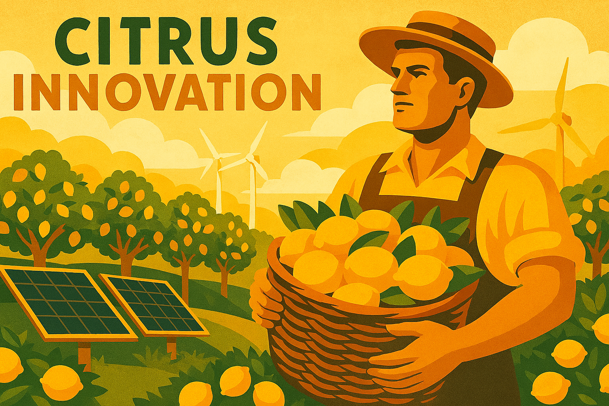

84

---

# Chapter 9 

Lime Green Growth, Not Green Grief

*From preventing scurvy to preventing catastrophe: why going green is essential for liberal survival*

## Introduction: The Climate Crisis as a Struggle for Power

The climate crisis is not just an environmental problem; it is a fundamental challenge to the liberal democratic order. For too long, the debate about climate change has been framed as a technical or economic issue, a matter of balancing costs and benefits. This is a dangerous misreading of the situation. The struggle to decarbonise our economy is not a polite negotiation; it is a power struggle against the vested interests of fossil-fuelled authoritarianism, both at home and abroad. For liberals, tackling climate change is not just about saving the planet; it is about defending a free, open, and democratic society from those who would see it destroyed.

The fossil fuel industry is the most powerful and destructive cartel in human history. For decades, its major players have known about the catastrophic consequences of their business model, yet they have systematically lied to the public, funded climate denial, and corrupted the political process to protect their profits. This is not just corporate malfeasance; it is a direct assault on the foundations of a democratic society. It is a strategy of deception and delay that mirrors the tactics of the tobacco industry and, more darkly, the propaganda techniques of fascist regimes. By deliberately sowing confusion and undermining public trust in science, they have paralysed our political system and left us dangerously exposed to the consequences of a rapidly changing climate.

85

---

Furthermore, the geopolitics of energy are inextricably linked to the global struggle between democracy and authoritarianism. The world’s major oil and gas producers are, almost without exception, authoritarian states. Russia, Saudi Arabia, Iran, Venezuela – these are regimes that use their fossil fuel wealth to fund military aggression, suppress dissent, and export corruption. Our dependence on their product is a strategic vulnerability that empowers the enemies of liberalism. Every time we fill our cars with petrol or heat our homes with gas, we are, in a small way, funding the very regimes that seek to undermine our democratic way of life. The fight for a green transition is therefore not just an environmental necessity; it is a geopolitical imperative. It is about defunding authoritarianism and building a more secure and democratic world.

## Petro-Fascism: The Unholy Alliance of Carbon and Coercion

The link between fossil fuels and authoritarianism is so strong that it has given rise to a new political term: **petro-fascism**. This describes a political ideology that combines the extractive, polluting logic of the fossil fuel industry with the nationalist, xenophobic, and anti-democratic politics of the far-right. It is a powerful and dangerous alliance that represents one of the greatest threats to liberal democracy in the 21st century.

Petro-fascism operates on several levels. At the international level, it is embodied by states like Putin's Russia, which uses its oil and gas revenues to fund military expansionism and interfere in the democratic processes of other countries. These regimes have a direct, existential interest in delaying climate action and maintaining global dependence on their product. They are the primary sponsors of climate disinformation campaigns and the key allies of far-right movements across the Western world.

86

---

At the domestic level, petro-fascism manifests as a political movement that weaponises climate policy as part of a broader culture war. It preys on the legitimate anxieties of working-class communities who fear that the green transition will leave them behind. It frames climate action as an elitist plot by out-of-touch urban liberals to destroy the traditional way of life. It promotes a politics of resentment, nostalgia, and grievance, arguing that the costs of climate action are an unacceptable burden on the hardworking, patriotic citizen. This is a classic fascist tactic: identify a real or perceived grievance, blame it on a scapegoat (in this case, environmentalists and the 'liberal elite'), and offer a simplistic, authoritarian solution.

We see this playbook in action across the world. In the United States, the MAGA movement is deeply intertwined with the fossil fuel industry, and climate denial has become a core tenet of its ideology. In Germany, the far-right AfD has made opposition to wind farms and electric vehicles a central part of its platform. In Britain, a small but vocal group of politicians and media commentators constantly attack net-zero policies, framing them as an unaffordable luxury that will impoverish ordinary people. This is not a good-faith debate about the best way to tackle climate change; it is a cynical attempt to use the climate crisis to advance a far-right political agenda. The goal is not to protect the public, but to protect the profits of the fossil fuel industry and to ride a wave of populist anger into power.

## The Liberal Response: Green Growth as a Strategy for Freedom

87

---

The liberal response to the threat of petro-fascism must be as strategic and comprehensive as the threat itself. It is not enough to talk about polar bears and melting ice caps; we must frame the green transition as a fundamental struggle for freedom, democracy, and security. Green growth is not just an environmental policy; it is a strategy for defunding authoritarianism, deconcentrating power, and building a more resilient and prosperous liberal society.

This means a radical and rapid shift away from our dependence on fossil fuels, not just because they are destroying the planet, but because they are empowering our enemies. A world powered by renewable energy is a world where power is decentralised, where communities can generate their own electricity, and where we are no longer dependent on the whims of authoritarian petro-states. The sun and the wind cannot be embargoed. They cannot be used to fund a war of aggression. They are the democratic energy sources of the future.

This transition is not a story of sacrifice and decline, but one of opportunity and renewal. The green economy is the greatest economic opportunity of the 21st century. The countries that lead the race to develop and deploy clean technologies will be the economic powerhouses of the future. A liberal government must therefore embrace a bold and ambitious programme of green industrial strategy, investing in the technologies, infrastructure, and skills needed to make Britain a world leader in the green economy. This is not about picking winners, but about creating the conditions for a new generation of entrepreneurs and innovators to thrive.

### A Green New Deal: A Just Transition to a Democratic Economy

88

---

The liberal response to the climate crisis must be a Green New Deal that combines rapid decarbonisation with a radical commitment to social and economic justice. This is not just about building wind turbines; it is about building a fairer, more democratic, and more resilient society. A Green New Deal would be a comprehensive programme of investment and reform designed to tackle the climate crisis and the crisis of inequality at the same time. Its key components would include:

*   **A massive programme of public and private investment in green infrastructure:** This would include a rapid roll-out of renewable energy, a national programme to insulate every home and building, a transformation of our transport system, and the restoration of our natural environment. This would create millions of good, well-paid jobs in every part of the country.
*   **A just transition for workers and communities:** A Green New Deal would ensure that the costs and benefits of the green transition are shared fairly. This means a properly funded programme of retraining and reskilling for workers in fossil fuel industries, targeted investment in communities that have been dependent on those industries, and a strong social safety net to support people through the transition.
*   **The democratisation of energy:** A Green New Deal would break the power of the big energy companies and give communities a direct stake in the new energy system. This would include support for community-owned renewable energy projects, the creation of a publicly owned green investment bank, and the regulation of energy markets to ensure that they serve the public interest, not just private profit.
*   **A circular economy:** A Green New Deal would move us away from the wasteful, linear model of ‘take, make, dispose’ and towards a circular economy where waste is eliminated, resources are reused, and products are designed to last. This is not just about recycling; it is about a fundamental redesign of our industrial system.

89

---

### International Leadership: Building a Global Alliance Against Petro-Fascism

The fight against petro-fascism cannot be won by one country alone. It requires a global alliance of democratic nations committed to a rapid and just transition to a green economy. A liberal Britain would be at the forefront of this alliance, using its diplomatic, economic, and technological power to accelerate the global green transition. This would include:

*   **A new climate diplomacy:** A liberal government would make climate action a central pillar of its foreign policy, working with our allies to create a ‘climate club’ of ambitious nations that would coordinate their climate policies and put pressure on laggards to do more.
*   **A carbon border adjustment mechanism:** This would impose a tariff on imports from countries with weaker climate policies, preventing British businesses from being undercut by high-carbon competitors and creating a powerful incentive for other countries to raise their climate ambitions.
*   **A massive increase in green development finance:** A liberal government would honour its commitment to international development and use its aid budget to help developing countries leapfrog to a clean energy future. This is not just a matter of charity; it is a matter of self-interest. A world where every country has access to affordable, clean energy is a more prosperous, more stable, and more democratic world.

90

---

In the 18th century, British sailors earned the nickname "Limeys" because the Royal Navy had discovered that lime juice could prevent scurvy, the disease that had killed more sailors than enemy action ever did. This simple green fruit became essential to British naval supremacy, enabling long voyages of exploration and trade that built an empire. Today, we face a different kind of scurvy—the slow poisoning of our planet by fossil fuels—and once again, going green is not just good policy, it is essential for survival. Just as limes were the key to preventing disease in the age of sail, green growth is the key to preventing catastrophe in the age of climate change.

### The Lime Principle: Mixing Solutions for Complex Problems

Like the lime in a well-crafted cocktail, the green transition requires the right mix of ingredients to work effectively. You cannot simply add renewable energy to our current economic system and expect transformation—any more than you can make a proper mojito by just dropping a lime into a glass of rum. The magic happens in the mixing, the careful combination of complementary elements that create something greater than the sum of their parts.

The lime principle teaches us that effective climate action requires blending economic policy with environmental science, social justice with technological innovation, local action with global cooperation. Just as the lime's acidity enhances other flavours while providing its own distinctive tang, green policies must enhance rather than replace existing liberal values while bringing their own transformative power. The result is not a compromise that satisfies no one, but a synthesis that creates new possibilities for prosperity, security, and freedom.

This is why the liberal approach to climate change is fundamentally different from both the technocratic solutions offered by some centrists and the hair-shirt environmentalism promoted by some on the left. We do not believe that people must choose between prosperity and sustainability, between jobs and the environment, between economic growth and planetary health. Like a master mixologist, we believe in finding the perfect blend that brings out the best in each ingredient.

91

---

## Conclusion: A Choice Between Freedom and Fossil Fuels

The climate crisis presents us with a stark choice. We can continue down the path of fossil fuel dependence, a path that leads to environmental catastrophe, economic decline, and the empowerment of authoritarian regimes. Or we can choose a different path, a path of green growth, innovation, and democratic renewal. For liberals, the choice is clear. The fight for a green future is the fight for a liberal future.

This is not a fight that can be won with half-measures or wishful thinking. It requires a radical and urgent transformation of our economy, our society, and our political system. It requires us to confront the power of the fossil fuel industry and its political allies, to build a global alliance of democratic nations committed to climate action, and to create a new economic model that delivers prosperity for all within the limits of our planet. This is the great challenge of our time, but it is also the great opportunity. By embracing the green transition, we can not only save the planet, but also build a fairer, freer, and more prosperous world.

The Limeys of the 18th century understood that prevention was better than cure, that a simple green solution could enable great voyages and grand adventures. Today's liberals must show the same wisdom and courage. The lime was the key to naval supremacy; green growth is the key to democratic survival. This is our lime chapter, our green manifesto, our call to adventure in the greatest challenge and opportunity of our time.
