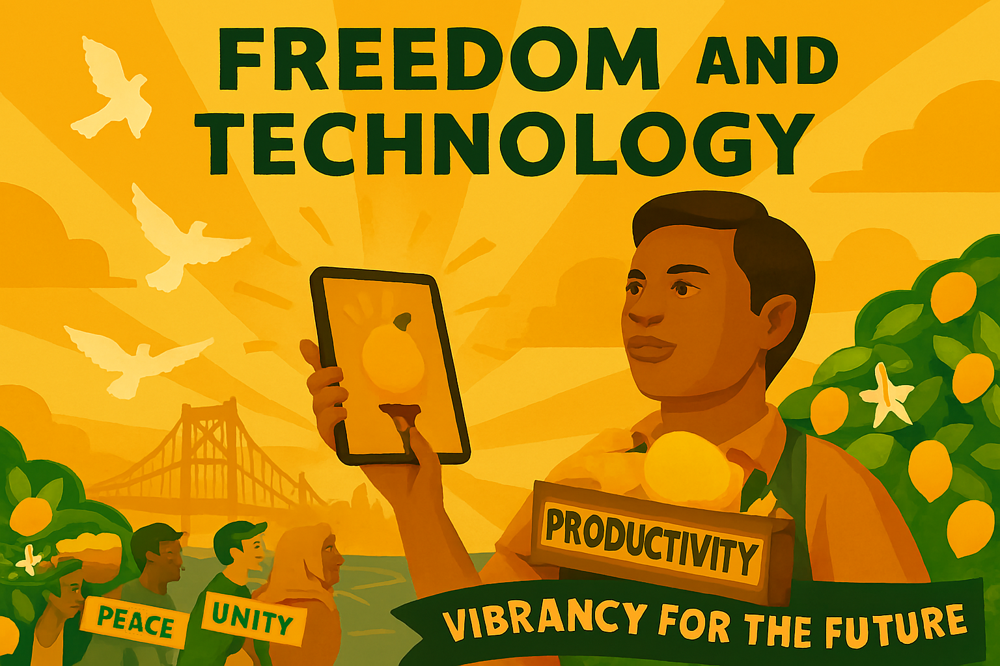

# Chapter 10

Technology for Good: A Liberal Digital Future

*Digital Rights and Opportunities in the Modern Age*

Technology is not neutral. Every algorithm, every platform design choice, every data collection practice embodies values and shapes human behaviour. The question is not whether technology will transform society – it already has – but whether that transformation will serve human flourishing or undermine it. The liberal answer is clear: we must harness technology for good, ensuring that digital innovation enhances rather than erodes our fundamental rights and freedoms.

The digital revolution has brought unprecedented opportunities: instant global communication, access to the world's knowledge, new forms of creativity and collaboration, and tools that can solve humanity's greatest challenges. Yet it has also created new forms of exploitation, surveillance, and control that would make Orwell's Big Brother seem quaint by comparison. The challenge for liberals is to embrace technology's potential while safeguarding the values that make us human.

## Introduction: Core Principles for the Digital Age

A liberal approach to technology policy must be grounded in fundamental principles that put human flourishing at the centre:

*   **Human Agency**: Technology should enhance human choice and capability, not replace human judgment or manipulate behaviour
*   **Privacy as a Fundamental Right**: Personal data is not a commodity to be harvested and sold, but an extension of personal autonomy
*   **Transparency and Accountability**: Algorithmic systems that affect people's lives must be explainable and subject to democratic oversight
*   **Digital Equality**: Everyone should have access to the benefits of digital technology, regardless of income, location, or technical expertise
*   **Innovation with Responsibility**: Technological progress must be balanced with protection of human rights and social cohesion

## Privacy and Digital Rights

Privacy is not about having something to hide – it's about having the space to be human. In the digital age, privacy enables intellectual freedom, personal development, democratic participation, and authentic human relationships. The liberal approach recognises that digital rights are human rights and must be protected with equal vigour.

### Protecting Privacy While Safeguarding Children

One of the most challenging issues in digital policy is protecting children from online harm while preserving privacy rights and avoiding censorship. The liberal approach distinguishes between platform responsibility and government censorship.

Platforms, not governments, should be responsible for content moderation within a framework of democratic accountability. This means requiring platforms to detect and remove genuinely harmful content, ensuring transparency about moderation policies, and responding quickly to reports of illegal content – all while avoiding pre-publication censorship, vague definitions of "harmful" content, and surveillance pretexts.

Children deserve special protection through age-appropriate design that collects minimal data by default, avoids manipulative design patterns, and provides parents with effective tools. This protection should come through targeted enforcement, industry standards, and international cooperation – not mass surveillance.

### Digital Democracy and Platform Accountability

Social media platforms and search engines have become the new public square, yet they operate according to opaque algorithms designed to maximise engagement rather than promote democratic discourse. A liberal approach would require algorithmic transparency, establish independent regulators, give users meaningful control over their experience, and ensure algorithmic systems don't systematically marginalise certain viewpoints.

Privacy protections must include comprehensive data protection laws, clear limits on government surveillance with judicial oversight, strong penalties for companies that misuse personal data, and the right to understand how algorithmic systems make decisions that affect you.

## Artificial Intelligence: Promise and Peril

Artificial Intelligence represents perhaps the most significant technological development since the printing press. Machine learning can help doctors diagnose diseases earlier, AI tutoring systems can personalise education, and climate models powered by AI can help us respond to environmental challenges. Yet the perils are equally significant: AI systems can perpetuate biases, autonomous weapons could make killing impersonal, and surveillance systems could enable unprecedented government control.

The liberal approach to AI governance balances innovation with protection of human rights and democratic values, grounded in five principles: human agency and oversight, algorithmic transparency, bias prevention and fairness, democratic control, and global cooperation.

### AI in Critical Sectors

Liberal policy on AI must ensure benefits are shared across society. In employment and automation, this means massive investment in retraining programmes and policies that encourage human-AI collaboration rather than replacement. In criminal justice, AI can assist human decision-makers but must not make final decisions about people's liberty. In healthcare, AI can revolutionise diagnosis and treatment but must be subject to rigorous testing with patients retaining the right to human review. In education, AI tutoring systems should enhance human teachers, not replace them. In financial services, algorithmic lending must be transparent and fair, with people having the right to challenge AI-driven decisions.

## Breaking Tech Monopolies

The concentration of digital power in the hands of a few tech giants represents one of the greatest threats to liberal democracy. A handful of companies control essential digital infrastructure that billions depend on daily – Google processes over 8 billion searches per day, Facebook connects nearly 3 billion people, Amazon hosts much of the internet's infrastructure. These companies wield more power over information and communication than any government in history.

This concentration creates market dominance that stifles competition, data monopolies with insurmountable barriers to entry, enormous political influence through lobbying and algorithmic control, innovation stagnation as potential competitors are acquired, and democratic threats through influence over elections and political processes.

### Liberal Solutions for a Competitive Digital Economy

The liberal response requires bold action across five fronts. Antitrust enforcement must break up tech monopolies, separate platforms from content, require interoperability between social media platforms, and prevent self-preferencing. Data portability and interoperability must allow users to move their data between platforms, reducing lock-in effects. Platform regulation should treat large platforms as public utilities with responsibilities for fair access, transparent content moderation, and public interest obligations.

Supporting public and cooperative alternatives to private platforms – just as we have public broadcasting – can provide genuine competition. Finally, digital taxation must ensure tech companies pay fair taxes through digital services taxes and minimum corporate tax rates, ending their current advantage over traditional businesses.

## Cybersecurity and Democratic Resilience

In an interconnected world, cybersecurity is national security. Cyber threats are growing in sophistication and scale: state-sponsored hackers from authoritarian regimes attack democratic governments, criminal networks use ransomware to extort money from hospitals and schools, and disinformation campaigns undermine democratic processes.

The challenge for liberal democracies is building cybersecurity without becoming surveillance states. Authoritarian regimes use cybersecurity as a pretext for controlling citizens. Liberal democracies must protect themselves while preserving privacy, freedom, and openness.

### A Liberal Cybersecurity Strategy

The liberal approach prioritises five key elements. International cooperation with democratic allies establishes norms for responsible state behaviour, shares threat intelligence, and coordinates sanctions against cyber criminals. Public-private partnerships enable collaboration while maintaining democratic oversight, recognising that most critical infrastructure is privately owned. Resilience over retaliation focuses on robust defences and rapid recovery rather than offensive cyber warfare. Human rights protection ensures cybersecurity measures don't become pretexts for surveillance. Supply chain security diversifies technology sources, reducing dependence on authoritarian regimes for critical technology.

## Technology and Democracy

Technology is transforming work and democracy simultaneously. The digital revolution is changing not just what jobs exist, but how work is organised. Platform work, remote work, and the gig economy offer flexibility but create precarity. Many platform workers lack healthcare, pensions, and the right to organise.

### Building a Fair Digital Economy

The liberal response combines lifelong learning with massive investment in education and retraining, portable benefits ensuring gig workers access healthcare and pensions regardless of employment status, worker rights in the digital age extending traditional protections to platform workers, universal basic services providing security that allows people to adapt to change, and technology for inclusion creating opportunities for disabled people, older workers, and other groups often excluded from the labour market.

### Digital Democracy: Promise and Peril

Digital technology offers unprecedented opportunities for democratic participation – online consultations, accessible voting, political organising, and transparent government data. During COVID-19, digital tools kept democracy functioning when physical meetings were impossible.

Yet the same tools can undermine democracy. Social media algorithms create echo chambers and polarisation. Disinformation spreads faster than truth. Foreign governments interfere in elections. Surveillance technology monitors and suppresses dissent.

The liberal approach requires five key principles: transparency in government use of technology, inclusion ensuring digital tools are accessible to all citizens, privacy protecting political participation from surveillance, authenticity measures to combat disinformation while protecting free speech, and human agency ensuring technology enhances rather than replaces human political judgment.

## Global Digital Governance

Many technology challenges cannot be solved by individual countries. Tech companies operate globally, cyber threats cross borders instantly, and digital technology's environmental impact requires global cooperation. Yet authoritarian regimes want to use technology for control and surveillance, while some countries prioritise economic development over human rights.

Democratic countries must work together through a liberal international strategy. This means coordinating with other democracies on technology regulation and standards, promoting digital rights and freedoms in international forums, helping developing countries access beneficial technologies while avoiding harmful ones, ensuring fair taxation of digital companies through global coordination, and addressing the environmental impact of digital technology including the enormous energy consumption of data centres and devices.

## Supporting Progress While Managing Risk

While regulating technology's harms, liberal policy must support beneficial innovation. This requires massive public funding for basic research in AI, quantum computing, biotechnology, and clean energy. Programmes to help new companies compete with tech giants through access to capital and regulatory support. Regulatory sandboxes allowing experimentation under relaxed regulations. Attracting global talent including skilled workers, entrepreneurs, and researchers. And ensuring education systems prepare people for technological careers with both technical skills and critical thinking.

Yet innovation must be responsible. This means building ethical considerations into technology development from the start, requiring impact assessments for new technologies similar to environmental reviews, involving affected communities in development decisions, applying the precautionary principle to technologies with potentially irreversible harmful effects, and ensuring public input into decisions about emerging technologies rather than leaving these decisions to companies or technical experts alone.

## Technology and Human Wellbeing

Technology's impact extends beyond economics and politics to human relationships, mental health, and social cohesion. Digital technology has profound effects on wellbeing – social media can connect people but also create anxiety, depression, and addiction. Research shows concerning trends, particularly among young people, with increased anxiety and depression alongside smartphone adoption, disrupted sleep patterns, and damaged self-esteem from social comparison.

Yet technology can also support mental health through therapy apps, online communities, and digital tracking tools. The liberal approach requires regulations requiring companies to consider mental health impacts, education programmes helping people maintain healthy relationships with technology, investment in research on technology's mental health impacts, and ensuring mental health services address technology-related issues.

### Building Digital Community

Digital technology changes how we relate to each other. Online communities can bring people together across geographical boundaries, yet technology can also fragment society through echo chambers, online harassment, and the decline of local news.

The liberal response means using technology to strengthen rather than replace real-world communities, strong measures to prevent online abuse particularly targeting women and minorities, policies supporting local journalism which plays crucial roles in community cohesion, and programmes bringing different generations together to share knowledge and bridge digital divides.

## Conclusion: Writing Our Digital Future

The liberal vision for technology is neither utopian nor dystopian, but pragmatic and humanistic. Technology is a tool – powerful, transformative, but ultimately neutral. What matters is how we choose to use it and who gets to make those choices.

The current trajectory, where a handful of tech billionaires and authoritarian governments shape technology's development with minimal democratic input, is neither inevitable nor acceptable. Liberal democracies can and must assert democratic control over technology, ensuring it serves human flourishing rather than narrow interests.

This requires new institutions, new regulations, and new forms of international cooperation. It requires investment in education, research, and innovation. Most importantly, it requires a renewed commitment to liberal values in the digital age. Technology for good is not just about regulating the bad – it's about actively promoting the good, ensuring that the digital revolution serves human flourishing, enhances democratic participation, and creates opportunities for everyone to thrive.

But achieving this vision requires political will, policy innovation, and the courage to challenge powerful interests. Technology policy is not a technical issue but a fundamentally political one about power, values, and the kind of society we want to live in.

The digital future is being written now, in the code of algorithms and the text of legislation. The question is whether that future will be liberal or authoritarian, democratic or technocratic, human-centred or machine-optimised. We can choose to write a future that reflects liberal values of freedom, equality, and human dignity – or we can allow others to write it for us. The liberal path is clear. The time for action is now.

---
