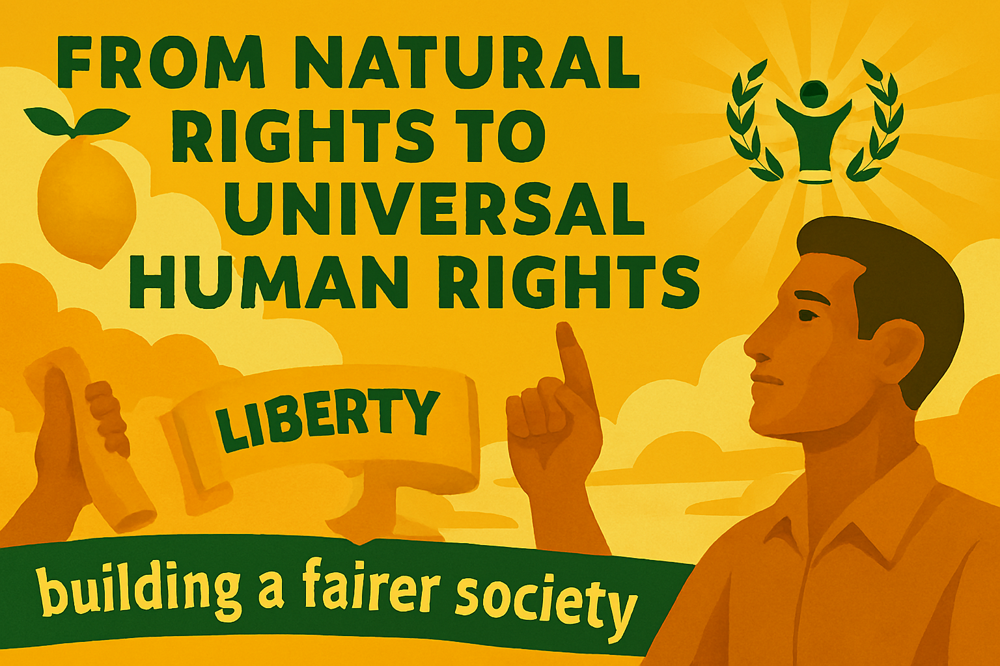

114

---

# Chapter 12

*From Natural Rights to Universal Human Rights*

Rights are not gifts from government or privileges earned through good behaviour – they are the fundamental entitlements that flow from our shared humanity. The liberal tradition has always recognised that certain rights are so basic to human dignity and flourishing that they must be protected from the tyranny of the majority, the whims of politicians, and the power of the state. Yet the concept of rights has evolved dramatically since the Enlightenment philosophers first articulated theories of natural rights, expanding to encompass not just civil and political freedoms, but also economic, social, and cultural rights that are essential for a truly free and equal society.

The challenge for contemporary liberalism is to defend and extend this rights framework while addressing new threats to human dignity that emerge from technological change, economic inequality, and the rise of authoritarianism. This requires us to move beyond abstract philosophical debates about the nature of rights to practical questions about how rights can be made real in people's daily lives.

**The Evolution of Rights Thinking**

The modern conception of human rights emerged from centuries of struggle against oppression and injustice. The Enlightenment philosophers, building on earlier traditions of natural law, argued that certain rights were inherent to human nature and could not legitimately be violated by any government. These natural rights – typically understood as life, liberty, and property – formed the foundation for the great democratic revolutions of the 18th century and the constitutional frameworks that emerged from them.

115

---

However, the classical liberal emphasis on negative rights – freedoms from interference – proved insufficient to address the realities of industrial society. The formal right to freedom of contract meant little to workers who had no choice but to accept exploitative conditions or starve. The right to political participation was hollow for those who lacked the education, leisure, or resources to engage meaningfully in democratic processes.

The 20th century saw the development of a more expansive understanding of rights that included positive rights – entitlements to the resources and opportunities necessary for human flourishing. The Universal Declaration of Human Rights, adopted by the United Nations in 1948, recognised not only civil and political rights, but also economic, social, and cultural rights including the right to education, healthcare, housing, and social security.

**Civil and Political Rights: The Foundation of Freedom**

Civil and political rights remain the bedrock of any free society. These include the right to life and security of person, freedom from torture and arbitrary detention, freedom of thought, conscience, and religion, freedom of expression and assembly, and the right to participate in democratic governance. Without these fundamental freedoms, other rights become meaningless, as people lack the basic protections and political power necessary to defend their interests.

Yet even these seemingly basic rights face new challenges in the modern world. The right to privacy, once understood primarily as protection from physical intrusion, must now grapple with digital surveillance capabilities that would have been unimaginable to earlier generations. The right to freedom of expression must be balanced against concerns about hate speech, misinformation, and the power of digital platforms to amplify or suppress particular voices.

The liberal approach to these challenges is to maintain strong protections for fundamental rights while adapting their application to new circumstances. This means robust legal frameworks that protect privacy in the digital age, clear limits on government surveillance powers, and transparent processes for content moderation that respect both free expression and the need to prevent genuine harm.

116

---

**Economic and Social Rights: Making Freedom Real**

The recognition that civil and political rights alone are insufficient for human dignity led to the development of economic and social rights. These include the right to work and to fair wages, the right to social security, the right to healthcare, education, and housing, and the right to participate in cultural life. These rights recognise that freedom requires not just the absence of interference, but also access to the resources and opportunities necessary to make meaningful choices about one's life.

Critics of economic and social rights argue that they are fundamentally different from civil and political rights because they require positive action from government rather than mere restraint, and because they involve claims on scarce resources that may not be available in all circumstances. However, this distinction is less clear-cut than it initially appears. Civil and political rights also require positive government action – courts to enforce them, police to protect them, and democratic institutions to give them meaning.

The liberal position is that economic and social rights are genuine human rights that governments have a duty to progressively realise to the maximum of their available resources. This doesn't mean that every person has an immediate claim to unlimited healthcare or housing, but it does mean that governments must take concrete steps to ensure that these rights become accessible to all over time.

**The Right to Healthcare**

117

---

Healthcare provides a clear example of how economic and social rights can be made real through practical policy. The establishment of the National Health Service represented a revolutionary recognition that healthcare is not a commodity to be purchased by those who can afford it, but a fundamental right that society must guarantee to all its members.

The liberal case for universal healthcare rests on both principled and practical arguments. As a matter of principle, access to healthcare is essential for human dignity and the ability to participate fully in society. As a practical matter, universal healthcare systems are more efficient, more equitable, and more effective at promoting public health than market-based alternatives.

However, the right to healthcare must be balanced against other considerations, including resource constraints, individual autonomy, and the rights of healthcare providers. This requires difficult decisions about what treatments should be publicly funded, how to balance individual choice with collective responsibility, and how to ensure that healthcare systems remain sustainable and responsive to changing needs.

**The Right to Housing**

Housing is another area where the gap between formal rights and lived reality is particularly stark. While most liberal democracies recognise some form of right to adequate housing, millions of people remain homeless or live in substandard conditions that undermine their health, dignity, and life chances.

The liberal approach to housing rights emphasises both the individual right to adequate shelter and the collective responsibility to ensure that housing markets work for everyone, not just the wealthy. This requires active government intervention to increase housing supply, regulate housing quality, and provide support for those who cannot afford market-rate housing.

118

---

The right to housing also intersects with other rights, including the right to family life, the right to education (as children need stable housing to succeed in school), and the right to work (as housing costs affect labour mobility and job choices). A comprehensive approach to housing rights must therefore consider these interconnections and address housing as part of a broader strategy for social and economic inclusion.

**Reproductive Rights and Bodily Autonomy**

Few areas of rights discourse are as contentious as reproductive rights, yet few are as fundamental to human dignity and equality. The right to make decisions about one's own body, including decisions about pregnancy, contraception, and childbearing, is essential to personal autonomy and gender equality.

The liberal position on reproductive rights is grounded in the principle of bodily autonomy – the idea that individuals have the right to make decisions about their own bodies free from coercion or interference by others. This includes the right to access contraception, the right to safe and legal abortion, and the right to reproductive healthcare more broadly.

However, reproductive rights also raise complex questions about the rights of others, including potential fathers, healthcare providers who may have conscientious objections, and society's interest in protecting potential life. The liberal approach seeks to balance these competing considerations while maintaining the fundamental principle that individuals must have the final say over decisions affecting their own bodies.

**LGBTQ+ Rights and Human Dignity**

The struggle for LGBTQ+ rights represents one of the great human rights advances of recent decades, demonstrating how the concept of human dignity can expand to encompass previously marginalised groups. The recognition that sexual orientation and gender identity are fundamental aspects of human identity that deserve protection from discrimination and persecution has transformed legal and social attitudes in many countries.

119

---

The liberal case for LGBTQ+ rights rests on the fundamental principle of human equality – the idea that all people, regardless of their sexual orientation or gender identity, deserve equal dignity, respect, and protection under the law. This includes not only freedom from discrimination and persecution, but also positive recognition of LGBTQ+ relationships and identities.

The fight for LGBTQ+ rights also illustrates how rights claims can evolve and expand over time. What began as a demand for decriminalisation has evolved into claims for marriage equality, adoption rights, gender recognition, and protection from discrimination in employment, housing, and public accommodations. This evolution reflects the liberal understanding that rights are not fixed or static, but must adapt to changing social understanding and circumstances.

**Digital Rights in the Information Age**

The digital revolution has created new categories of rights that were unimaginable to previous generations. These include the right to internet access, the right to digital privacy, the right to be forgotten, and the right to algorithmic transparency. As more aspects of human life move online, these digital rights become increasingly important for participation in modern society.

The right to internet access, for example, is increasingly recognised as essential for access to education, employment, healthcare, and civic participation. During the COVID-19 pandemic, the digital divide became a stark barrier to equality, as those without reliable internet access were cut off from remote work, online learning, and telehealth services.

Digital privacy rights face particular challenges from both government surveillance and corporate data collection. The liberal approach emphasises strong legal protections for personal data, transparent policies about data collection and use, and meaningful consent requirements that give individuals control over their digital footprint.

**The Right to a Healthy Environment**

120

---

Climate change and environmental degradation pose fundamental threats to human rights, including the rights to life, health, food, water, and housing. The recognition of environmental rights represents an important evolution in human rights thinking, acknowledging that individual rights cannot be separated from the health of the ecosystems that sustain human life.

The right to a healthy environment includes both procedural rights (such as the right to participate in environmental decision-making and access to environmental information) and substantive rights (such as the right to clean air and water). It also raises important questions about intergenerational justice and the rights of future generations to inherit a habitable planet.

Environmental rights also highlight the global nature of many contemporary rights challenges. Climate change, pollution, and biodiversity loss cross national boundaries, requiring international cooperation and shared responsibility for protecting the global commons.

**Balancing Rights and Responsibilities**

Rights do not exist in isolation – they must be balanced against other rights and against legitimate collective interests. The right to free speech must be balanced against the right to dignity and protection from hate speech. The right to property must be balanced against the right to housing and the collective interest in environmental protection. The right to religious freedom must be balanced against the rights of others to be free from discrimination.

The liberal approach to balancing rights emphasises proportionality, necessity, and the least restrictive means of achieving legitimate objectives. Restrictions on rights must be clearly justified, narrowly tailored, and subject to democratic oversight and judicial review.

This balancing act also requires recognition that rights come with responsibilities. The right to free speech carries the responsibility to use that freedom thoughtfully and with consideration for others. The right to vote carries the responsibility to participate in democratic processes in an informed and engaged manner. The right to a healthy environment carries the responsibility to live sustainably and consider the impact of one's actions on others and future generations.

121

---

**Making Rights Real**

Ultimately, rights are only as strong as the institutions and practices that protect them. This requires not only strong legal frameworks and independent courts, but also vibrant civil society organisations, free media, and engaged citizens who are willing to defend rights when they come under threat.

It also requires recognition that rights are not self-executing – they must be actively promoted and protected through education, advocacy, and political action. This includes ensuring that all people understand their rights and have access to effective remedies when those rights are violated.

The liberal vision of rights is both ambitious and practical. It recognises that human dignity requires not just formal equality before the law, but substantive equality of opportunity and access to the resources necessary for human flourishing. It acknowledges that rights must evolve to address new challenges and circumstances, while maintaining core commitments to human dignity, equality, and freedom.

Your rights are not abstract legal concepts – they are the foundation of your ability to live a free and dignified life. The choices you can make, the opportunities available to you, and the protections you enjoy all depend on the strength and scope of the rights framework that society provides. The question is not whether we can afford to protect and extend human rights, but whether we can afford not to. In a world where authoritarianism is on the rise and inequality is growing, the defence of human rights is not just a moral imperative – it is essential for the survival of free and democratic society.
