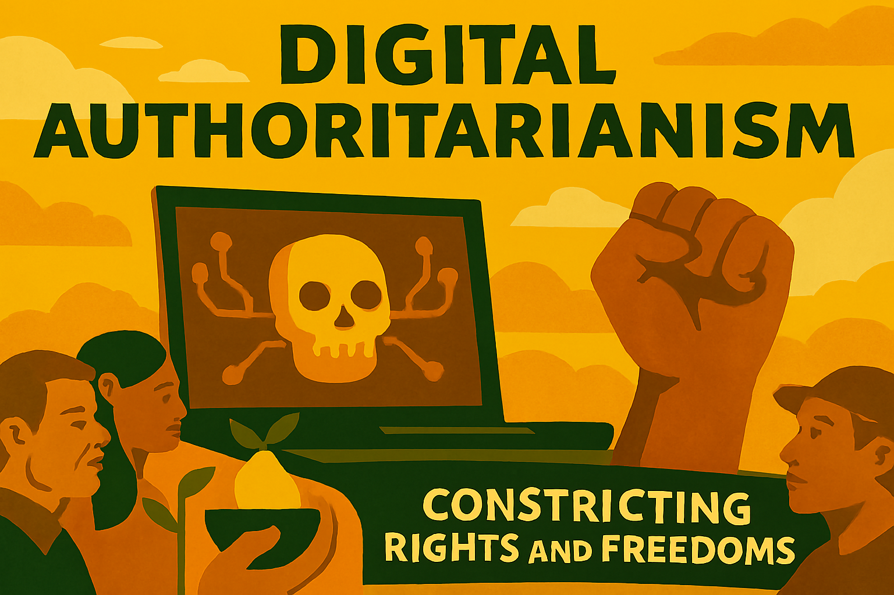

# Chapter 14

*Liberalism in the Face of Techno-Fascism and Inverted Totalitarianism*

The tyranny of tomorrow will not announce itself with jackboots and rallies. It will arrive quietly, wrapped in the language of efficiency, security, and convenience. It will promise to make our lives easier, our decisions smarter, and our society safer. It will use our own data against us, our own devices to monitor us, and our own democratic institutions to legitimise its power. The greatest threat to liberal democracy in the 21st century is not the crude authoritarianism of the past, but a sophisticated form of techno-fascism that uses the tools of the digital age to create new forms of control and manipulation.

This new tyranny operates through what political scientist Sheldon Wolin called "inverted totalitarianism" – a system that maintains the formal structures of democracy while hollowing out their substance. Unlike classical totalitarianism, which sought to mobilise the masses for political ends, inverted totalitarianism seeks to demobilise them, to render them passive consumers of political spectacle rather than active participants in democratic governance.

## The Architecture of Digital Authoritarianism

The foundation of techno-fascism is the surveillance capitalism that has emerged from the digital economy. Tech giants like Google, Facebook, Amazon, and their Chinese counterparts have built business models based on the extraction and manipulation of human behaviour data. What began as a way to target advertising has evolved into a comprehensive system for predicting and influencing human behaviour across all domains of life.

This system operates through what Harvard Business School professor Shoshana Zuboff calls "surveillance capitalism" – an economic system that extracts human experience as raw material for behavioural data, which is then processed into predictive products that are sold to third parties seeking to influence behaviour. The result is a form of capitalism that treats human experience as a free resource to be appropriated for commercial purposes.

The surveillance apparatus built by these companies provides the infrastructure for authoritarian control. Governments around the world are learning to leverage this infrastructure for their own purposes, creating public-private partnerships in surveillance that would have been unimaginable in earlier eras. China's social credit system represents the most advanced example of this fusion, but similar systems are emerging in democracies under the guise of public safety, fraud prevention, and national security.

## Algorithmic Governance

One of the most insidious aspects of techno-fascism is the way it erodes human agency through algorithmic governance. Increasingly, decisions that affect people's lives are made by automated systems that operate according to opaque rules and optimise for objectives that may not align with human welfare or democratic values.

These systems shape behaviour through what behavioural economists call "choice architecture" – the way options are presented to influence decision-making. Social media algorithms determine what information people see, dating apps influence who they meet, and recommendation systems shape what they buy, watch, and read. The cumulative effect is to create what appears to be choice while actually constraining it within parameters set by algorithmic systems.

The danger is not just that these systems make bad decisions, but that they gradually erode the human capacity for independent judgment. When people become accustomed to having decisions made for them by algorithms, they may lose the skills and confidence necessary for autonomous decision-making. This creates a form of learned helplessness that makes populations more susceptible to authoritarian control.

## The Weaponisation of Information

Information warfare has become a central tool of modern authoritarianism. Unlike traditional propaganda, which sought to convince people of particular truths, modern information warfare often seeks to undermine the very concept of truth itself. By flooding the information environment with contradictory claims, conspiracy theories, and deliberate misinformation, authoritarian actors can create a state of epistemic chaos in which people lose confidence in their ability to distinguish truth from falsehood.

This strategy, sometimes called "the firehose of falsehood," is particularly effective in democratic societies that depend on informed public debate. When citizens cannot agree on basic facts, democratic deliberation becomes impossible, and people retreat into ideological echo chambers that reinforce their existing beliefs while demonising those who disagree.

Social media platforms have become the primary battleground for information warfare. Their algorithms, designed to maximise engagement, tend to amplify content that provokes strong emotional reactions, including anger, fear, and outrage. This creates an information environment that is inherently polarising and conducive to the spread of extremist ideologies.

## The Erosion of Democratic Institutions

Techno-fascism does not seek to destroy democratic institutions outright, but rather to capture and hollow them out from within. This process, which political scientists call "competitive authoritarianism" or "electoral authoritarianism," maintains the formal structures of democracy while systematically undermining their effectiveness.

The capture of democratic institutions occurs through multiple mechanisms. Wealthy interests use their resources to influence elections, lobby for favourable policies, and shape public opinion through media ownership and advertising. Tech companies use their platforms to influence political discourse and their data to micro-target political messages. Foreign governments use cyber operations and information warfare to interfere in democratic processes.

The result is a system that appears democratic but is increasingly responsive to the interests of powerful elites rather than ordinary citizens. Elections continue to be held, but they become exercises in manipulation rather than genuine expressions of popular will. Legislatures continue to meet, but they become venues for political theatre rather than serious policy deliberation.

## The Psychology of Digital Manipulation

The effectiveness of techno-fascism depends on sophisticated understanding of human psychology and behaviour. Tech companies employ teams of behavioural scientists, neuroscientists, and data analysts to design systems that are maximally engaging and addictive. These same techniques can be used for political manipulation.

The psychology of digital manipulation operates through several mechanisms. Variable ratio reinforcement schedules, borrowed from gambling psychology, make social media platforms addictive by providing unpredictable rewards for engagement. Social proof mechanisms exploit people's tendency to conform to perceived social norms. Fear appeals and emotional manipulation bypass rational deliberation to influence behaviour at a subconscious level.

Perhaps most insidiously, these systems create what psychologists call "learned helplessness" – a state in which people become passive and accepting of their circumstances even when they have the power to change them. When people become accustomed to having their choices made for them by algorithms, they may lose the confidence and skills necessary for autonomous decision-making.

## The Corporate-State Surveillance Alliance

The boundary between corporate surveillance and government surveillance has become increasingly blurred. Governments purchase data from private companies, subpoena records from tech platforms, and use legal authorities to compel cooperation with surveillance programmes. Companies, in turn, rely on government protection from regulation and competition.

This public-private surveillance alliance creates a system of total information awareness that would have been impossible for either sector to achieve alone. Governments gain access to detailed information about citizens' private lives without having to build their own surveillance infrastructure. Companies gain protection from regulation and access to government data that enhances their own surveillance capabilities.

The result is a surveillance system that is both more comprehensive and more difficult to regulate than traditional government surveillance. When surveillance is conducted by private companies under the guise of providing services, it becomes harder to challenge through traditional civil liberties frameworks that focus on government overreach.

## The Manipulation of Democratic Processes

Techno-fascism poses a particular threat to democratic processes through its ability to manipulate elections and political discourse. Micro-targeting technologies allow political actors to deliver different messages to different groups of voters, making it impossible for citizens to engage in the kind of shared deliberation that democracy requires.

Deepfake technologies and other forms of synthetic media make it increasingly difficult to distinguish authentic from manipulated content. This creates opportunities for political actors to discredit opponents through fabricated evidence while also providing plausible deniability for authentic evidence of wrongdoing.

The speed and scale of digital communication also create new vulnerabilities. False information can spread faster than fact-checkers can debunk it, and the sheer volume of information makes it difficult for citizens to stay informed about important issues. This creates opportunities for political actors to overwhelm the information environment with propaganda and disinformation.

## The Liberal Response to Techno-Fascism

Defending liberal democracy against techno-fascism requires both institutional reforms and cultural changes. On the institutional side, this means strengthening democratic institutions, regulating surveillance capitalism, and creating new forms of accountability for algorithmic systems.

Regulatory responses must address both the economic and political dimensions of the problem. This includes antitrust enforcement to break up tech monopolies, data protection laws to give individuals control over their personal information, and transparency requirements for algorithmic systems that affect public welfare.

However, regulation alone is insufficient. Defending democracy also requires cultural changes that strengthen democratic norms and practices. This includes media literacy education that helps citizens navigate the digital information environment, civic education that prepares people for democratic participation, and the cultivation of democratic virtues like tolerance, compromise, and respect for truth.

## Building Resilient Democratic Communities

Perhaps most importantly, defending against techno-fascism requires building resilient democratic communities that can resist manipulation and maintain their capacity for autonomous decision-making. This means creating spaces for genuine democratic deliberation, supporting independent media and civil society organisations, and fostering the social connections that make democracy possible.

Local democracy becomes particularly important in this context. While global tech platforms and authoritarian governments operate at a scale that can seem overwhelming, local communities retain the capacity for face-to-face interaction and collective action. Strengthening local democratic institutions and practices can provide a foundation for broader democratic renewal.

The fight against techno-fascism is ultimately a fight for human agency and democratic self-governance. It requires recognising that technology is not neutral, that current trends are not inevitable, and that different choices are possible. The question is whether liberal democracies will have the wisdom and courage to make those choices before it is too late.

## The Stakes of the Struggle

The emergence of techno-fascism represents an existential threat to liberal democracy. Unlike previous forms of authoritarianism, which could be defeated through military force or economic pressure, techno-fascism operates through the very technologies and institutions that define modern life. It cannot be defeated through traditional means alone.

The stakes of this struggle extend beyond politics to encompass fundamental questions about human nature and human flourishing. If techno-fascism succeeds in creating a world of algorithmic governance and surveillance capitalism, it will represent a fundamental transformation in what it means to be human. People will become data points to be optimised rather than autonomous agents capable of self-determination.

The liberal response must therefore be equally fundamental. It requires not just defending existing institutions, but reimagining them for the digital age. It requires not just regulating technology, but ensuring that technology serves human purposes rather than the reverse. It requires not just preserving democracy, but deepening and extending it to meet the challenges of the 21st century.

The tyranny of tomorrow is not inevitable, but preventing it will require unprecedented vigilance, creativity, and commitment to liberal democratic values. The choice is ours to make, but we must make it soon. The future of human freedom hangs in the balance.

---
