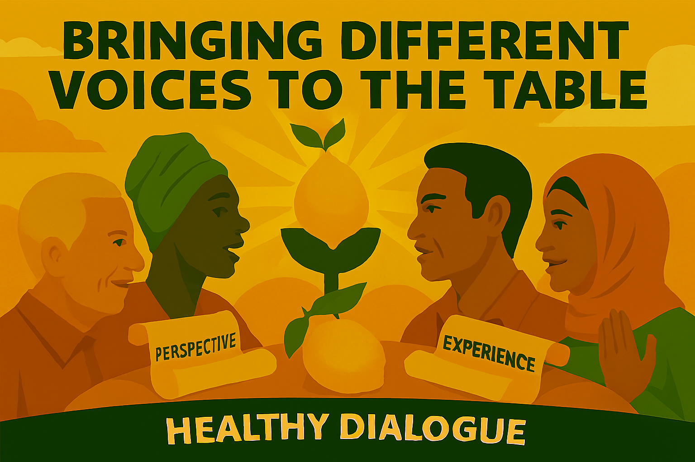

# Chapter 15

"Guest Voices: A Conversation on the Future of Liberalism"

*Celebrating the diversity of liberal thought and the exciting possibilities that emerge when we bring different voices to the table*

## Introduction: The Rich Tapestry of Liberal Thought

Liberalism is not a dogma; it is a conversation. It is a living, breathing tradition that has always been enriched by a diversity of voices, perspectives, and experiences. The story of liberalism is the story of how different people, from different backgrounds, have come together to grapple with the great questions of their time and to find new ways to advance the cause of human freedom.

This chapter is a celebration of that diversity. It is an invitation to listen to some of the many voices that make up the rich tapestry of modern liberal thought. Rather than presenting a single, monolithic vision, this chapter explores the different themes, priorities, and approaches that have been brought to the liberal conversation by a range of prominent figures. It is a reminder that our diversity is our strength, and that the future of liberalism will be shaped not by any one person, but by the creative and dynamic interplay of many different voices.

## The Liberal Conversation: A Symphony of Ideas

One of the most exciting things about liberalism is that it is not a fixed ideology, but a constantly evolving conversation. Different liberals, at different times, have emphasised different aspects of our shared tradition, creating a rich and complex symphony of ideas. Understanding these different themes is not about choosing one over the other; it is about appreciating the richness and the dynamism of the liberal tradition as a whole.

## Social Liberalism: The Power of Community

Many liberals have been inspired by the social liberal tradition, which emphasises the importance of community and the power of working together to create a more just and equitable society. This tradition recognises that we are not just isolated individuals, but social beings who thrive when we are part of a strong and supportive community. It sees the state not as a threat to freedom, but as a tool that we can use to empower individuals and to create opportunities for all.

This approach has led to some of the greatest achievements of modern liberalism, from the creation of the welfare state to the expansion of public education. It is a vision of a society where everyone has a stake, where everyone is cared for, and where everyone has the opportunity to contribute.

## Economic Liberalism: The Power of Enterprise

Other liberals have been inspired by the economic liberal tradition, which emphasises the power of free markets to drive innovation, to create prosperity, and to empower individuals. This tradition recognises that a dynamic and competitive economy is the engine of social progress, creating the resources we need to fund our public services and the opportunities people need to build better lives for themselves.

This approach has led to policies that champion entrepreneurship, that promote free trade, and that harness the power of markets to solve social and environmental problems. It is a vision of a society where everyone has the opportunity to succeed, where innovation is celebrated, and where we are constantly finding new and better ways to meet the needs of our society.

## Political Liberalism: The Power of Democracy

Still other liberals have been inspired by the political liberal tradition, which emphasises the importance of democracy, of human rights, and of the rule of law. This tradition recognises that a free society is one where power is dispersed, where government is accountable to the people, and where every person is treated with dignity and respect.

This approach has led to the great democratic reforms that have transformed our society, from the extension of the franchise to the creation of new checks and balances on power. It is a vision of a society where every voice is heard, where every person is empowered, and where we work together to build a government that is truly of the people, by the people, and for the people.

## The Personal and the Political: How Experience Shapes Our Liberalism

Our political beliefs are not just abstract ideas; they are shaped by our personal experiences, our values, and our hopes for the future. The diversity of liberal thought is a reflection of the diversity of the human experience itself. Different people, with different life stories, will naturally bring different perspectives to the liberal conversation.

For some, liberalism is about breaking down the barriers that have held them back, whether it is poverty, discrimination, or a lack of opportunity. For others, it is about creating a more tolerant and inclusive society, where everyone is free to be themselves. For still others, it is about protecting our environment, promoting peace, or building a more just and sustainable world.

All of these are valid and important expressions of the liberal spirit. The beauty of liberalism is that it is a broad and inclusive tradition that can accommodate a wide range of different priorities and perspectives. It is a conversation, not a monologue, and it is a conversation that is enriched by every new voice that joins it.

## The Future of Liberalism

The future of liberalism will not be determined by any one person or any one book. It will be shaped by the ongoing conversation between all of us who share a commitment to a more free, more just, and more prosperous world. It will be shaped by the new ideas, the new perspectives, and the new experiences that we bring to the table.

This is an exciting and hopeful prospect. It means that liberalism is not a relic of the past, but a living and evolving tradition that is constantly being renewed and reinvented. It means that the best is yet to come.

So let us celebrate the diversity of our liberal family. Let us listen to each other with respect and with an open mind. And let us work together to write the next chapter in the great story of liberalism—a chapter that is more inclusive, more innovative, and more inspiring than any that has come before.

## Voices from the Past: The Liberal Legacy

The liberal tradition has been shaped by many remarkable individuals who have brought their unique perspectives and experiences to the great questions of their time. Looking back at some of the key figures in our liberal history, we can see how their diverse voices have enriched our tradition and continue to inspire us today.

## William Gladstone: The Moral Crusader

William Gladstone, four times Prime Minister in the 19th century, brought to liberalism a profound moral vision and a passionate commitment to justice. For Gladstone, politics was not just about pragmatic reforms; it was about moral principles and the duty to stand up for what is right. His campaigns against slavery, against imperialism, and for Irish Home Rule were all driven by a deep sense of moral purpose.

Gladstone's liberalism reminds us that politics is not just about economics or administration; it is about values and principles. It is about having the courage to stand up for what is right, even when it is difficult or unpopular. In a world where politics is often reduced to technocratic management or cynical calculation, Gladstone's moral vision continues to inspire.

## Lloyd George: The Radical Reformer

David Lloyd George, the "Welsh Wizard" who led Britain through the First World War, brought to liberalism a radical vision of social reform and a practical determination to improve the lives of ordinary people. His People's Budget of 1909, which introduced progressive taxation to fund new social programs, was a landmark in the development of the welfare state.

Lloyd George's liberalism reminds us that liberalism is not just about abstract principles; it is about practical reforms that make a real difference to people's lives. It is about using the power of government to tackle poverty, to reduce inequality, and to create opportunities for all. In a world where many people feel left behind by economic change, Lloyd George's commitment to social justice continues to resonate.

## Beveridge: The Welfare State Architect

William Beveridge, whose 1942 report laid the foundations for the post-war welfare state, brought to liberalism a vision of a society where everyone is protected from the "five giants" of Want, Disease, Ignorance, Squalor, and Idleness. His plan for a comprehensive system of social security, healthcare, education, housing, and employment was a bold and ambitious vision of a better future.

Beveridge's liberalism reminds us that liberalism is not just about individual freedom; it is about creating the conditions where everyone can live a life of dignity and security. It is about building a society where no one is left behind and where everyone has the opportunity to fulfill their potential. In a world where many people feel insecure and anxious about the future, Beveridge's vision of a society that cares for all its members continues to inspire.

## Voices from the Present: The Liberal Renewal

Today, a new generation of liberal voices is bringing fresh perspectives and new ideas to the liberal conversation. These voices are shaped by the challenges and opportunities of the 21st century, from climate change to digital technology, from global migration to the rise of populism. They are helping to renew and reinvigorate the liberal tradition for a new era.

## The Environmental Voice: Green Liberalism

Many contemporary liberals are bringing a strong environmental perspective to the liberal conversation. They recognize that the climate crisis is one of the greatest challenges of our time and that it requires bold and ambitious action. But they also see it as an opportunity to build a greener, more sustainable, and more just economy.

This green liberalism is not about doom and gloom; it is about hope and opportunity. It is about harnessing the power of innovation, of markets, and of community action to create a future that is both environmentally sustainable and economically prosperous. It is about creating green jobs, building sustainable communities, and ensuring that the transition to a low-carbon economy is fair and inclusive.

## The Digital Voice: Tech Liberalism

Other contemporary liberals are bringing a digital perspective to the liberal conversation. They recognize that the digital revolution is transforming every aspect of our society, from how we work to how we communicate, from how we learn to how we participate in democracy. They see this as both a challenge and an opportunity for liberalism.

This tech liberalism is about ensuring that the digital revolution serves human values and human needs. It is about using technology to empower individuals, to strengthen communities, and to revitalize democracy. It is about creating a digital world that is open, inclusive, and respectful of human rights and human dignity.

## The Global Voice: International Liberalism

Still other contemporary liberals are bringing a global perspective to the liberal conversation. They recognize that in our interconnected world, many of the greatest challenges we face—from climate change to pandemics, from terrorism to economic inequality—are global in nature and require global solutions. They see this as an opportunity to build a more cooperative and more just world order.

This international liberalism is about building bridges, not walls. It is about working together across borders to tackle shared challenges and to create shared opportunities. It is about creating a world where everyone, everywhere, has the chance to live a life of dignity and freedom.

## The Liberal Conversation: How to Join In

The liberal conversation is not just for politicians or academics; it is for everyone who cares about building a more free, more just, and more prosperous world. There are many ways to join this conversation and to add your voice to the rich tapestry of liberal thought.

## Join a Liberal Party or Organization

One of the most direct ways to join the liberal conversation is to become a member of a liberal party or organization. In the UK, the Liberal Democrats are the standard-bearers of the liberal tradition, but there are liberal voices in other parties as well. By joining a party, you can participate in policy discussions, attend conferences, and help to shape the future direction of liberalism.

## Engage with Liberal Ideas

Another way to join the liberal conversation is to engage with liberal ideas through reading, discussion, and debate. There are many books, articles, podcasts, and online forums where liberal ideas are being discussed and developed. By engaging with these ideas, you can deepen your understanding of liberalism and contribute your own thoughts and perspectives.

## Live Liberal Values

Perhaps the most important way to join the liberal conversation is to live liberal values in your everyday life. This means treating others with respect and dignity, standing up for the rights of the marginalized, and working to create a more just and inclusive community. It means being open to new ideas, willing to change your mind, and committed to finding common ground with those who see things differently.

## Conclusion: The Conversation Continues

The liberal conversation is not a destination; it is a journey. It is a journey that has been going on for centuries and that will continue long into the future. It is a journey that has been enriched by the contributions of countless individuals, each bringing their unique perspective and experience to the great questions of their time.

As we look to the future, let us embrace the diversity of our liberal family. Let us celebrate the different voices, the different perspectives, and the different approaches that make liberalism such a rich and vibrant tradition. And let us continue the conversation, knowing that it is through this ongoing dialogue that we will find the answers to the challenges of our time and build a future that is more free, more just, and more prosperous for all.

---
