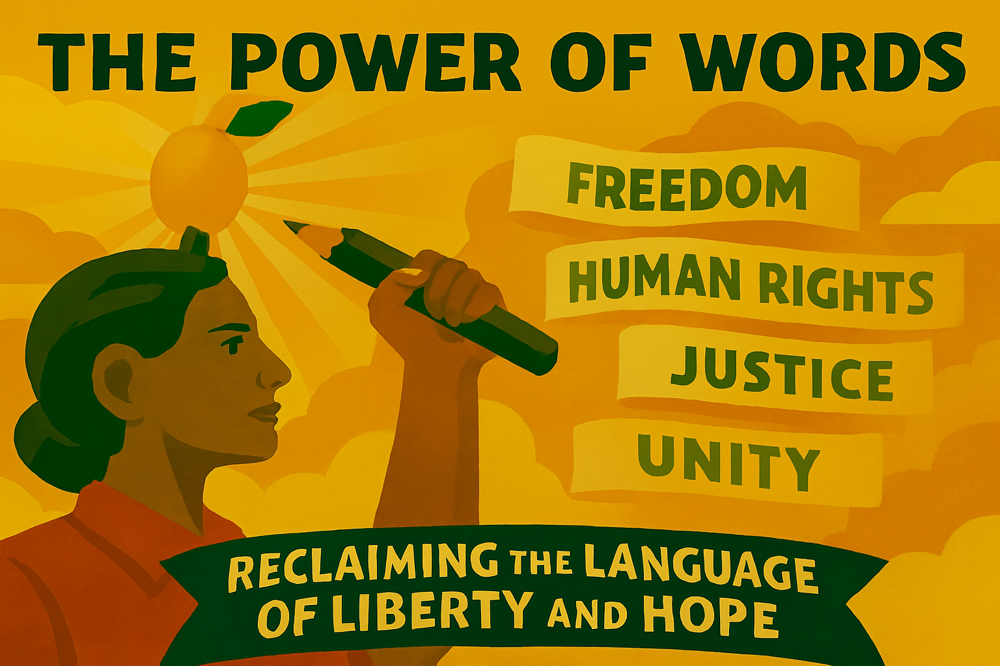

# Chapter 16

"The Power of Words: Reclaiming the Language of Liberalism and Hope"

*Celebrating the enduring power of liberal language and the exciting opportunities for building a more inspiring and hopeful political conversation*

## Introduction: The Adventure of Language

Language is one of the greatest adventures of the human spirit. It is the tool we use to build worlds, to share our dreams, and to connect with each other across the vast distances of time and space. The words we use matter. They shape how we see the world, how we feel about ourselves, and what we believe is possible. In politics, language is everything. It is the currency of debate, the engine of persuasion, and the foundation of our shared public life.

For liberals, language has alwayvs been a source of hope and of inspiration. The language of liberalism is the language of freedom, of reason, of progress, and of a profound belief in the power of people to build a better world. It is a language that has inspired revolutions, that has transformed societies, and that has empowered billions of people to live lives of dignity and of purpose.

In recent years, this inspiring language has sometimes been lost in the noise and the negativity of our political debate. But this is not a cause for despair; it is an opportunity for renewal. We have an incredible opportunity to reclaim the language of liberalism, to fill it with new meaning and new energy, and to use it to build a more hopeful and more inspiring political conversation. This chapter is a celebration of that opportunity. It is about the power of words to change the world, and about the exciting adventure of reclaiming the language of liberalism and of hope.

## The Liberal Lexicon: A Glossary of Hope

The language of liberalism is a rich and diverse lexicon of hope. It is a collection of words and ideas that have the power to inspire, to empower, and to unite. By reclaiming these words and filling them with their true liberal meaning, we can begin to build a more positive and more hopeful political discourse.

## Freedom: The Power to Flourish

For liberals, freedom is not just the absence of constraint; it is the presence of opportunity. It is the power to live a life of your own choosing, to pursue your dreams, and to fulfill your potential. This is a vision of freedom that is about empowerment, not just about non-interference. It is about creating a society where everyone has the resources and the opportunities they need to flourish.

## Choice: The Power to Create

For liberals, choice is not just about consumer sovereignty; it is about the power to create a life that is authentic, meaningful, and fulfilling. It is about having a real say in the decisions that affect your life, from your education and your healthcare to your work and your community. This is a vision of choice that is about empowerment, not just about consumption.

## Reform: The Power to Improve

For liberals, reform is not about dismantling our public services; it is about making them better. It is about constantly seeking new and innovative ways to meet the needs of our society, to improve the quality of our public services, and to ensure that they are delivering the best possible outcomes for everyone. This is a vision of reform that is about progress, not about cuts.

## Modernisation: The Power to Innovate

For liberals, modernisation is not about a soulless pursuit of efficiency; it is about embracing the future with confidence and with hope. It is about harnessing the power of new ideas and new technologies to build a society that is more prosperous, more just, and more sustainable. This is a vision of modernisation that is about innovation, not about a race to the bottom.

## The Art of Political Storytelling: Weaving a Narrative of Hope

Politics is not just about policies; it is about stories. The most successful political movements are those that are able to tell a compelling story about who we are, where we have come from, and where we are going. For too long, liberals have allowed others to tell the story of our country, a story of decline, of division, and of nostalgia for a mythical past. We have an opportunity to tell a different story, a story of hope, of progress, and of a bright and exciting future.

This means:

*   **Celebrating Our Successes:** We need to be better at celebrating the incredible successes of our liberal society. We have built a country that is more tolerant, more diverse, and more prosperous than ever before. We have created a welfare state that protects the vulnerable, a national health service that is the envy of the world, and a vibrant and creative culture that is admired around the globe. This is a story to be proud of, and it is a story that we should be telling with confidence and with joy.
*   **Painting a Picture of the Future:** We need to offer people a bold and inspiring vision of the future that we can build together. This is not about making a list of policies; it is about painting a picture of a society where everyone can thrive, where our communities are strong and united, and where we are leading the world in tackling the great challenges of our time, from climate change to global poverty. This is a vision that can inspire people and give them a sense of hope for the future.
*   **Making it Personal:** We need to connect our political vision to the everyday lives of people. This means talking about how our policies will make a real difference to their lives, to their families, and to their communities. It means showing people that we understand their hopes and their fears, and that we are on their side.

## The Power of Conversation

A healthy democracy needs a healthy public square, a place where people from all walks of life can come together to discuss, to debate, and to find common ground. In recent years, our public square has become more polarized and more toxic, but we have the power to change this. We have the opportunity to build a more inclusive, more respectful, and more constructive public conversation.

This means:

*   **Listening as well as Talking:** We need to be better at listening to those who see things differently from us. This is not about abandoning our principles; it is about seeking to understand the perspectives of others and to find common ground where we can. It is about recognizing that we do not have a monopoly on wisdom and that we can learn from those who disagree with us.
*   **Finding a Common Language:** We need to find a language that can bring people together rather than drive them apart. This means avoiding jargon and abstractions, and talking about our values and our vision in a way that is clear, accessible, and relatable. It means focusing on the things that unite us rather than the things that divide us.
*   **Creating Spaces for Conversation:** We need to create more spaces where people can come together for genuine conversation. This could be through town hall meetings, through community forums, or through new online platforms that are designed to promote dialogue rather than division. It is about rebuilding the social infrastructure of our democracy and creating a public square that is worthy of a free and open society.

## Conclusion: The Language of a Brighter Future

Language is a gift. It is a gift that allows us to share our hopes, our dreams, and our vision for a better world. The language of liberalism is a particularly precious gift, a language of freedom, of reason, and of a profound belief in the power of people to build a better future.

Let us reclaim this gift. Let us fill the language of liberalism with new energy, new meaning, and new hope. Let us use it to tell a story of a brighter future, a future of opportunity, of community, and of a shared sense of purpose.

This is the adventure of language, and it is an adventure that we can all be a part of. Let us go out and start the conversation.

## The Liberal Language in Action: Reclaiming Words

The power of language is not just theoretical; it is practical and transformative. By reclaiming key words and concepts, liberals can reshape the political conversation and build a more hopeful and inspiring politics. Here are some examples of how we can put the liberal language into action:

## Reclaiming "Patriotism": Love of Country is Good

For too long, patriotism has been defined as a narrow and exclusive love of country that is suspicious of outsiders and resistant to change. But there is another, more liberal understanding of patriotism—one that sees love of country as a force for good in the world.

Liberal patriotism is about being proud of the best of our country while also being honest about its flaws. It is about celebrating our achievements while also working to make our country better. It is about recognizing that our national identity is not fixed in the past, but is constantly evolving as new people and new ideas enrich our culture.

This liberal patriotism is inclusive rather than exclusive. It welcomes newcomers and sees diversity as a source of strength rather than a threat. It is outward-looking rather than inward-looking, recognising that in our interconnected world, our national interest is best served by working with others to tackle shared challenges.

By reclaiming patriotism in this way, liberals can challenge the idea that love of country is the exclusive preserve of the right. We can show that it is possible to be both patriotic and progressive, to love our country while also wanting to make it better.

## Reclaiming "Security": Beyond Fear to Flourishing

Security is another concept that has been narrowly defined in our political discourse. Too often, it is reduced to protection from external threats, whether from terrorism, crime, or immigration. This narrow definition plays into a politics of fear and division.

A liberal understanding of security is much broader and more positive. It recognizes that true security comes not just from being protected from harm, but from having the resources and the opportunities to flourish. It includes economic security—having a stable job, a decent income, and a roof over your head. It includes social security—being part of a strong and supportive community. And it includes environmental security—living in a clean and healthy environment.

This broader understanding of security is not about building walls or creating a fortress society. It is about building a society where everyone has the security they need to live a life of dignity and purpose. It is about creating the conditions where people can feel confident about the future and can make plans for themselves and their families.

By reclaiming security in this way, liberals can challenge the politics of fear and offer a more hopeful and inclusive vision of a secure society.

## Reclaiming "Family": Beyond Nuclear to Diverse

The concept of family has often been narrowly defined in our political discourse, with the traditional nuclear family held up as the ideal. This narrow definition can exclude many people and many types of families.

A liberal understanding of family is much more inclusive and diverse. It recognises that families come in all shapes and sizes—from single-parent families to blended families, from same-sex couples to extended families. It celebrates this diversity and sees it as a source of strength rather than a problem to be solved.

This broader understanding of family is not about undermining the traditional family; it is about recognising that there are many ways to create loving and supportive family relationships. It is about creating a society where all families are valued and supported, regardless of their structure.

By reclaiming family in this way, liberals can challenge the idea that they are somehow anti-family and can offer a more inclusive and supportive vision of family life.

## The Digital Frontier

The digital revolution has created new spaces for political conversation, from social media to online forums, from blogs to podcasts. These new spaces present both challenges and opportunities for liberal language. On the one hand, they can amplify division and polarisation. On the other hand, they offer exciting new possibilities for reaching people with a message of hope and optimism.

## Digital Citizenship: Building a Better Online Public Square

The concept of digital citizenship is about how we behave and interact in online spaces. A liberal approach to digital citizenship would emphasise the values of respect, of openness, and of a willingness to engage with different perspectives. It would seek to create online spaces that are more conducive to genuine conversation and less prone to polarisation and toxicity.

This could involve supporting initiatives that promote digital literacy and critical thinking, so that people are better equipped to navigate the online world. It could involve working with social media platforms to develop better algorithms and better content moderation systems that promote quality discourse rather than outrage and division. And it could involve creating new online platforms that are specifically designed to facilitate constructive dialogue across political divides.

## Digital Storytelling: New Ways to Share the Liberal Vision

The digital world offers exciting new possibilities for storytelling. From videos to podcasts, from interactive websites to social media campaigns, there are countless ways to share the liberal vision with a wider audience.

A liberal approach to digital storytelling would focus on creating content that is authentic, engaging, and hopeful. It would use the power of personal stories to connect with people on an emotional level. It would harness the creativity and the energy of digital culture to create content that resonates with younger audiences. And it would use data visualization and interactive tools to help people understand complex issues in a more accessible way.

## Digital Democracy: Ways to Participate

The digital world also offers exciting new possibilities for democratic participation. From online consultations to digital town halls, from e-petitions to participatory budgeting, there are countless ways to use digital tools to involve more people in the democratic process.

A liberal approach to digital democracy would focus on using these tools to create a more participatory and more inclusive democracy. It would seek to reach out to those who are often excluded from traditional forms of political participation, whether because of time constraints, geographical location, or social barriers. It would use digital tools to make the democratic process more transparent and more accountable. And it would harness the collective intelligence of citizens to solve complex problems and to develop better policies.

## Conclusion: Words to Build a Better World

Words have power. They have the power to inspire, to unite, and to create a vision of a better world. The language of liberalism is a language of hope, of reason, and of a profound belief in the power of people to shape their own destiny. By reclaiming this language and filling it with new energy and new meaning, we can build a more positive and more inspiring political conversation.

This is not just about changing the words we use; it is about changing the way we think and the way we act. It is about creating a politics that is more hopeful, more inclusive, and more focused on the future than on the past. It is about building a society where everyone has the opportunity to flourish, where our communities are strong and united, and where we are working together to tackle the great challenges of our time.

So let us embrace the power of words. Let us tell a story of hope, of progress, and of a bright and exciting future. Let us use the language of liberalism to build a better world. As the great liberal philosopher John Stuart Mill once said, "One person with a belief is equal to a force of ninety-nine who have only interests." With the right words, with the right story, and with the right vision, we can be that force for good in the world.

And remember, as the Monty Python team might say, "Nobody expects the Liberal Inspiration!" Let's surprise the world with our optimism, our creativity, and our unwavering belief in the power of words to change the world for the better.

---
