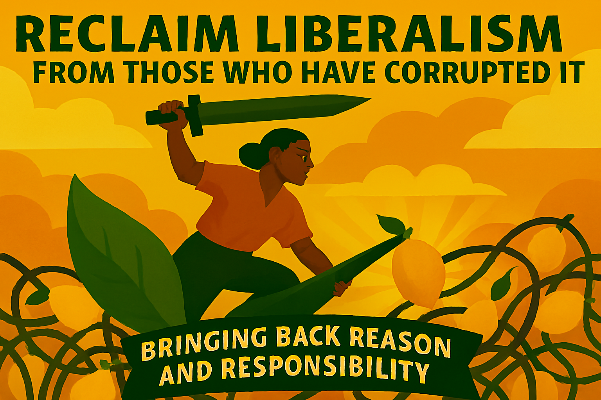

# Chapter 17

*A Call for Renewal and Resistance*

The time has come to reclaim liberalism from those who have corrupted it, distorted it, and used it to justify the very inequalities and injustices that authentic liberalism was designed to combat. For too long, we have allowed the language and concepts of liberalism to be appropriated by those who understand neither its history nor its values. We have watched as "freedom" has been redefined to mean the freedom of the powerful to exploit the powerless, as "choice" has been reduced to consumer choice in rigged markets, and as "reform" has become a euphemism for regression.

This corruption of liberal language and ideas has not happened by accident. It has been the result of a systematic campaign by those who benefit from inequality and injustice to appropriate the moral authority of liberalism while gutting its substantive content. They have understood what many liberals have forgotten: that ideas have power, that language shapes reality, and that controlling the terms of political debate is essential to controlling its outcomes.

But the corruption of liberalism is not irreversible. Throughout its history, liberalism has shown a remarkable capacity for renewal and reinvention. Each generation of liberals has faced the challenge of applying liberal principles to new circumstances and challenges. Our generation faces the same challenge, and we have the same opportunity to renew and revitalise the liberal tradition for the 21st century.

**Returning to First Principles**

Reclaiming authentic liberalism begins with returning to first principles – understanding what liberalism actually means and what it has historically stood for. This is not an exercise in nostalgia or an attempt to return to some imagined golden age. Rather, it is an effort to understand the core values and commitments that have made liberalism a force for human progress and freedom throughout its history.

At its heart, liberalism is about human dignity. It is the belief that every human being possesses inherent worth and deserves to be treated with respect and consideration. This belief in human dignity leads to a commitment to individual rights and freedoms, but it also leads to a recognition that these rights and freedoms are meaningless unless people have the practical capacity to exercise them.

Authentic liberalism recognises that freedom is not just the absence of external constraints, but the presence of genuine opportunities for self-determination. It understands that equality is not just formal equality before the law, but substantive equality of opportunity and access to the resources necessary for human flourishing. It sees democracy not just as a method for selecting leaders, but as a way of life that empowers people to shape their own destinies and participate meaningfully in the decisions that affect their lives.

**The Social Liberal Tradition**

The reclamation of authentic liberalism must draw particularly on the social liberal tradition that emerged in the late 19th and early 20th centuries. This tradition recognised that the classical liberal emphasis on negative rights – freedoms from interference – was insufficient to address the realities of industrial society and the new forms of power and inequality it created.

Social liberals like T.H. Green, L.T. Hobhouse, and John Maynard Keynes understood that genuine freedom required positive rights – entitlements to the resources and opportunities necessary for self-development and self-determination. They recognised that the state had a positive role to play in creating the conditions for individual liberty and social justice.

This social liberal tradition provides the foundation for a contemporary liberalism that can address the challenges of the 21st century. It offers a vision of freedom that is both individual and social, a conception of equality that is both formal and substantive, and an understanding of democracy that is both procedural and participatory.

**Economic Democracy and Shared Prosperity**

One of the most important tasks in reclaiming authentic liberalism is developing a new approach to economic policy that serves liberal values rather than undermining them. This means moving beyond the false choice between state socialism and market fundamentalism to develop forms of economic organisation that combine the efficiency and innovation of markets with the equality and security that liberalism demands.

Economic democracy – giving workers and communities a greater say in economic decisions that affect their lives – is essential to this vision. This includes not just traditional forms of collective bargaining and worker representation, but also new forms of worker ownership, community ownership, and stakeholder governance that distribute economic power more broadly throughout society.

The goal is not to eliminate markets, but to embed them in social institutions and democratic processes that ensure they serve human purposes rather than becoming ends in themselves. This requires strong regulation to prevent monopolisation and exploitation, progressive taxation to ensure that the benefits of economic growth are shared broadly, and public investment in the infrastructure and institutions that make prosperity possible.

**Participatory Democracy and Civic Renewal**

Reclaiming authentic liberalism also requires a renewed commitment to participatory democracy and civic engagement. The corruption of liberalism has been facilitated by the decline of democratic participation and the concentration of political power in the hands of wealthy elites and corporate interests.

Reversing this trend requires both institutional reforms and cultural changes. Institutionally, it means electoral reform to make the political system more representative and responsive, campaign finance reform to reduce the influence of money in politics, and devolution of power to bring decision-making closer to the people affected by it.

Culturally, it means rebuilding the civic institutions and practices that make democracy possible – from local community organisations to trade unions to independent media. It means fostering the democratic virtues of tolerance, compromise, and respect for evidence that enable people with different views to work together for the common good.

**Environmental Sustainability and Intergenerational Justice**

Any authentic liberalism for the 21st century must grapple seriously with the environmental crisis and the challenge of climate change. This is not just because environmental degradation threatens human welfare and freedom, but because it raises fundamental questions about our obligations to future generations and our relationship with the natural world.

Environmental liberalism recognises that genuine freedom requires a sustainable relationship with the natural environment that supports human life. It understands that the freedom of current generations to consume and pollute without limit undermines the freedom of future generations to inherit a habitable planet.

This requires a fundamental shift in how we think about economic growth and development. Rather than pursuing growth for its own sake, we must pursue forms of development that enhance human welfare while respecting planetary boundaries. This means investing in clean energy and sustainable technology, redesigning our cities and transport systems, and developing new measures of progress that go beyond GDP to include environmental and social indicators.

**Global Solidarity and Cosmopolitan Values**

Liberalism has always been an internationalist philosophy, committed to the idea that human rights and dignity transcend national boundaries. In an interconnected world facing global challenges like climate change, pandemics, and technological disruption, this internationalist commitment is more important than ever.

Reclaiming authentic liberalism requires rejecting the false nationalism that seeks to divide people against each other and embracing a cosmopolitan vision that recognises our shared humanity and common interests. This means supporting international cooperation and multilateral institutions, promoting human rights and democracy around the world, and working to address global inequalities and injustices.

It also means recognising that many of the challenges facing liberal democracies are global in nature and require global solutions. Climate change, tax avoidance by multinational corporations, and the regulation of digital platforms all require international cooperation and coordination.

**Technology for Human Flourishing**

The digital revolution presents both opportunities and challenges for liberal values. Technology can be used to enhance human freedom and capability, to expand access to education and healthcare, and to enable new forms of democratic participation and civic engagement. But it can also be used for surveillance and control, to manipulate behaviour and undermine autonomy, and to concentrate power in the hands of a few tech giants.

Reclaiming authentic liberalism requires ensuring that technology serves human purposes rather than the reverse. This means regulating digital platforms to protect privacy and prevent manipulation, breaking up tech monopolies to promote competition and innovation, and investing in digital infrastructure and education to ensure that everyone can participate in the digital economy.

It also means developing new forms of democratic governance that can keep pace with technological change. Traditional regulatory approaches that take years to develop and implement are inadequate for technologies that evolve rapidly. We need more agile and adaptive forms of governance that can respond quickly to new challenges while maintaining democratic accountability.

**Cultural Renewal and Liberal Values**

Reclaiming authentic liberalism is not just a matter of policy and institutions – it also requires cultural renewal and the revitalisation of liberal values in civil society. This means promoting education that develops critical thinking and civic engagement, supporting arts and culture that celebrate diversity and creativity, and fostering communities that embody liberal values of tolerance, inclusion, and mutual respect.

It also means challenging the cultural narratives that have been used to justify inequality and injustice. The myth of meritocracy that suggests that existing inequalities reflect natural differences in ability and effort must be replaced with a more accurate understanding of how social structures and institutions shape life chances. The cult of individualism that ignores the social foundations of individual success must be balanced with recognition of our mutual interdependence and shared responsibilities.

**Building a Liberal Movement**

Reclaiming authentic liberalism requires building a broad-based movement that can challenge the concentration of power and wealth that has corrupted our political and economic systems. This movement must include not just political parties and elected officials, but also trade unions, community organisations, advocacy groups, and ordinary citizens who are committed to liberal values.

Building such a movement requires overcoming the divisions that have weakened liberal politics in recent decades. This means bridging the gap between economic and social liberalism, between national and international perspectives, and between different generations and communities that share liberal values but may have different priorities and concerns.

It also means learning from other successful social movements about how to build power and create change. This includes developing clear and compelling narratives about liberal values and goals, building coalitions across different groups and interests, and using both electoral and non-electoral strategies to advance liberal objectives.

**The Role of Liberal Parties**

Liberal political parties have a crucial role to play in reclaiming authentic liberalism, but they cannot do it alone. They must be part of a broader movement for liberal renewal that includes civil society organisations, academic institutions, media outlets, and engaged citizens.

For liberal parties to be effective, they must be willing to challenge powerful interests and articulate bold visions for change. This means moving beyond the cautious centrism that has characterised much liberal politics in recent decades and embracing the radical potential of liberal ideas to transform society.

It also means being willing to form coalitions with other progressive forces when necessary to advance liberal objectives. While maintaining their distinctive identity and values, liberal parties must be pragmatic about working with others who share their commitment to democracy, equality, and human rights.

**Education and Intellectual Renewal**

Reclaiming authentic liberalism requires a sustained effort at education and intellectual renewal. This means developing new scholarship and research that applies liberal principles to contemporary challenges, creating educational programmes that teach liberal values and history, and fostering public intellectuals who can articulate liberal ideas in accessible and compelling ways.

It also means challenging the intellectual frameworks and assumptions that have been used to justify illiberal policies and practices. This includes developing critiques of neoliberalism, authoritarianism, and other ideologies that threaten liberal values, as well as positive visions of what a liberal society might look like in the 21st century.

Universities and other educational institutions have a particular responsibility in this effort. They must resist pressures to treat education as merely vocational training and maintain their commitment to developing critical thinking, civic engagement, and liberal values.

**Local Action and Community Organising**

While reclaiming authentic liberalism requires action at national and international levels, it also requires sustained work at the local and community level. This is where liberal values are lived out in practice and where people experience the concrete benefits of liberal policies and institutions.

Local action can take many forms: organising for better schools and healthcare, advocating for affordable housing and public transport, promoting environmental sustainability and social inclusion, and building the civic institutions that make democracy possible. These efforts may seem small in comparison to national politics, but they are essential for demonstrating the practical benefits of liberal values and building the grassroots support necessary for broader change.

Community organising also provides opportunities for people to develop the skills and confidence necessary for democratic participation. By working together to address local problems, people learn how to research issues, build coalitions, engage with officials, and hold institutions accountable.

**The Urgency of Liberal Renewal**

The task of reclaiming authentic liberalism is urgent. Around the world, liberal democracy is under threat from authoritarian populists who exploit economic insecurity and cultural anxiety to build support for illiberal policies. Climate change threatens to undermine the foundations of human civilisation. Technological change is creating new forms of inequality and control that could make democratic governance impossible.

In this context, the renewal of liberalism is not just a political project – it is essential for human survival and flourishing. Liberal values of human dignity, individual freedom, social justice, and democratic governance provide the foundation for addressing these challenges in ways that enhance rather than diminish human welfare.

But reclaiming authentic liberalism will not be easy. It requires challenging powerful interests that benefit from the status quo, overcoming decades of ideological conditioning that has corrupted liberal language and ideas, and building new institutions and practices adequate to 21st-century challenges.

**A Call to Action**

The reclamation of authentic liberalism begins with each of us. It begins with understanding what liberalism actually means and what it has historically stood for. It begins with rejecting the corrupted versions of liberalism that have been used to justify inequality and injustice. It begins with articulating positive visions of what a liberal society might look like and working to make those visions reality.

This is not a task for politicians alone, or for liberal parties alone, or for any single group or institution. It is a task for everyone who believes in human dignity, individual freedom, social justice, and democratic governance. It is a task for everyone who wants to live in a society that enables all people to flourish and reach their full potential.

The stakes could not be higher. The future of liberal democracy, and perhaps of human civilisation itself, depends on our ability to reclaim and renew the liberal tradition for the challenges of the 21st century. The question is not whether we can afford to undertake this task, but whether we can afford not to.

The time for half-measures and compromises with illiberalism is over. The time has come to reclaim authentic liberalism and to build the movement necessary to make it a reality. The future is in our hands, and the choice is ours to make.

