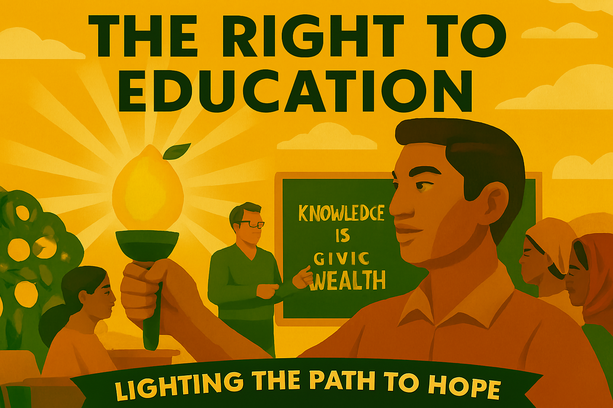
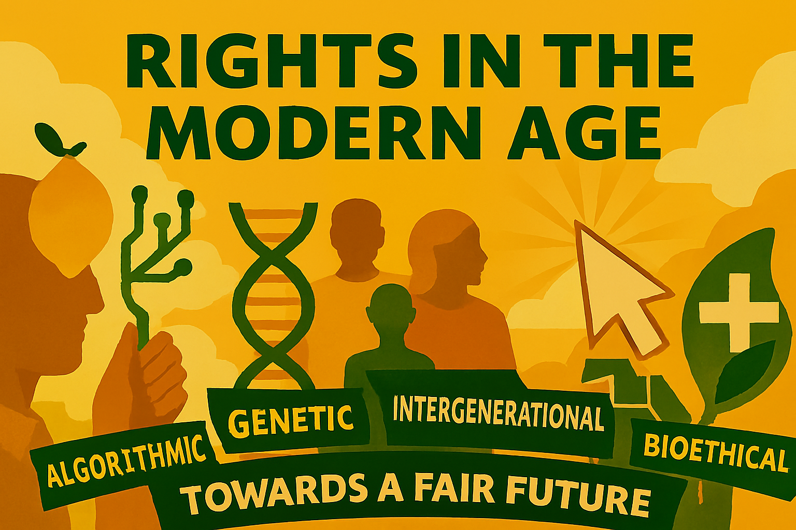
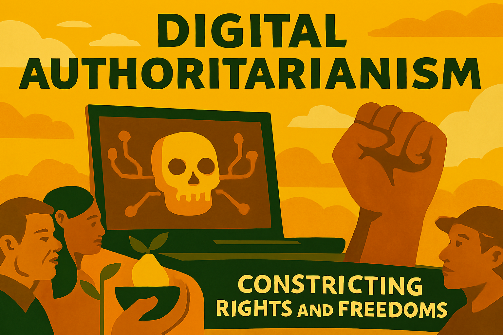

## Table of Contents Summary

**Front Matter**
- Dedication
- About the Author
- Acknowledgements

**Introduction: Why Britain Needs Liberal Answers**

### Part II: Fixing the Fundamentals

**Chapter 3: "Actually, We Can Build Houses"**
*Why Britain's housing crisis isn't inevitable*

**Chapter 4: "Your Health Matters"**
*Making healthcare normal*

**Chapter 5: "Capitalism with a Conscience"**
*Harnessing the market for social good, not just private profit*

**Chapter 6: "Every Vote Should Count"**
*Reforming our democracy for a fairer, more representative Britain*

**Chapter 7: "Europe: It's Complicated"**
*Finding a pragmatic path forward after Brexit*

**Chapter 8: "Immigration: Honest Conversations"**
*Moving beyond rhetoric to a fair, effective, and humane system*

**Chapter 9: "Green Growth, Not Green Grief"**
*Turning environmental challenge into economic opportunity*

**Chapter 10: "Technology for Good"**
*Digital rights and opportunities in the modern age*

### Part IV: Contemporary Challenges

**Chapter 14: "Tomorrow's Tyranny"**
*Liberalism in the Face of Techno-Fascism and Inverted Totalitarianism*

**Chapter 15: "Guest Voices: Liberal Democrat Leaders Speak"**
*Frameworks for contributions from prominent LibDem figures*

**Chapter 17: "Reclaiming Authentic Liberalism"**
*A Call for Renewal and Resistance*

**Chapter 18: "The Liberal Betrayal"**
*How the Guardians of Freedom Paved the Way for Tyranny*

## About the Author

The author is a passionate advocate for liberal democracy and evidence-based policy. With a background spanning politics, policy analysis, and public service, they bring both theoretical knowledge and practical experience to the challenges facing modern liberalism.

Having witnessed firsthand the erosion of liberal institutions and the rise of authoritarian populism, the author felt compelled to write this book as both a diagnosis of liberalism's current crisis and a roadmap for its renewal. They believe that liberalism, properly understood and courageously applied, remains humanity's best hope for creating societies that are both free and fair.

The author lives in Britain and remains actively engaged in political and policy debates. This book represents their contribution to the vital conversation about liberalism's future in the 21st century.

## Acknowledgements

This book would not have been possible without the contributions of many people who have shaped the author's thinking over the years. Special thanks go to the countless activists, politicians, academics, and citizens who continue to fight for liberal values in an increasingly illiberal world.

The author is particularly grateful to the Liberal Democrat party members and supporters who provided insights and feedback during the writing process, and to the many scholars and practitioners whose work is cited throughout these pages.

Any errors or omissions remain the author's responsibility alone.

This blend of pragmatic policy and relatable leadership is precisely why Britain needs liberal answers now more than ever. But it's also why we need to refresh our understanding of what liberalism means in practice. The old recipes aren't working. The political establishment has given us plenty of lemons—from the chaos of Brexit to the dysfunction of Westminster, from the housing crisis to the mental health epidemic, from democratic backsliding to the rise of techno-fascism.

So welcome to my lemonade stand. The product I'm selling is a refreshed liberalism: one that learns from the past whilst adapting to present challenges, one that combines the zest of fresh thinking with the substance of proven principles, one that is both critical of liberalism's failures and constructive about its potential. This isn't just another political book—it's a recipe for making something refreshing from the sour circumstances we find ourselves in.

The lemons are already here. The question is: are you ready for some lemonade?

## Part I: The Foundations of Liberal Thought\pagenumbering{arabic} % Start arabic numbering for main content
\setcounter{page}{1} % Set to page 1

Hobbes's most famous work, *Leviathan* (1651), is a powerful argument for the necessity of a strong, centralised government. He argued that to escape the horrors of the state of nature, individuals must enter into a **social contract**, surrendering some of their individual freedoms to a sovereign authority (a monarch or an assembly) in exchange for security and the rule of law. This sovereign, the "Leviathan," would have absolute power to enforce laws and prevent society from collapsing back into chaos. While this sounds profoundly illiberal, Hobbes's ideas contained several seeds that would later blossom in liberal thought:

- **Individualism:** Hobbes's political theory starts with the individual. He argued that society is composed of self-interested individuals, each seeking their own preservation and happiness. This focus on the individual as the fundamental unit of political analysis is a cornerstone of liberalism.

- **Social Contract Theory:** The idea that government derives its legitimacy from an agreement among individuals, rather than from divine right or tradition, was revolutionary. While Hobbes used this concept to justify absolute power, later thinkers like Locke would use it to argue for limited government and individual rights.

- **Materialism and Rationalism:** Hobbes's materialist philosophy and his emphasis on reason as a tool for understanding the world challenged traditional religious and aristocratic authority. This rational approach to politics would become central to Enlightenment thinking.

Key contributions from Locke, often seen as the father of classical liberalism, include:

- **Natural Rights:** Locke argued that individuals possess inherent natural rights to life, liberty, and property, which are not granted by any government but are intrinsic to human existence. These rights are inalienable and precede the formation of any society or state.

- **Social Contract Theory:** He posited that governments derive their legitimacy from the consent of the governed through a social contract. This contract is an agreement between individuals to form a society and establish a government to protect their natural rights. If the government fails to uphold its end of the contract and infringes upon these rights, the people have the right to resist and even overthrow it.

- **Limited Government:** Locke was a strong proponent of limited government, arguing that the power of the state should be constrained to protect individual liberties. He advocated for a separation of powers within government to prevent tyranny and ensure checks and balances.

- **Religious Toleration:** Locke championed religious toleration, arguing that the state should not interfere with individuals' religious beliefs, as long as those beliefs do not disrupt civil order. He believed that faith was a matter of individual conscience.

- **Empiricism:** As a founder of British empiricism, Locke argued that all knowledge is derived from sensory experience, rather than innate ideas. This epistemological stance influenced his political philosophy by emphasising the importance of experience and reason in understanding the world and forming political systems.

Key aspects of his influence include:

- **Emphasis on Experience and Utility:** Hume's empiricism, which asserted that knowledge is derived from sensory experience, extended to his moral and political philosophy. He argued that moral and political principles are not based on abstract reason or divine command, but on human sentiments, utility, and experience. This focus on practical consequences and what works for society aligns with a pragmatic liberal approach.

- **Limited Government and Rule of Law:** Hume stressed the benefits of limited government and the importance of the rule of law for social order and stability. He believed that government authority, while necessary, should be constrained to protect individual liberties and property rights. His historical writings often highlighted the dangers of arbitrary power and the advantages of constitutional governance.

- **Self-Interest and Social Order:** Hume explored how self-interest, when properly channeled, could contribute to social order and the common good. He argued that conventions and institutions, such as property rights and justice, arise from the recognition of mutual advantage, rather than from a formal social contract. This perspective influenced later liberal economic thought, particularly Adam Smith.

- **Scepticism towards Abstract Principles:** Hume's scepticism extended to abstract political theories, including some aspects of social contract theory. He preferred to ground political arrangements in historical experience, custom, and the practical needs of society. This pragmatic approach, focusing on what actually works to maintain a stable and prosperous society, is a hallmark of classical liberalism.

- **Freedom of Thought and Discussion:** Mill was a passionate defender of freedom of speech and expression, arguing that the suppression of opinion is always wrong. He believed that open debate, even of false ideas, is essential for the discovery of truth and the intellectual development of society. He contended that even if an opinion is wrong, its discussion forces others to re-examine and justify their own beliefs, preventing them from becoming dead dogma.

- **Individuality and Self-Development:** Mill placed great emphasis on the importance of individuality and the cultivation of diverse ways of living. He argued that a society that encourages individuals to develop their unique talents and pursue their own conceptions of the good life is more vibrant and progressive. This focus on self-realisation and personal growth is a key aspect of his liberalism.

- **Utilitarianism and its Refinement:** While a proponent of utilitarianism (the greatest good for the greatest number), Mill refined the doctrine by distinguishing between higher and lower pleasures, arguing that intellectual and moral pleasures are superior to purely sensual ones. This refinement sought to address criticisms that utilitarianism could lead to a 'pig's philosophy' focused solely on base gratification.

- **Advocacy for Women's Rights and Equality:** Mill was a pioneering advocate for women's rights and equality, co-authoring *The Subjection of Women* (1869) with his wife Harriet Taylor Mill. He argued forcefully against the legal and social subordination of women, seeing it as a fundamental barrier to individual liberty and societal progress.

## Modern Liberalism (20th Century)

As the 20th century dawned, the confident stride of classical liberalism began to falter. The unfettered markets championed by Adam Smith, while generating immense wealth, also produced stark inequalities, urban squalor, and economic instability. The two World Wars shattered illusions of inevitable progress, and the Great Depression exposed the fragility of purely self-regulating economies. These seismic shifts demanded a new kind of liberalism, one that recognised the need for collective action and state intervention to safeguard individual freedom and promote social justice. It was a time when liberals realised that sometimes, even the most individualistic of knights needed a bit of communal armour to face the dragons of poverty, disease, and ignorance. And perhaps a very large, wooden rabbit.

The horrors of World War II further galvanised the commitment to social welfare. In Britain, this led to the groundbreaking **Beveridge Report** (1942), which laid the blueprint for the modern welfare state. William Beveridge identified five “Giant Evils” afflicting society: Want, Disease, Ignorance, Squalor, and Idleness. The report proposed a comprehensive system of social insurance, universal healthcare (the NHS), free education, and decent housing, all designed to provide a safety net “from the cradle to the grave.” This was a profoundly liberal vision, arguing that true individual freedom could only be realised when individuals were liberated from the crushing burdens of poverty and insecurity. The state, far from being a minimal night-watchman, was now seen as an enabler, actively creating the conditions for individuals to flourish. It’s a monumental undertaking, a bit like building a very large, very comfortable, and universally accessible sofa for the entire nation to recline upon.

The **post-war consensus** saw both Labour and Conservative governments largely adhere to these Keynesian and Beveridgean principles, creating a mixed economy and an expansive welfare state. However, this consensus began to fray in the 1970s, challenged by economic stagnation and a growing critique from the **New Right**. Figures like Margaret Thatcher in the UK and Ronald Reagan in the US argued that the welfare state had become bloated and inefficient, stifling individual initiative and economic growth. They advocated for a return to more classical liberal principles: deregulation, privatisation, and reduced state spending. This period saw a significant ideological battle over the role and scope of the liberal state, demonstrating that liberalism itself is not a static doctrine but a dynamic conversation.

# Chapter 2

Classical Liberalism and its Evolution

*From Individual Freedom to Social Justice*

The story of liberalism is fundamentally a story about power. From its earliest origins in the struggle against absolute monarchy to its contemporary battles against fascism, liberalism has always been about challenging concentrated power and redistributing it in ways that serve human dignity and freedom. Understanding this central truth is essential for grasping both the historical development of liberal thought and its continued relevance in the 21st century.

The evolution from classical to social liberalism was not merely an intellectual exercise or philosophical refinement – it was a response to changing configurations of power in society. As new forms of economic and social power emerged with industrialisation, urbanisation, and technological change, liberal thinkers and activists had to develop new strategies and concepts to address these challenges while remaining true to their core commitment to human freedom and equality.

**The Original Liberal Challenge to Power**

Classical liberalism emerged in the 17th and 18th centuries as a direct challenge to the absolute power of monarchs and the hereditary privileges of aristocracy. The liberal philosophers we examined in the previous chapter – Hobbes, Locke, Hume, and Mill – were all grappling with fundamental questions about the legitimate sources and limits of political power.

Locke's theory of government by consent was revolutionary precisely because it challenged the divine right of kings and asserted that political power must derive from the people it governs. His argument that governments exist to protect natural rights, and that people have the right to overthrow governments that fail in this duty, provided the intellectual foundation for the American and French revolutions.

13

These contradictions within classical liberalism became increasingly apparent as industrial capitalism developed. The very market freedoms that liberals had championed as tools for breaking up old forms of power were creating new forms of power that were equally oppressive. The question facing liberal thinkers was whether liberalism could adapt to address these new realities or whether it would become an ideology that served only the interests of the wealthy.

**The Emergence of Social Liberalism**

The answer came in the form of social liberalism, which emerged in the late 19th and early 20th centuries as liberal thinkers grappled with the social consequences of industrial capitalism. Figures like T.H. Green, L.T. Hobhouse, and John Maynard Keynes recognised that genuine freedom required not just the absence of government interference, but also access to the resources and opportunities necessary for self-development and self-determination.

This insight represented a fundamental shift in liberal thinking about power. Classical liberals had focused primarily on limiting the power of the state, assuming that this would automatically lead to greater individual freedom. Social liberals recognised that power could be concentrated in private hands as well as public ones, and that sometimes state power was necessary to check private power and create genuine opportunities for all.

T.H. Green's concept of "positive freedom" was particularly important in this regard. Green argued that true freedom was not just the absence of external constraints, but the presence of the power and resources necessary to realise one's potential. A person who was formally free but lacked education, healthcare, or economic security was not truly free in any meaningful sense.

15

Keynes argued that markets, left to themselves, could become trapped in equilibria of high unemployment and low growth. Government intervention was necessary not to replace markets, but to ensure that they functioned effectively. This required active fiscal and monetary policy to maintain full employment, as well as social insurance to protect people from the inevitable fluctuations of market economies.

**The Welfare State as Liberal Achievement**

The creation of the welfare state in the mid-20th century represented the culmination of social liberal thinking about power and freedom. The welfare state was not, as its critics often claim, an abandonment of liberal principles, but rather their fullest expression in the context of industrial society.

The Beveridge Report of 1942, which laid the foundation for Britain's post-war welfare state, was explicitly grounded in liberal principles. William Beveridge argued that the "five giant evils" of want, disease, ignorance, squalor, and idleness were barriers to individual freedom that could only be overcome through collective action.

The National Health Service, comprehensive education, social security, and public housing were all designed to ensure that everyone had access to the basic requirements for a free and dignified life. These institutions redistributed power from those who had inherited wealth or market advantages to those who had been excluded from opportunity by accident of birth or circumstance.

The welfare state also represented a new understanding of the relationship between individual and collective responsibility. Social liberals recognised that individual success or failure was not simply a matter of personal virtue or vice, but was heavily influenced by social structures and institutions. Creating fair institutions was therefore a collective responsibility that required collective action through democratic government.

**The Neoliberal Counter-Revolution**

17

The political consequences of this crisis have been profound. The rise of authoritarian populism, the Brexit vote, the election of Donald Trump, and the growth of far-right parties across Europe all reflect, in different ways, popular anger at a political and economic system that has failed to deliver on its promises of prosperity and opportunity for all.

However, the crisis of neoliberalism has not automatically led to a revival of social liberalism. Instead, it has opened up space for various forms of authoritarianism that promise simple solutions to complex problems. The challenge for contemporary liberals is to develop new approaches that can address the legitimate grievances that fuel populist anger while defending democratic institutions and liberal values.

**Technology and the New Concentration of Power**

The digital revolution has created new forms of concentrated power that pose unprecedented challenges to liberal democracy. Tech giants like Google, Facebook, Amazon, and Apple have accumulated market power that rivals or exceeds that of the great industrial monopolies of the early 20th century. Their control over information flows, communication networks, and digital infrastructure gives them enormous influence over political and social life.

These new concentrations of power operate through different mechanisms than traditional forms of economic or political power. They rely on network effects, data advantages, and algorithmic manipulation rather than physical coercion or legal authority. This makes them more difficult to regulate through traditional liberal tools like antitrust law or constitutional rights.

19

Contemporary challenges like inequality, authoritarianism, technological disruption, and climate change all fundamentally involve questions about power – who has it, how it is exercised, and how it can be redistributed to serve human flourishing rather than narrow interests. Liberal responses to these challenges must be grounded in this understanding of power dynamics.

This means that contemporary liberalism cannot be content with defending existing institutions or returning to some imagined golden age of classical liberalism. It must be willing to challenge existing concentrations of power and develop new institutions and practices that can ensure that power serves democratic purposes.

**Democracy as Power Distribution**

One of the most important insights of social liberalism is that democracy is not just a method for selecting leaders, but a way of distributing power throughout society. Democratic institutions – elections, parliaments, courts, free press, civil society organisations – all serve to check concentrated power and ensure that different voices and interests are represented in political decision-making.

However, democracy is always fragile and must be constantly defended and renewed. Concentrated economic power can undermine democratic institutions by buying political influence, controlling media narratives, and shaping the options available to voters. Technological power can manipulate democratic processes through surveillance, disinformation, and algorithmic manipulation.

Defending democracy therefore requires more than just protecting formal democratic procedures. It requires addressing the underlying power imbalances that can make democratic institutions ineffective or illegitimate. This includes economic reforms to reduce inequality, media reforms to ensure diverse and independent sources of information, and technological reforms to prevent manipulation and surveillance.

**The Liberal Tradition of Institutional Innovation**

21

However, responsibility must be matched with capability. It is unfair to hold people responsible for outcomes they cannot influence or to expect them to solve problems that require collective action. This is why liberal approaches to social problems typically combine individual responsibility with collective institutions that enable people to exercise that responsibility effectively.

**The Future of Liberal Power Analysis**

As we look toward the future, the liberal analysis of power remains as relevant as ever. New technologies like artificial intelligence and genetic engineering are creating new forms of power that could either enhance human freedom or create new forms of domination. Global challenges like climate change and inequality require new forms of collective action that transcend traditional boundaries.

The question facing contemporary liberals is whether they can develop new strategies and institutions adequate to these challenges while remaining true to their core commitments to human dignity, individual freedom, and democratic governance. This will require both intellectual innovation and political mobilisation, as well as a willingness to challenge existing power structures that benefit from the status quo.

The evolution of liberalism from its classical origins to its contemporary forms shows that liberal thought is not static or dogmatic, but adaptive and creative. Each generation of liberals has faced the challenge of applying liberal principles to new circumstances and new forms of power. Our generation faces the same challenge, and we have the same opportunity to contribute to the ongoing development of the liberal tradition.

**Conclusion: The Eternal Liberal Struggle**

23

# Chapter 3

Actually, We Can Build Houses

*Why Britain's housing crisis isn't inevitable*

The housing crisis in Britain is not a natural disaster; it is a man-made catastrophe, the result of decades of policy failure, ideological blindness, and a collective failure of imagination. For too long, we have been told that soaring house prices are inevitable, that young people will simply have to accept living with their parents well into their thirties, and that the dream of homeownership is a luxury that only the wealthy can afford. This is not just wrong; it is a betrayal of the liberal promise that everyone should have the opportunity to build a secure and prosperous life.

The statistics are stark and shameful. The average house price in England is now more than eight times the average salary, compared to just over three times in the 1990s. Homeownership among young adults has plummeted, with many trapped in expensive, insecure rental accommodation. The human cost is immense: families crammed into overcrowded flats, young professionals spending half their income on rent, and an entire generation locked out of the stability and security that homeownership provides.

But here's the thing: we can build houses. We have the land, we have the skills, and we have the technology. What we lack is the political will to challenge the vested interests that benefit from the current broken system. The liberal answer is not to tinker at the edges, but to fundamentally reform how we approach housing in this country.

**Land Value Capture and Planning Reform**

25

- **Expand Shared Ownership**: Making it easier for people to get on the housing ladder through part-buy, part-rent schemes
- **Reform Stamp Duty**: Abolishing stamp duty for first-time buyers and replacing it with a more progressive system that doesn't penalise mobility
- **Support Community Land Trusts**: Empowering local communities to develop affordable housing that remains affordable in perpetuity

**The International Perspective: Learning from Success**

Britain's housing crisis is not unique, but neither is it inevitable. Countries across Europe have managed to maintain affordable housing while preserving quality of life and economic dynamism. Austria's social housing programme houses 60% of Vienna's population in high-quality, mixed-income developments. Singapore has achieved 90% homeownership through innovative public-private partnerships. The Netherlands has maintained housing affordability through strategic land use planning and cooperative housing models.

These examples demonstrate that different policy choices lead to different outcomes. The question is not whether we can solve the housing crisis, but whether we have the political will to learn from international best practice and adapt successful models to British circumstances.

**The Economics of Housing: Breaking the Speculation Cycle**

At the heart of Britain's housing dysfunction lies a fundamental misunderstanding of what housing should be. Housing has been treated as a financial asset first and a home second, leading to a speculative bubble that prices out ordinary families while enriching property investors and developers.

A liberal housing policy would rebalance this equation by:

- **Speculation Tax**: Implementing higher taxes on second homes and buy-to-let properties to discourage speculative investment
- **Foreign Buyer Levy**: Following examples from Canada and New Zealand in taxing foreign property investment that inflates local prices
- **Empty Homes Tax**: Penalising properties left vacant for extended periods, encouraging productive use of existing stock
- **Community Land Trusts**: Supporting models where communities own land collectively, keeping housing affordable in perpetuity

27

A liberal government would launch a massive programme of social housebuilding, but this would not mean returning to the failed tower blocks of the 1960s. Modern social housing can be:

- **Architecturally Excellent**: Beautiful, well-designed homes that enhance rather than detract from their neighbourhoods
- **Environmentally Sustainable**: Leading the way in energy efficiency and renewable energy
- **Socially Mixed**: Integrated with private housing to create diverse, cohesive communities
- **Tenure Flexible**: Offering a range of options from rental to shared ownership to full ownership

**Addressing Homelessness: Housing First**

No discussion of housing policy can ignore the scandal of homelessness in one of the world's wealthiest countries. The liberal approach recognises that homelessness is not primarily about individual failings but about systemic failures in housing, healthcare, and social support.

The "Housing First" model, successfully implemented in Finland and other countries, provides permanent housing as the foundation for addressing other issues like mental health, addiction, and unemployment. This approach is not only more humane but also more cost-effective than the current system of temporary accommodation and crisis intervention.

**Regional Variation: Different Solutions for Different Places**

Britain's housing challenges vary significantly between regions. London faces acute affordability problems, while some northern towns struggle with low demand and declining populations. A liberal housing policy would recognise these differences and tailor solutions accordingly:

- **London and the South East**: Focus on increasing supply through planning reform and public housebuilding
- **Northern Cities**: Investment in regeneration and transport links to attract residents and businesses
- **Rural Areas**: Support for affordable housing that maintains community character while meeting local needs
- **Coastal Towns**: Addressing the specific challenges of seasonal economies and aging populations

29

- **Neighbourhood Planning**: Giving communities real power to influence development in their areas
- **Community Benefits**: Ensuring that new developments contribute to local infrastructure and services
- **Design Quality**: Requiring high standards of architecture and urban design that enhance local character
- **Affordable Housing**: Ensuring that new developments include homes for local people, not just wealthy incomers

**The Economic Benefits of Housing Reform**

Solving the housing crisis would not just improve quality of life – it would also boost economic growth and productivity:

- **Labour Mobility**: Workers could move more easily to where jobs are available
- **Consumer Spending**: Families would have more money to spend on goods and services rather than housing costs
- **Business Investment**: Companies would find it easier to recruit and retain staff
- **Innovation**: A more dynamic housing market would encourage innovation in construction and design

**Conclusion: From Crisis to Opportunity**

The housing crisis is not inevitable. It is the result of political choices, and it can be solved by making different choices. We can build houses, we can make them affordable, and we can create communities where everyone has the chance to thrive.

But this requires more than just technical solutions. It requires the political will to challenge vested interests, the imagination to learn from international best practice, and the commitment to put the needs of families and communities ahead of the profits of speculators and developers.

The choice is ours. We can continue with a housing system that serves the few at the expense of the many, or we can build a system that provides everyone with a decent, affordable home in a thriving community. The liberal vision is clear: housing is a human right, not a commodity. It's time to make that vision a reality.
31

The liberal vision is simple: mental healthcare should be treated with exactly the same priority, funding, and accessibility as physical healthcare. This means:

- **Free Prescriptions**: Abolishing prescription charges for all mental health medications, just as we do for diabetes, cancer, and other chronic conditions
- **Timely Access**: Ensuring that people can access mental health support within weeks, not months, with a guarantee that no one waits longer than four weeks for treatment
- **Preventive Care**: Investing in early intervention and prevention, including mental health support in schools, workplaces, and communities

**A Community-Centred Approach**

The current system is too focused on crisis intervention and not enough on prevention and community support. A liberal government would:

- **Expand Talking Therapies**: Massively increase funding for counselling and psychotherapy, making these treatments as accessible as seeing your GP
- **Peer Support Networks**: Fund peer support programmes where people with lived experience help others going through similar challenges
- **Mental Health in Every Community**: Ensure every community has access to mental health services, ending the postcode lottery that currently exists

**Breaking the 18-Year Cliff Edge**

One of the most heartbreaking aspects of the current system is the '18-year cliff edge' that young people face. As they transition from child and adolescent mental health services (CAMHS) to adult services, many young people find themselves in a perilous gap, often losing vital support at a critical juncture in their lives.

A liberal government would commit to breaking this cliff edge, ensuring a seamless transition between services and providing continuous support tailored to the evolving needs of young adults. This means investing in integrated services that recognise the unique challenges of adolescence and early adulthood.

33

- **Economic Security**: Universal basic income, job guarantees, and progressive taxation to reduce inequality
- **Housing Policy**: Ensuring everyone has access to decent, affordable housing
- **Community Building**: Investment in public spaces, community centres, and social programmes
- **Anti-Discrimination**: Strong equality laws and cultural change to combat prejudice
- **Trauma-Informed Services**: Training all public services to recognise and respond to trauma

**Workplace Mental Health: Changing the Culture**

The modern workplace is often a source of mental health problems rather than a support for wellbeing. Long hours, job insecurity, workplace bullying, and unrealistic performance targets all contribute to stress, anxiety, and depression.

A liberal approach would transform workplace culture through:

- **Right to Disconnect**: Legal protections for workers' time outside office hours
- **Mental Health Days**: Statutory entitlement to time off for mental health, just as for physical illness
- **Workplace Wellbeing**: Requirements for employers to assess and address mental health risks
- **Flexible Working**: Default right to flexible hours and remote working where possible
- **Employee Voice**: Stronger trade unions and worker representation to address workplace stress

**Education and Early Intervention**

Mental health problems often begin in childhood and adolescence, yet our education system does little to promote psychological wellbeing or identify problems early. A liberal government would make mental health a core part of education:

- **Mental Health Curriculum**: Teaching children about emotions, relationships, and coping strategies
- **School Counsellors**: Qualified mental health professionals in every school
- **Teacher Training**: Ensuring all teachers can recognise signs of mental distress
- **Peer Support**: Training young people to support each other's mental health
- **Family Support**: Helping parents understand and support their children's mental health

**The Role of Technology: Promise and Peril**

35

- **Public Education**: Campaigns to increase understanding of mental health
- **Media Responsibility**: Guidelines for reporting on mental health and suicide
- **Workplace Policies**: Legal protections against mental health discrimination
- **Positive Role Models**: Public figures sharing their mental health experiences
- **Language Change**: Moving away from stigmatising language and towards person-first terminology

**International Perspectives: Learning from Success**

Other countries have made significant progress in mental health care that Britain can learn from:

- **Australia**: Comprehensive mental health reform with increased funding and community-based care
- **Norway**: Integration of mental health services with primary care
- **New Zealand**: Wellbeing budgets that prioritise mental health alongside economic indicators
- **Finland**: Successful suicide prevention programmes that have dramatically reduced rates
- **Canada**: Mental health first aid training for the general public

**The Economics of Mental Health Investment**

Investing in mental health is not just morally right – it makes economic sense. The current cost of mental illness to the UK economy is estimated at over £100 billion per year through:

- **Lost Productivity**: Absenteeism and reduced performance at work
- **Healthcare Costs**: Emergency interventions and long-term treatment
- **Social Care**: Support for people unable to live independently
- **Criminal Justice**: Costs of policing, courts, and prisons
- **Welfare**: Benefits for people unable to work due to mental illness

Proper investment in mental health prevention and early intervention would:

- **Reduce Healthcare Costs**: Preventing expensive crisis interventions
- **Increase Productivity**: Helping people stay in work and perform better
- **Reduce Crime**: Addressing mental health factors in offending
- **Improve Education**: Helping children learn and achieve their potential
- **Strengthen Communities**: Creating more cohesive and supportive societies

**Research and Innovation: Advancing Understanding**

37

Mental health is not a luxury or an afterthought – it is fundamental to human flourishing and social progress. A society that neglects the mental health of its citizens is not just cruel but also economically and socially self-defeating.

The liberal vision is of a society where mental health is treated with the same seriousness as physical health, where seeking help is seen as a sign of strength rather than weakness, and where everyone has access to the support they need to thrive.

This is not just about healthcare – it is about creating a society that promotes wellbeing rather than undermining it, that builds people up rather than breaking them down, that recognises our common humanity and mutual interdependence.

Your mental health matters, and in a liberal Britain, the bill for its care would be borne by society, not by those already struggling. We can create a system where seeking help for your mental health is as normal and accessible as going to the dentist – and just as free.

But more than that, we can create a society where mental health problems are less likely to occur in the first place, where communities support their members, where workplaces promote wellbeing, and where everyone has the opportunity to live a fulfilling and meaningful life.

The choice is ours. We can continue with a system that treats mental health as a personal failing and a private problem, or we can build a system that recognises mental health as a shared responsibility and a public good. The liberal path is clear – it's time to take it.
39

The NHS was born from social liberal thinking that emerged in the early 20th century. Liberals like Lloyd George and William Beveridge understood that genuine freedom required more than just political rights – it required freedom from the "giant evils" of want, disease, ignorance, squalor, and idleness. Healthcare was not a privilege to be earned or purchased, but a prerequisite for human dignity and meaningful choice.

This vision was radical precisely because it rejected the market fundamentalism that saw healthcare as just another commodity. The liberal architects of the welfare state understood that healthcare is different – that when you're sick, you cannot shop around, that information asymmetry makes genuine market choice impossible, and that leaving healthcare to the market inevitably means that the poor die young while the rich live long.

The NHS embodied several core liberal principles:

- **Universality**: Healthcare available to all, regardless of ability to pay
- **Equality**: The same standard of care for everyone, from the street cleaner to the Prime Minister
- **Comprehensive**: Covering all health needs, from prevention to end-of-life care
- **Free at Point of Use**: Removing financial barriers that prevent people from seeking care
- **Funded by Taxation**: Those with broader shoulders contributing more

For decades, this model worked. The NHS delivered better health outcomes at lower cost than market-based systems. It was more efficient than American healthcare, more equitable than insurance-based European systems, and more popular than any other British institution.

## The Trust System: Fragmenting a Service

The rot began in the 1990s with the introduction of the "internal market" and the creation of NHS Trusts. The Conservative government of the time, influenced by market fundamentalism, decided that the NHS would work better if it operated like a business. Hospitals became autonomous Trusts, competing with each other for contracts from commissioning bodies. The service was fragmented into purchasers and providers, introducing transaction costs and bureaucracy that had never existed before.

41

**5. Collaboration Collapse**
Healthcare requires cooperation between different specialties, organisations, and sectors. But when organisations are set up to compete, collaboration suffers. Information isn't shared, resources aren't pooled, and patients fall through the cracks between competing Trusts.

## The Privatisation Agenda: Profits Before Patients

The Trust system paved the way for wholesale privatisation. Once the NHS was fragmented into competing units, it became easier to allow private companies to bid for contracts. This was never about improving efficiency – it was about creating profit opportunities for private healthcare companies.

### The Reality of NHS Privatisation:

**1. Cherry-Picking Profitable Services**
Private companies take profitable, straightforward procedures while leaving expensive, complex care to the NHS. Hip replacements and cataract operations go private; emergency care, mental health, and chronic disease management stay public. This cream-skimming leaves the NHS with the most challenging cases and least resources.

**2. Lower Standards, Higher Costs**
Contrary to the promises, privatisation has not delivered better value. Private providers often charge more than it costs the NHS to provide the same service. They cut corners on staffing, use inexperienced staff, and refer complex cases back to the NHS. When things go wrong – as with the Southern Cross care home collapse – taxpayers pick up the bill.

**3. The PFI Disaster**
The Private Finance Initiative, used to build new hospitals, represents one of the greatest financial scandals in NHS history. Hospitals built with private money under PFI deals are saddled with debt repayments that far exceed what public borrowing would have cost. Some Trusts pay more in PFI repayments than they spend on doctors and nurses. This is not efficiency – it is a government-sanctioned transfer of wealth from the public sector to private finance.

43

**Staff Crisis**
The NHS is haemorrhaging staff. Nurses, doctors, and other healthcare professionals are leaving in record numbers, burnt out by impossible workloads, demoralised by poor conditions, and exhausted from years of real-terms pay cuts. The NHS now relies on expensive agency staff to fill gaps, further straining budgets.

**Mental Health**
Despite political promises of "parity of esteem," mental health services remain the poor relation. Child and adolescent mental health services turn away children in crisis because they don't meet thresholds. Adult services are overwhelmed. People in mental health crisis wait hours in A&E because there are no mental health beds available.

## The Marketisation Failure

The fundamental problem is that healthcare cannot function as a market because it violates every condition necessary for markets to work efficiently:

**Information Asymmetry**
Patients cannot make informed choices about treatment because they lack medical knowledge. The doctor-patient relationship requires trust, not the adversarial dynamics of market transactions.

**Emergency Care**
When you're having a heart attack, you cannot shop around for the best price. Healthcare is not a voluntary transaction – often it's literally life or death.

**Monopoly Power**
Healthcare providers have local monopolies. If your nearest hospital is 30 miles away, you don't have meaningful choice, regardless of how many Trusts theoretically compete.

**Externalities**
Healthcare decisions affect others – infectious diseases spread, mental health problems impact families and communities. Markets cannot account for these social effects.

**Moral Hazard**
Insurance-based systems create incentives for overtreatment (providers profit from doing more) and undertreatment (insurers profit from denying claims). Neither serves patients.

## The Liberal Solution: Healthcare as a Service

The liberal answer to the NHS crisis is not more marketisation but a return to the founding principle: healthcare as a public service, not a business. This means:

45

**8. Democratic Accountability**
Make the NHS truly accountable to the public it serves, not to private shareholders or unelected Trust boards. This means transparency about performance, meaningful public involvement in decision-making, and democratic oversight of priorities and spending.

## Learning from International Examples

Other countries show that different approaches are possible:

**The Scandinavian Model**
Nordic countries achieve better health outcomes than Britain with publicly funded, publicly delivered healthcare that rejects marketisation. They invest more, value their staff, and focus on prevention.

**The Spanish Regional System**
Spain's regional health services demonstrate how to maintain national standards while allowing local flexibility, without fragmenting into competing Trusts.

**The Best of Europe**
Many European countries achieve universal coverage without fragmenting services into internal markets. They show that coordination and cooperation work better than competition.

## The Cost of Inaction

Every day the current system continues, people suffer:

- Patients die waiting for treatment
- Treatable conditions become chronic because of delayed diagnosis
- Staff burn out and leave, creating vicious cycles of understaffing
- Health inequalities widen as those who can afford it go private
- Trust in the NHS erodes, making future reform harder

The human cost is incalculable. Behind every statistic is a person in pain, a family worried sick, a healthcare worker stretched beyond breaking point.

## The Political Challenge

Reforming the NHS faces powerful opposition. Private healthcare companies profit from the current system. Management consultants make fortunes advising on "efficiency." Politicians fear being accused of creating another reorganisation. Trade unions worry about job losses. Vested interests will fight to preserve the status quo.

But the greater political risk is doing nothing. The NHS is in terminal decline under the current model. Without fundamental reform, it will continue to deteriorate until it becomes so dysfunctional that privatisation becomes inevitable – not through ideological choice but through practical failure.

47

## Conclusion: A Service, Not a Business

The fundamental error of the past three decades has been treating healthcare as a business rather than a service. Businesses exist to generate profits. Services exist to meet needs. Healthcare is a service – one of the most important services society provides.

When we run the NHS as a business, we get business outcomes: focus on profitable services, cost-cutting that undermines quality, competition that prevents collaboration, short-termism that neglects long-term investment. When we run it as a service, we get service outcomes: universal coverage, equity of access, coordination of care, investment in prevention.

The choice is stark: continue down the path of marketisation and privatisation until the NHS is unrecognisable, or reclaim the founding vision and rebuild the NHS as a public service. For liberals, committed to human dignity and social justice, that choice is clear.

The NHS is in crisis not because public services cannot work, but because we have stopped treating it as a public service. The solution is not more markets, but better public service. Not more competition, but more cooperation. Not more profit extraction, but more public investment.

Bevan's vision remains sound. What we need is the political will to defend it, the intellectual honesty to acknowledge where we've gone wrong, and the courage to reverse course. The NHS can be saved – but only if we reclaim healthcare as a public service, not a business opportunity.

The question is not whether we can afford to properly fund and reform the NHS. The question is whether we can afford not to. In a civilised, liberal society, healthcare is not a luxury but a necessity, not a commodity but a right. It's time we started treating it that way.

49

This chapter will explore how the ideology of market fundamentalism, often associated with the Chicago School of Economics, was not a neutral academic theory but a political project designed to shift power upwards. We will then examine how fascist movements exploit the economic anxieties created by unregulated capitalism, promising a false salvation while advancing an agenda of extraction and control. Finally, we will outline a practical liberal vision for a democratic economy—one that harnesses the dynamism of the market while ensuring it serves the many, not the few. This is not about finding a mythical 'third way' between capitalism and socialism, but about building a better capitalism, one where the invisible hand is guided by a democratic conscience.

## The Chicago School: An Ideological Project for Concentrated Power

To understand our current economic predicament, we must examine the systematic ideological campaign that transformed economic policy from the 1970s onwards. The **Chicago School of Economics**, led by figures like Milton Friedman, was not just an academic school of thought; it was a political project funded by wealthy industrialists and channelled through a network of right-wing think tanks. Their goal was to dismantle the post-war social-democratic consensus and re-establish the primacy of capital over labour and democratic oversight.

This project was remarkably successful. Through a sustained campaign of intellectual production, political lobbying, and strategic placement of personnel, the Chicago School and its allies shifted the **Overton window** of acceptable economic discourse. The core tenets of their ideology—that markets are inherently efficient, regulation is always harmful, and the pursuit of private profit automatically serves the public good—became the new orthodoxy. This was not a victory of superior ideas, but a triumph of power and influence. As detailed in Chapter 2, this mirrors the fascist strategy of creating an entire intellectual ecosystem to legitimize an authoritarian project.

### The International Architecture of Austerity

51

This model was evident in Nazi Germany, where corporations like IG Farben and Krupp became integral parts of the war machine, profiting from slave labour and the expropriation of Jewish property. We see a similar pattern in contemporary authoritarian regimes, where a small group of oligarchs, closely tied to the state, controls vast sectors of the economy. This is the logical endpoint of the concentration of economic and political power, a theme that runs through this book, from the Norman Conquest to the present day.

## The Liberal Response: Building a Democratic Economy

The liberal response to the concentration of economic power and the fascist threat is not to abandon the market but to reclaim it for democratic ends. This requires a clear-eyed understanding that markets are not natural phenomena but political constructs. The challenge is to build an economic system that is not only prosperous but also just, sustainable, and resilient in the face of authoritarian threats. This means moving beyond the false dichotomy of state versus market and instead focusing on how to build a genuinely democratic economy where power is broadly distributed.

A liberal economic agenda for the 21st century must therefore focus on three core principles:

1.  **Deconcentrating Power:** Actively breaking up concentrations of economic power, whether they lie in corporate monopolies, financial institutions, or the hands of a few billionaires.
2.  **Democratising Capital:** Broadening ownership and control over capital, so that the people who create wealth have a stake in its rewards and governance.
3.  **Strengthening Public and Social Goods:** Reinvesting in the public services, social safety nets, and environmental protections that create a just and resilient society, directly countering the fascist politics of austerity and neglect.

### Deconcentrating Power: A Modern Antitrust Agenda

53

### Democratising Capital: From Wage Labour to Co-ownership

For too long, the dominant model of capitalism has been one where a small minority owns the capital and the vast majority provides the labour. This creates a fundamental imbalance of power and ensures that the rewards of economic activity flow disproportionately to the owners of capital. A liberal vision for a democratic economy must therefore focus on democratising capital, giving workers a genuine stake in the enterprises where they work. This is not about expropriation, but about creating a more dynamic and equitable form of capitalism where ownership and control are broadly shared. This can be achieved through:

*   **Promoting Employee Ownership and Co-operatives:** Employee-owned businesses and co-operatives have repeatedly demonstrated their ability to deliver not only greater economic equality but also higher productivity and resilience. A liberal government should actively support these models through tax incentives, access to finance, and the creation of a legal and regulatory framework that facilitates the transition to employee ownership. The success of models like the John Lewis Partnership in the UK and the Mondragon Corporation in Spain provides a clear blueprint for a more democratic and participatory economy.
*   **Worker Representation on Corporate Boards:** The German model of co-determination, where workers have representation on the supervisory boards of large companies, has been a key factor in that country's economic success. It ensures that corporate decision-making takes into account the long-term interests of workers and the broader community, not just the short-term demands of shareholders. A liberal government should mandate worker representation on the boards of all large companies, giving labour a voice in the governance of the firms they help to create.
*   **A People's Sovereign Wealth Fund:** A portion of the wealth generated by our collective resources should be owned by all citizens. A liberal government should create a sovereign wealth fund, seeded by a tax on corporate profits and capital gains, that would invest on behalf of all citizens. The dividends from this fund could be paid out as a universal basic income or reinvested in public services, providing a direct link between economic growth and shared prosperity.

55

*   **A National Care Service:** Just as the NHS provides healthcare for all, a National Care Service should provide high-quality social care for all who need it, free at the point of use. This would not only provide dignity and support for the elderly and disabled but also recognise the vital work of caregivers, who are disproportionately women.
*   **Investing in Lifelong Learning:** In a rapidly changing economy, education cannot end at 18 or 21. A liberal government should fund a system of lifelong learning, giving everyone the opportunity to retrain and upskill throughout their lives. This would not only boost productivity but also create a more adaptable and resilient workforce.
*   **A Green New Deal:** The climate crisis is the greatest market failure in history. A liberal government must lead a national mission to decarbonise the economy, investing in renewable energy, green infrastructure, and a just transition for workers in carbon-intensive industries. This is not just an environmental necessity but also a massive economic opportunity to create millions of good jobs and build a more sustainable prosperity.

## Conclusion: A Capitalism Worth Fighting For

The vision of a capitalism with a conscience is not a utopian dream but a practical political project. It requires a clear-eyed understanding of power and a willingness to challenge the vested interests that profit from the current system's failures. The choice is not between a mythical free market and a monolithic state, but between a capitalism that serves the few and a capitalism that serves the many. 

Building a democratic economy is the great liberal challenge of our time. It is the necessary next step in the long struggle against concentrated power, a struggle that runs from the Magna Carta to the civil rights movement. By deconcentrating economic power, democratising capital, and reinvesting in public and social goods, we can build an economy that is not only more prosperous but also more just, more sustainable, and more resilient in the face of the fascist threat. This is a capitalism worth fighting for, a capitalism that reflects the best of the liberal tradition, a capitalism with a conscience.

57

## The Democratic Deficit: A Gateway for Fascism

Britain's democratic deficit is not an accident of history; it is the legacy of a political system designed to concentrate power, not to distribute it. The First-Past-the-Post electoral system, the unelected House of Lords, and the hyper-centralised state are not neutral arbiters of the popular will; they are institutions that have historically served to protect the interests of a powerful elite. This concentration of power, a theme we have traced from the Norman Conquest (Chapter 3) to the boardrooms of multinational corporations (Chapter 5), creates a political system that is dangerously vulnerable to fascist exploitation.

Fascist movements thrive on the alienation and disenfranchisement of ordinary people. They exploit the sense that the system is rigged, that the political class is out of touch, and that democracy has failed to deliver. The British political system, with its safe seats, wasted votes, and unelected legislators, provides fertile ground for this narrative. When millions of people feel that their vote doesn't matter, they become susceptible to the siren song of the strongman who promises to smash the corrupt system and restore power to 'the people'.

59

Furthermore, PR typically produces coalition governments. Far from being a recipe for instability, as critics often claim, this is a feature, not a bug. Coalitions require negotiation, compromise, and consensus-building. They prevent the wild swings in policy that occur when a party with 35% of the vote can seize 100% of the power and impose a radical agenda that lacks broad public support. Countries with PR consistently demonstrate more stable, predictable, and effective governance. Germany's post-war economic and political stability, for instance, is inseparable from its mixed-member proportional system, which has encouraged a culture of consensus and long-term thinking.

## Dismantling Bastions of Unaccountable Power: Reforming the House of Lords

The House of Lords is not merely an anachronism; it is the living embodiment of the principle of concentrated, unaccountable power that liberalism has always opposed. It is a direct institutional descendant of the aristocratic power structures established after the Norman Conquest (Chapter 3), where birthright and patronage, not democratic consent, confer the right to legislate. Its existence is a permanent, structural affront to the principle of popular sovereignty and a dangerous vulnerability in our democratic system.

An unelected chamber, whether filled with hereditary peers or political appointees, provides a perfect target for fascist critique. It allows them to rail against an out-of-touch, unelected elite, and they are not wrong to do so. The liberal response cannot be to defend the indefensible, but to lead the charge for democratic renewal. The House of Lords must be abolished and replaced with a fully elected second chamber, one designed to act as a constitutional check on power, not as a repository of it. This new chamber should be elected by a proportional system, representing the nations and regions of the UK, and given specific powers to safeguard the constitution and protect fundamental rights. This would transform it from a symbol of elite privilege into a guardian of democratic integrity.

61

## Fortifying Democracy: A Liberal Agenda for Reform

Building a democracy resilient enough to withstand the pressures of the 21st century requires more than just electoral reform. It requires a comprehensive programme of renewal that strengthens democratic institutions at every level. This is not about tinkering at the edges, but about a fundamental redistribution of power away from the centre and back to the people.

### Cleaning Up Political Finance

Money is the poison in the well of British democracy. The reliance of political parties on a small number of wealthy donors creates a system of dependency and a perception of corruption that corrodes public trust. A liberal government would legislate to get big money out of politics, including strict caps on donations, full transparency of all political funding, and a move towards state funding of political parties based on their level of public support. This would ensure that political influence is a function of public support, not private wealth.

### A Written Constitution: Codifying Our Rights

Britain’s unwritten constitution, a relic of a more deferential age, is no longer fit for purpose. The concentration of power in the executive, combined with the absence of clear constitutional safeguards, has created a system that is dangerously vulnerable to abuse. A liberal government would initiate a citizen-led process to create a written constitution, one that codifies the separation of powers, protects fundamental rights, and establishes clear rules for the exercise of power. This would be a foundational act of democratic renewal, creating a constitutional framework that is fit for a modern, pluralistic democracy.

63

# Chapter 7

Europe: It's Complicated

*Finding a pragmatic path forward after Brexit*

## Introduction: Europe as a Liberal Project Under Threat

Britain's relationship with Europe has always been complicated, but the decision to leave the European Union was more than just another chapter in this long and fraught history. It was a seismic event that struck at the heart of the post-war liberal international order. For liberals, the challenge is not to re-fight the battles of the past, but to understand the present crisis in the context of the book's central theme: the struggle between liberal democracy and the forces of concentrated power, particularly the rising tide of fascism. The European Union, for all its flaws, represents the most ambitious attempt in history to replace the power politics of nationalism with a system of pooled sovereignty, shared rules, and cooperation. It is a fundamentally liberal project, and its weakening is a strategic goal for every authoritarian leader, from Moscow to Beijing.

Brexit was not a singular event but a symptom of a broader populist-nationalist wave that fascists and their allies have skillfully exploited. They sold a fantasy of absolute sovereignty, a concept as meaningless in the modern world as the divine right of kings that early liberals fought against (Chapter 1). They preyed on legitimate economic anxieties, many of which were caused by the failures of the neoliberal economic model (Chapter 5), and channelled them into xenophobia and nationalism. This chapter will argue that a pragmatic and constructive relationship with Europe is not merely an economic imperative for Britain; it is a geopolitical and moral necessity. In an era defined by the return of great power competition and the systematic assault on democratic values, standing alone is not a viable strategy. A liberal Britain must see itself as a key partner in a broader European alliance dedicated to defending the liberal international order against its authoritarian challengers.

65

The liberal failure to understand and counter this threat was a critical factor in the Brexit vote. For too long, the debate about Europe was framed in narrow economic terms, ignoring the profound geopolitical and security implications of leaving the EU. The liberal case for Europe was often technocratic and uninspiring, failing to articulate a powerful vision of the EU as a bulwark against authoritarianism and a champion of democratic values. To move forward, liberals must learn this lesson: the argument for European cooperation is not just about trade statistics; it is about the defence of a shared civilisation against those who would see it destroyed.

## The Liberal Response: Rebuilding Bridges as a Geopolitical Imperative

The liberal response to Brexit cannot be to wish it away, but to confront its consequences with a clear-eyed pragmatism rooted in a deep understanding of the geopolitical landscape. Rebuilding a close, constructive relationship with the European Union is not a matter of choice; it is a strategic imperative for the defence of liberal democracy in an increasingly dangerous world. This is not about rejoining the EU tomorrow, but about a patient, step-by-step process of rebuilding trust and cooperation across a range of areas, from trade and security to climate change and research. Each step should be judged not just on its economic merits, but on its contribution to the collective strength and resilience of the European democratic community.

This project of reconstruction must be based on a sober assessment of the damage done. The economic costs of leaving the Single Market and Customs Union have been immense, weakening the British economy and reducing the resources available for public services and national defence. The political costs have been equally severe, diminishing Britain's international standing and creating deep divisions within the United Kingdom itself. A liberal government must be honest with the public about these costs, not to assign blame, but to build a consensus for a more pragmatic and cooperative path forward.

67

The most urgent area for renewed cooperation is in security and defence. The war in Ukraine has been a brutal reminder that military aggression is not a relic of the past but a clear and present danger to the European continent. While Britain remains a leading member of NATO, Brexit has created unnecessary friction and complexity in our security relationship with our European partners. A liberal government would seek to build a new, comprehensive security pact with the EU, covering everything from defence and intelligence sharing to counter-terrorism and the fight against organised crime. This is not about creating a European army, but about ensuring the closest possible coordination between the democratic nations of Europe in the face of a common threat.

This cooperation must also extend to the legal and judicial sphere. Authoritarian states and their proxies use corruption, money laundering, and lawfare to undermine democratic societies from within. By working closely with European partners on law enforcement, asset freezes, and sanctions, Britain can help to close the loopholes that allow dirty money to flow through London and other financial centres. Upholding the rule of law is not just a domestic issue; it is a vital part of the international struggle against kleptocracy and authoritarianism.

### People-to-People Connections: Building a Resilient Democratic Citizenry

The struggle against fascism is not just a military or economic contest; it is a battle of ideas and values. A population that feels connected to its democratic neighbours, that understands and values cultural diversity, and that has personal experience of international cooperation is a population that is far more resilient to the simplistic narratives of nationalist propaganda. This is why rebuilding the people-to-people connections severed by Brexit is not a soft-power luxury, but a hard-headed strategic necessity. A liberal government must therefore prioritise the restoration of cultural and educational ties with Europe.

69

# Chapter 8

Immigration: Honest Conversations

*Moving beyond rhetoric to a fair, effective, and humane system*

## Introduction: We Are All Cheddar Man's Children

In 1997, Adrian Targett, a retired history teacher from Somerset, volunteered for a DNA test that would change our understanding of British identity forever. Scientists had extracted DNA from Cheddar Man, a 9,000-year-old skeleton found in Gough's Cave in the Cheddar Gorge, and were looking for living relatives. The results were extraordinary: Targett shared mitochondrial DNA with this ancient Briton, making him a direct descendant through an unbroken maternal line stretching back nearly ten millennia.

This connection is possible because of a remarkable quirk of human biology. Mitochondrial DNA is inherited exclusively from the mother's side. When sperm fertilises an egg, the father's mitochondria are systematically destroyed and replaced by the mother's, ensuring that the immune system functions properly by maintaining genetic consistency in these cellular powerhouses. What this means is that the genetic link between Cheddar Man and Adrian Targett represents not just any ancestral connection, but a continuous line of mothers—grandmothers stretching back through 450 generations of women who survived, thrived, and passed on their genetic heritage.

But here's the crucial point that should humble every politician who rails against immigration: Cheddar Man himself was an immigrant. His ancestors had crossed the land bridge from continental Europe as the ice sheets retreated. He was part of a wave of hunter-gatherers who "invaded" Britain and displaced whatever sparse populations had survived the Ice Age.

71

The hypocrisy of modern anti-immigration politics is perhaps most starkly illustrated by the immigrant family histories of its most prominent champions. Donald Trump, whose rhetoric about immigrants has poisoned political discourse on both sides of the Atlantic, is himself the grandson of a German immigrant who arrived in America with nothing. His mother was a Scottish immigrant, and two of his three wives have been immigrants—one from Czechoslovakia, another from Slovenia. His own family story is a testament to the American dream built on immigration, yet he has built his political career on demonising today's immigrants.

Nigel Farage, the architect of Brexit and Britain's most prominent anti-immigration politician, bears a surname that immediately reveals his own immigrant heritage. "Farage" is a Huguenot name, marking him as a descendant of French Protestant refugees who fled religious persecution in the 17th century. These Huguenots were the asylum seekers of their day, arriving with little more than their skills and their faith. They faced suspicion and hostility from some quarters, yet they went on to contribute enormously to British commerce, industry, and culture. Farage's own wife was German, and he has personally benefited from the EU's freedom of movement provisions, yet he has spent his career campaigning to deny similar opportunities to others.

This pattern repeats throughout the ranks of anti-immigration politicians. They are often the beneficiaries of the very processes they now seek to deny to others. Their families' success stories are immigration success stories, yet they have built their careers on the politics of exclusion and fear. This is not just hypocrisy; it is a form of historical amnesia that denies the very foundations of their own prosperity and position.

73

For liberals, the conversation about immigration is therefore not a mere policy debate to be won or lost. It is the frontline in the defence of an open, tolerant, and democratic society against the forces of authoritarian nationalism that would deny the very history that made us who we are. How we talk about and manage immigration is a direct reflection of our commitment to the core liberal principles of universal human dignity and the rule of law. It is also a test of our honesty about our own past and our wisdom about our future.

Fascist and proto-fascist movements understand the power of immigration as a political weapon better than anyone. They do not see it as a complex policy challenge, but as their primary tool for stoking fear, dividing communities, and creating the sense of perpetual crisis that justifies the erosion of democratic norms. As we saw in Chapter 2, the creation of a demonised 'other' is the foundational step in the fascist project of stripping rights and consolidating power. This chapter will argue that a liberal approach to immigration must be more than just a set of pragmatic policies; it must be a conscious and strategic rebuttal of the fascist narrative, grounded in the scientific and historical truth that we are all immigrants' children.

## The Fascist Playbook: Weaponising Immigration for Political Gain

75

4.  **Attack the Rule of Law and Human Rights:** Finally, the fascist playbook attacks the very legal and moral frameworks that protect human dignity. International laws like the Refugee Convention are portrayed as outdated and naive, an obstacle to the nation's will to protect itself. Judges who uphold these laws are branded "enemies of the people." Human rights lawyers are vilified as self-serving activists. This is a direct assault on the liberal international order and the principle of universal human rights that emerged from the ashes of the Second World War (Chapter 2).

The "hostile environment" policy, introduced by a Conservative government, represents a chilling example of how this fascist framing can be absorbed into the political mainstream. It was a policy that, by its own admission, sought to create a climate of fear and suspicion. It turned ordinary citizens—landlords, doctors, teachers—into unwilling agents of the state's immigration enforcement. The Windrush scandal was not an accidental outcome of this policy; it was its logical and inevitable consequence. When you create a system designed to hunt for the "illegal" immigrant, you will inevitably end up persecuting the legal and the legitimate. It is a policy that poisons the well of community trust and corrodes the very fabric of a decent society.

## The Liberal Response: A Strategy of Competence, Compassion, and Control

77

### 2. Countering Dehumanisation with a Humane and Dignified System

The fascist strategy of dehumanisation can only be countered by a system that treats every individual with dignity and respect. This is not a matter of sentimentality, but a core liberal principle. A humane system is also a more effective one. When people are treated with dignity, they are more likely to comply with the rules and integrate successfully into society. A liberal government would:

*   **End the ‘Hostile Environment’:** This toxic policy, which has caused immense suffering and injustice, as exemplified by the Windrush scandal, would be scrapped. Public servants like doctors and teachers should not be co-opted as border guards.
*   **Close indefinite detention centres:** The practice of holding people in immigration detention for months or even years without charge is a moral stain on our nation. It should be replaced with a system of community-based alternatives and a strict time limit on all forms of immigration detention.
*   **Allow asylum seekers to work:** It is both absurd and cruel to force people seeking asylum to live in enforced destitution for years on end. Allowing them to work after six months would enable them to support themselves, contribute to the economy, and maintain their skills and dignity.

### 3. Countering the Blame Game with Investment and Integration

The far-right tactic of blaming immigrants for pressure on public services can only be neutralised by honestly acknowledging the challenges and investing in the solutions. A liberal government would recognise that population change, from whatever source, requires investment in public services and infrastructure. This means:

79

## Conclusion: An Immigration System for a Confident, Liberal Britain

The liberal approach to immigration is not a choice between compassion and control; it is the recognition that true control is impossible without compassion and competence. A system that is seen as fair, humane, and effective is a system that commands public confidence and starves the politics of fear of its oxygen. By contrast, a system built on performative cruelty, administrative chaos, and the deliberate stoking of division—as we have seen in recent years—is one that fails on every level. It is inhumane, it is ineffective, and it serves only to empower the very extremists who thrive on the narrative of a broken system.

Building a liberal immigration system is therefore a core part of the broader project outlined in this book: the defence of an open, democratic society against the forces of authoritarianism. It requires us to reject the false choices presented by the far-right and to articulate a confident, hopeful vision of a country enriched by, not afraid of, the world. It means having honest conversations, investing in our communities, and building a system that reflects the best of our values. This is not the easy path, but it is the only one that leads to a stronger, more prosperous, and more united United Kingdom.

## We Are All Immigrants: The Slippery Slope of Dehumanisation

81

## The Historical Gift of Immigration: From Roman Roads to Norman Innovation

The history of Britain is the history of successful immigration and integration. Each wave of newcomers brought not just people, but ideas, technologies, and innovations that transformed these islands for the better. The Romans gave us roads, law, and the concept of urban civilisation. They introduced writing, advanced engineering, and a sophisticated administrative system. Without Roman immigration, there would be no London, no Bath, no York as we know them. The very concept of Britain as a unified political entity emerged from Roman rule.

The Anglo-Saxon migrations of the 5th and 6th centuries brought new agricultural techniques, metalworking skills, and the foundations of the English language. The Vikings, often portrayed as mere raiders, were also traders and settlers who established thriving commercial centres and introduced new forms of governance. Dublin, York, and many other cities owe their origins to Viking immigrants.

The Norman Conquest of 1066, often seen as the last successful invasion of Britain, is perhaps better understood as the Norman Integration. Yes, William's army conquered the Anglo-Saxon elite, but what followed was not the replacement of one people by another, but a remarkable fusion of cultures. The Normans brought sophisticated administrative systems, revolutionary architectural techniques (those soaring cathedrals and imposing castles), and a legal framework that evolved into English common law. They introduced new agricultural methods, advanced military technology, and connections to European networks of trade and learning.

83

# Chapter 9 

Lime Green Growth, Not Green Grief

*From preventing scurvy to preventing catastrophe: why going green is essential for liberal survival*

## Introduction: The Climate Crisis as a Struggle for Power

The climate crisis is not just an environmental problem; it is a fundamental challenge to the liberal democratic order. For too long, the debate about climate change has been framed as a technical or economic issue, a matter of balancing costs and benefits. This is a dangerous misreading of the situation. The struggle to decarbonise our economy is not a polite negotiation; it is a power struggle against the vested interests of fossil-fuelled authoritarianism, both at home and abroad. For liberals, tackling climate change is not just about saving the planet; it is about defending a free, open, and democratic society from those who would see it destroyed.

The fossil fuel industry is the most powerful and destructive cartel in human history. For decades, its major players have known about the catastrophic consequences of their business model, yet they have systematically lied to the public, funded climate denial, and corrupted the political process to protect their profits. This is not just corporate malfeasance; it is a direct assault on the foundations of a democratic society. It is a strategy of deception and delay that mirrors the tactics of the tobacco industry and, more darkly, the propaganda techniques of fascist regimes. By deliberately sowing confusion and undermining public trust in science, they have paralysed our political system and left us dangerously exposed to the consequences of a rapidly changing climate.

85

At the domestic level, petro-fascism manifests as a political movement that weaponises climate policy as part of a broader culture war. It preys on the legitimate anxieties of working-class communities who fear that the green transition will leave them behind. It frames climate action as an elitist plot by out-of-touch urban liberals to destroy the traditional way of life. It promotes a politics of resentment, nostalgia, and grievance, arguing that the costs of climate action are an unacceptable burden on the hardworking, patriotic citizen. This is a classic fascist tactic: identify a real or perceived grievance, blame it on a scapegoat (in this case, environmentalists and the 'liberal elite'), and offer a simplistic, authoritarian solution.

We see this playbook in action across the world. In the United States, the MAGA movement is deeply intertwined with the fossil fuel industry, and climate denial has become a core tenet of its ideology. In Germany, the far-right AfD has made opposition to wind farms and electric vehicles a central part of its platform. In Britain, a small but vocal group of politicians and media commentators constantly attack net-zero policies, framing them as an unaffordable luxury that will impoverish ordinary people. This is not a good-faith debate about the best way to tackle climate change; it is a cynical attempt to use the climate crisis to advance a far-right political agenda. The goal is not to protect the public, but to protect the profits of the fossil fuel industry and to ride a wave of populist anger into power.

## The Liberal Response: Green Growth as a Strategy for Freedom

87

The liberal response to the climate crisis must be a Green New Deal that combines rapid decarbonisation with a radical commitment to social and economic justice. This is not just about building wind turbines; it is about building a fairer, more democratic, and more resilient society. A Green New Deal would be a comprehensive programme of investment and reform designed to tackle the climate crisis and the crisis of inequality at the same time. Its key components would include:

*   **A massive programme of public and private investment in green infrastructure:** This would include a rapid roll-out of renewable energy, a national programme to insulate every home and building, a transformation of our transport system, and the restoration of our natural environment. This would create millions of good, well-paid jobs in every part of the country.
*   **A just transition for workers and communities:** A Green New Deal would ensure that the costs and benefits of the green transition are shared fairly. This means a properly funded programme of retraining and reskilling for workers in fossil fuel industries, targeted investment in communities that have been dependent on those industries, and a strong social safety net to support people through the transition.
*   **The democratisation of energy:** A Green New Deal would break the power of the big energy companies and give communities a direct stake in the new energy system. This would include support for community-owned renewable energy projects, the creation of a publicly owned green investment bank, and the regulation of energy markets to ensure that they serve the public interest, not just private profit.
*   **A circular economy:** A Green New Deal would move us away from the wasteful, linear model of ‘take, make, dispose’ and towards a circular economy where waste is eliminated, resources are reused, and products are designed to last. This is not just about recycling; it is about a fundamental redesign of our industrial system.

89

In the 18th century, British sailors earned the nickname "Limeys" because the Royal Navy had discovered that lime juice could prevent scurvy, the disease that had killed more sailors than enemy action ever did. This simple green fruit became essential to British naval supremacy, enabling long voyages of exploration and trade that built an empire. Today, we face a different kind of scurvy—the slow poisoning of our planet by fossil fuels—and once again, going green is not just good policy, it is essential for survival. Just as limes were the key to preventing disease in the age of sail, green growth is the key to preventing catastrophe in the age of climate change.

### The Lime Principle: Mixing Solutions for Complex Problems

Like the lime in a well-crafted cocktail, the green transition requires the right mix of ingredients to work effectively. You cannot simply add renewable energy to our current economic system and expect transformation—any more than you can make a proper mojito by just dropping a lime into a glass of rum. The magic happens in the mixing, the careful combination of complementary elements that create something greater than the sum of their parts.

The lime principle teaches us that effective climate action requires blending economic policy with environmental science, social justice with technological innovation, local action with global cooperation. Just as the lime's acidity enhances other flavours while providing its own distinctive tang, green policies must enhance rather than replace existing liberal values while bringing their own transformative power. The result is not a compromise that satisfies no one, but a synthesis that creates new possibilities for prosperity, security, and freedom.

This is why the liberal approach to climate change is fundamentally different from both the technocratic solutions offered by some centrists and the hair-shirt environmentalism promoted by some on the left. We do not believe that people must choose between prosperity and sustainability, between jobs and the environment, between economic growth and planetary health. Like a master mixologist, we believe in finding the perfect blend that brings out the best in each ingredient.

91

# Chapter 10

*Digital rights and opportunities in the modern age*

Technology is not neutral. Every algorithm, every platform design choice, every data collection practice embodies values and shapes human behaviour. The question is not whether technology will transform society – it already has – but whether that transformation will serve human flourishing or undermine it. The liberal answer is clear: we must harness technology for good, ensuring that digital innovation enhances rather than erodes our fundamental rights and freedoms.

The digital revolution has brought unprecedented opportunities: instant global communication, access to the world's knowledge, new forms of creativity and collaboration, and tools that can solve humanity's greatest challenges. Yet it has also created new forms of exploitation, surveillance, and control that would make Orwell's Big Brother seem quaint by comparison. The challenge for liberals is to embrace technology's potential while safeguarding the values that make us human.

**The Liberal Vision for Digital Rights**

A liberal approach to technology policy must be grounded in fundamental principles:

- **Human Agency**: Technology should enhance human choice and capability, not replace human judgment or manipulate behaviour
- **Privacy as a Fundamental Right**: Personal data is not a commodity to be harvested and sold, but an extension of personal autonomy
- **Transparency and Accountability**: Algorithmic systems that affect people's lives must be explainable and subject to democratic oversight
- **Digital Equality**: Everyone should have access to the benefits of digital technology, regardless of income, location, or technical expertise
- **Innovation with Responsibility**: Technological progress must be balanced with protection of human rights and social cohesion

**Balancing Privacy with Protecting Children Online**

93

**Protecting Children Without Mass Surveillance**

The temptation to use child protection as justification for mass surveillance must be resisted. Effective child protection can be achieved through:

- **Targeted Enforcement**: Focusing resources on detecting and prosecuting those who create and distribute illegal content
- **Industry Standards**: Requiring platforms to implement effective safeguards without mandating specific technologies
- **International Cooperation**: Working with other countries to tackle cross-border online crimes
- **Support for Victims**: Providing comprehensive support for children who have been harmed online

**The Right to Privacy in the Digital Age**

Privacy is not about having something to hide – it's about having the space to be human. In the digital age, privacy enables:

- **Intellectual Freedom**: The ability to explore ideas, read, and learn without surveillance
- **Personal Development**: The space to make mistakes, change opinions, and grow as a person
- **Democratic Participation**: The ability to engage in political activity without fear of retaliation
- **Human Relationships**: The capacity for intimate, authentic connections with others

A liberal government would enshrine strong privacy rights in law:

- **Data Protection**: Comprehensive data protection laws that give individuals control over their personal information
- **Surveillance Limits**: Clear legal limits on government surveillance, with robust judicial oversight
- **Corporate Accountability**: Strong penalties for companies that misuse personal data
- **Right to Explanation**: The right to understand how algorithmic systems make decisions that affect you

**Digital Democracy and Algorithmic Accountability**

Social media platforms and search engines have become the new public square, yet they operate according to opaque algorithms designed to maximise engagement rather than promote democratic discourse. A liberal approach would:

95

Technology is transforming work at an unprecedented pace. A liberal response must ensure that technological progress benefits everyone:

- **Lifelong Learning**: Investing in education and training systems that help workers adapt to technological change
- **Portable Benefits**: Creating benefit systems that aren't tied to specific employers, giving workers security in a changing economy
- **New Forms of Work**: Recognising and protecting the rights of gig workers and other new forms of employment
- **Reduced Working Hours**: As productivity increases, ensuring that the benefits are shared through shorter working hours and better work-life balance

**Global Digital Governance**

The internet is global, but governance remains national. A liberal approach to digital policy must work across borders:

- **International Cooperation**: Working with like-minded countries to establish common standards for digital rights
- **Resistance to Authoritarianism**: Opposing attempts by authoritarian regimes to fragment the internet or export their surveillance models
- **Development Support**: Helping developing countries build digital infrastructure and governance capacity
- **Tax Justice**: Ensuring that global tech companies pay their fair share of taxes in the countries where they operate

**Innovation and Regulation: Finding the Balance**

The liberal approach to technology regulation is not anti-innovation – it's pro-human innovation. Good regulation can actually spur innovation by creating clear rules of the game and ensuring that competition is based on merit rather than exploitation:

- **Regulatory Sandboxes**: Allowing innovative companies to test new technologies in controlled environments
- **Proportionate Regulation**: Ensuring that regulatory requirements are proportionate to the risks involved
- **Innovation Incentives**: Using public procurement and research funding to encourage innovation that serves the public good
- **Competition Policy**: Preventing tech monopolies from stifling innovation and consumer choice

97

**Democratic Control**: AI development should be subject to democratic oversight, not left entirely to private companies or technical experts. Citizens must have a voice in how AI is developed and deployed.

**Global Cooperation**: AI governance requires international coordination to prevent a "race to the bottom" where countries compete by lowering standards.

**Specific AI Policy Areas**

**Employment and Automation**: Rather than trying to stop technological progress, liberal policy should focus on ensuring its benefits are shared. This includes massive investment in retraining programmes, universal basic services, and policies that encourage human-AI collaboration rather than replacement. We need a "just transition" for the AI age, similar to what we need for the green transition.

**Criminal Justice**: AI should not be used to make final decisions about people's liberty, but can assist human decision-makers with better information and analysis, provided systems are transparent and auditable. Predictive policing algorithms must be carefully monitored to prevent reinforcing existing biases in the criminal justice system.

**Healthcare**: AI can revolutionise medical diagnosis and treatment, but must be subject to rigorous testing and human oversight to ensure patient safety and prevent discrimination. Patients must have the right to human review of AI-assisted medical decisions.

**Education**: AI tutoring systems can personalise learning and help teachers identify students who need additional support, but must not replace human teachers or reduce education to algorithmic optimisation. The goal should be enhancing human potential, not replacing human judgment.

**Financial Services**: AI can improve access to credit and financial services, but algorithmic lending must be transparent and fair. People must have the right to challenge AI-driven financial decisions and understand the criteria used.

**The Platform Economy and Market Power**

99

**Platform Regulation**: Treating large platforms as public utilities with corresponding responsibilities for fair access and non-discrimination. This could include requirements for transparent content moderation, non-discriminatory access, and public interest obligations.

**Public Alternatives**: Supporting public and cooperative alternatives to private platforms, including public social media, search engines, and digital infrastructure. Just as we have public broadcasting, we could have public digital platforms.

**Digital Taxation**: Ensuring tech companies pay fair taxes on their profits, including digital services taxes and minimum corporate tax rates. Tech companies currently pay far lower tax rates than traditional businesses.

**Cybersecurity and Digital Resilience**

In an interconnected world, cybersecurity is national security. Liberal democracies must build resilience against cyber threats while preserving openness and freedom.

**The Cybersecurity Challenge**

Cyber threats are growing in sophistication and scale. State-sponsored hackers from authoritarian regimes regularly attack democratic governments, businesses, and civil society organisations. Criminal networks use ransomware to extort money from hospitals, schools, and local governments. Disinformation campaigns seek to undermine democratic processes and social cohesion.

The challenge for liberal democracies is building cybersecurity without becoming surveillance states. Authoritarian regimes use cybersecurity as a pretext for controlling their citizens. Liberal democracies must find ways to protect themselves while preserving privacy, freedom, and openness.

**Liberal Cybersecurity Strategy**

**International Cooperation**: Working with democratic allies to establish norms for responsible state behaviour in cyberspace and coordinate responses to cyber threats. This includes sharing threat intelligence, coordinating sanctions against cyber criminals, and developing common standards for cybersecurity.

**Public-Private Partnership**: Collaborating with private sector to share threat intelligence and coordinate responses, while maintaining democratic oversight. Most critical infrastructure is privately owned, so government and business must work together.

101

**Worker Rights in the Digital Age**: Extending traditional labour protections to platform workers and ensuring the right to organise. This includes clarifying when platform workers should be classified as employees and ensuring they have collective bargaining rights.

**Universal Basic Services**: Providing universal access to healthcare, education, and other essential services to provide security in a changing economy. This creates a foundation of security that allows people to take risks and adapt to change.

**Technology for Inclusion**: Using technology to create opportunities for disabled people, older workers, and other groups often excluded from the labour market. AI and automation can eliminate barriers and create new forms of accessible work.

**Digital Democracy and Civic Engagement**

Technology can enhance democratic participation, but only if designed with democratic values in mind.

**The Promise of Digital Democracy**

Digital technology offers unprecedented opportunities for democratic participation. Online platforms can enable broader consultation on policy issues. Digital tools can make voting more accessible and convenient. Social media can facilitate political organising and activism. Government data can be made more transparent and accessible.

During the COVID-19 pandemic, digital tools enabled democratic processes to continue when physical meetings were impossible. Online consultations, virtual town halls, and digital voting systems kept democracy functioning.

**The Risks to Democracy**

Yet digital technology also poses serious risks to democratic governance. Social media algorithms can create echo chambers and political polarisation. Disinformation can spread faster than truth. Foreign governments can interfere in elections through social media manipulation. Surveillance technology can be used to monitor and suppress political dissent.

103

**Digital Rights Diplomacy**: Promoting digital rights and freedoms in international forums. This includes supporting civil society organisations, promoting internet freedom, and opposing authoritarian uses of technology.

**Technology Transfer**: Helping developing countries access beneficial technologies while avoiding harmful ones. This includes supporting digital infrastructure development and capacity building.

**Global Tax Coordination**: Working through international organisations to ensure fair taxation of digital companies. This requires coordinated action to prevent tax avoidance and ensure tech companies contribute to public finances.

**Climate Action**: Addressing the environmental impact of digital technology through international cooperation. Data centres and digital devices consume enormous amounts of energy and resources.

**Innovation and Entrepreneurship**

While regulating technology's harms, liberal policy must also support beneficial innovation and entrepreneurship.

**Supporting Innovation**

**Research Investment**: Massive public funding for basic research and development, particularly in areas where private investment is insufficient. This includes fundamental research in AI, quantum computing, biotechnology, and clean energy.

**Startup Support**: Programmes to help new companies compete with tech giants, including access to capital, mentorship, and regulatory support. Small innovative companies should be able to challenge established monopolies.

**Regulatory Sandboxes**: Allowing experimentation with new technologies under relaxed regulations, enabling innovation while managing risks. This allows beneficial innovations to develop while preventing harm.

**Immigration**: Attracting global talent to drive innovation, including skilled workers, entrepreneurs, and researchers. Innovation thrives on diversity and international collaboration.

**Education**: Ensuring education systems prepare people for technological careers, including both technical skills and critical thinking about technology's social impact.

**Responsible Innovation**

**Ethics by Design**: Building ethical considerations into technology development from the start, not as an afterthought. This includes considering social impact, human rights, and environmental effects.

**Impact Assessment**: Requiring assessment of social and environmental impacts of new technologies, similar to environmental impact assessments for major projects.

105

**Support Services**: Ensuring mental health services are equipped to address technology-related issues and that digital mental health tools meet appropriate standards.

**Technology and Social Cohesion**

Digital technology is changing how we relate to each other and participate in society. Online communities can bring together people with shared interests across geographical boundaries. Social media can facilitate political organising and social movements.

Yet technology can also fragment society. Echo chambers can increase political polarisation. Online harassment can silence voices and exclude people from public discourse. The decline of local news and shared media experiences can reduce social cohesion.

**Building Digital Community**

**Community Building**: Using technology to strengthen rather than replace real-world communities. This includes supporting local digital platforms and using technology to facilitate offline community activities.

**Combating Online Harassment**: Strong measures to prevent online abuse and harassment, particularly targeting women, minorities, and other vulnerable groups.

**Supporting Local Media**: Policies to support local journalism and media, which play crucial roles in community cohesion and democratic accountability.

**Intergenerational Dialogue**: Programmes bringing together different generations to share knowledge and perspectives on technology, bridging digital divides.

**Conclusion: Technology as a Tool for Human Flourishing**

The liberal vision for technology is neither utopian nor dystopian, but pragmatic and humanistic. Technology is a tool – powerful, transformative, but ultimately neutral. What matters is how we choose to use it and who gets to make those choices.

The current trajectory, where a handful of tech billionaires and authoritarian governments shape technology's development with minimal democratic input, is neither inevitable nor acceptable. Liberal democracies can and must assert democratic control over technology, ensuring it serves human flourishing rather than narrow interests.

107

# Chapter 11

*From Elite Privilege to Algorithmic Indoctrination*

Education is the great equaliser, the foundation upon which liberal democracy rests, and the key to human flourishing in the modern world. Yet Britain's education system has become a mechanism for perpetuating inequality rather than overcoming it. From the persistence of elite privilege in our universities to the growing threat of algorithmic indoctrination in our schools, we face challenges that strike at the heart of what it means to be an educated citizen in a free society.

The liberal vision of education is transformative. It sees every child as possessing unlimited potential, regardless of their background, and views education not as a commodity to be purchased by the wealthy, but as a fundamental right that society must guarantee to all. This vision recognises that in an age of artificial intelligence and rapid technological change, the purpose of education must evolve from simply transmitting information to developing critical thinking, creativity, and the capacity for lifelong learning.

**The Crisis of Educational Inequality**

Britain's education system reflects and reinforces the broader inequalities in our society. Despite decades of reform, the gap between rich and poor in educational outcomes remains stubbornly wide. Children from disadvantaged backgrounds are less likely to achieve good qualifications, less likely to go to university, and when they do, less likely to attend the most prestigious institutions that still dominate access to positions of power and influence.

This inequality begins early and compounds throughout a child's educational journey. By age five, children from the poorest families are already behind their peers in language development and school readiness. The pandemic has widened these gaps further, as children from better-off families had access to technology, quiet study spaces, and parental support that enabled them to continue learning during lockdowns, while their disadvantaged peers fell further behind.

109

Technology has the potential to democratise education, providing access to world-class teaching and resources regardless of location or economic circumstances. Online learning platforms can offer personalised instruction adapted to each student's pace and learning style. Virtual reality can bring historical events to life and make abstract concepts tangible. Artificial intelligence can provide instant feedback and identify areas where students need additional support.

However, the digital transformation of education also brings significant risks. The increasing use of algorithmic systems to assess student performance, predict outcomes, and make decisions about educational pathways raises serious concerns about bias, transparency, and human agency. When algorithms trained on historical data perpetuate existing inequalities, they can entrench disadvantage rather than overcome it.

**Combating Algorithmic Bias in Education**

The liberal response to algorithmic bias in education must be proactive and comprehensive. Educational algorithms must be subject to rigorous testing for bias, with particular attention to their impact on students from different ethnic, socioeconomic, and cultural backgrounds. There must be transparency about how these systems work and meaningful human oversight of their decisions.

Students and parents have a right to understand how algorithmic systems are being used to make decisions about their education and to challenge those decisions when they appear unfair or inaccurate. Educational institutions must be held accountable for the outcomes of their algorithmic systems and required to take corrective action when bias is identified.

**Critical Thinking in the Age of Information**

In an era of information overload and deliberate misinformation, the ability to think critically has never been more important. Yet our education system often emphasises memorisation and test performance over the development of analytical skills and independent judgment. Students learn to reproduce information rather than to question it, to follow instructions rather than to think for themselves.

111

Every child has the right to an education that meets their individual needs and enables them to reach their full potential. For children with special educational needs and disabilities, this often requires additional support, specialist teaching, and adapted learning environments. Yet too often, these children are failed by a system that lacks the resources, expertise, or commitment to provide truly inclusive education.

The liberal vision of inclusive education goes beyond simply placing children with different needs in the same classroom. It requires a fundamental rethinking of how we organise learning to ensure that all children can participate fully and achieve their potential. This includes investing in specialist training for teachers, providing adequate support staff, and creating learning environments that are accessible to all.

**Global Citizenship and Cultural Understanding**

In an interconnected world, education must prepare young people to be global citizens who can work and collaborate across cultural boundaries. This requires not just language learning, but also cultural literacy that helps students understand different perspectives, values, and ways of life.

A liberal education celebrates diversity while also promoting shared values of human rights, democracy, and mutual respect. It helps students understand their own cultural heritage while also appreciating the contributions of other cultures to human knowledge and achievement.

**The Role of Teachers**

Teachers are the heart of any education system, yet they are often undervalued, overworked, and inadequately supported. The liberal vision recognises teaching as a profession that requires high levels of skill, knowledge, and judgment, and that should be rewarded accordingly.

This means not just better pay and working conditions for teachers, but also greater professional autonomy and respect for their expertise. Teachers should be trusted to use their professional judgment about how best to help their students learn, rather than being micromanaged by bureaucrats or constrained by rigid testing regimes.

113

# Chapter 12

*From Natural Rights to Universal Human Rights*

Rights are not gifts from government or privileges earned through good behaviour – they are the fundamental entitlements that flow from our shared humanity. The liberal tradition has always recognised that certain rights are so basic to human dignity and flourishing that they must be protected from the tyranny of the majority, the whims of politicians, and the power of the state. Yet the concept of rights has evolved dramatically since the Enlightenment philosophers first articulated theories of natural rights, expanding to encompass not just civil and political freedoms, but also economic, social, and cultural rights that are essential for a truly free and equal society.

The challenge for contemporary liberalism is to defend and extend this rights framework while addressing new threats to human dignity that emerge from technological change, economic inequality, and the rise of authoritarianism. This requires us to move beyond abstract philosophical debates about the nature of rights to practical questions about how rights can be made real in people's daily lives.

**The Evolution of Rights Thinking**

The modern conception of human rights emerged from centuries of struggle against oppression and injustice. The Enlightenment philosophers, building on earlier traditions of natural law, argued that certain rights were inherent to human nature and could not legitimately be violated by any government. These natural rights – typically understood as life, liberty, and property – formed the foundation for the great democratic revolutions of the 18th century and the constitutional frameworks that emerged from them.

115

**Economic and Social Rights: Making Freedom Real**

The recognition that civil and political rights alone are insufficient for human dignity led to the development of economic and social rights. These include the right to work and to fair wages, the right to social security, the right to healthcare, education, and housing, and the right to participate in cultural life. These rights recognise that freedom requires not just the absence of interference, but also access to the resources and opportunities necessary to make meaningful choices about one's life.

Critics of economic and social rights argue that they are fundamentally different from civil and political rights because they require positive action from government rather than mere restraint, and because they involve claims on scarce resources that may not be available in all circumstances. However, this distinction is less clear-cut than it initially appears. Civil and political rights also require positive government action – courts to enforce them, police to protect them, and democratic institutions to give them meaning.

The liberal position is that economic and social rights are genuine human rights that governments have a duty to progressively realise to the maximum of their available resources. This doesn't mean that every person has an immediate claim to unlimited healthcare or housing, but it does mean that governments must take concrete steps to ensure that these rights become accessible to all over time.

**The Right to Healthcare**

117

The right to housing also intersects with other rights, including the right to family life, the right to education (as children need stable housing to succeed in school), and the right to work (as housing costs affect labour mobility and job choices). A comprehensive approach to housing rights must therefore consider these interconnections and address housing as part of a broader strategy for social and economic inclusion.

**Reproductive Rights and Bodily Autonomy**

Few areas of rights discourse are as contentious as reproductive rights, yet few are as fundamental to human dignity and equality. The right to make decisions about one's own body, including decisions about pregnancy, contraception, and childbearing, is essential to personal autonomy and gender equality.

The liberal position on reproductive rights is grounded in the principle of bodily autonomy – the idea that individuals have the right to make decisions about their own bodies free from coercion or interference by others. This includes the right to access contraception, the right to safe and legal abortion, and the right to reproductive healthcare more broadly.

However, reproductive rights also raise complex questions about the rights of others, including potential fathers, healthcare providers who may have conscientious objections, and society's interest in protecting potential life. The liberal approach seeks to balance these competing considerations while maintaining the fundamental principle that individuals must have the final say over decisions affecting their own bodies.

**LGBTQ+ Rights and Human Dignity**

The struggle for LGBTQ+ rights represents one of the great human rights advances of recent decades, demonstrating how the concept of human dignity can expand to encompass previously marginalised groups. The recognition that sexual orientation and gender identity are fundamental aspects of human identity that deserve protection from discrimination and persecution has transformed legal and social attitudes in many countries.

119

Climate change and environmental degradation pose fundamental threats to human rights, including the rights to life, health, food, water, and housing. The recognition of environmental rights represents an important evolution in human rights thinking, acknowledging that individual rights cannot be separated from the health of the ecosystems that sustain human life.

The right to a healthy environment includes both procedural rights (such as the right to participate in environmental decision-making and access to environmental information) and substantive rights (such as the right to clean air and water). It also raises important questions about intergenerational justice and the rights of future generations to inherit a habitable planet.

Environmental rights also highlight the global nature of many contemporary rights challenges. Climate change, pollution, and biodiversity loss cross national boundaries, requiring international cooperation and shared responsibility for protecting the global commons.

**Balancing Rights and Responsibilities**

Rights do not exist in isolation – they must be balanced against other rights and against legitimate collective interests. The right to free speech must be balanced against the right to dignity and protection from hate speech. The right to property must be balanced against the right to housing and the collective interest in environmental protection. The right to religious freedom must be balanced against the rights of others to be free from discrimination.

The liberal approach to balancing rights emphasises proportionality, necessity, and the least restrictive means of achieving legitimate objectives. Restrictions on rights must be clearly justified, narrowly tailored, and subject to democratic oversight and judicial review.

This balancing act also requires recognition that rights come with responsibilities. The right to free speech carries the responsibility to use that freedom thoughtfully and with consideration for others. The right to vote carries the responsibility to participate in democratic processes in an informed and engaged manner. The right to a healthy environment carries the responsibility to live sustainably and consider the impact of one's actions on others and future generations.

121

# Chapter 13

*Expanding the Liberal Vision of Human Dignity*

The 21st century has brought unprecedented challenges to our understanding of human rights. Artificial intelligence makes decisions about our lives, genetic engineering promises to reshape human nature itself, and global interconnectedness means that actions in one part of the world can have immediate consequences everywhere else. In this context, the liberal tradition of human rights must evolve to address new forms of vulnerability and new possibilities for human flourishing.

The modern age demands that we expand our conception of human dignity to encompass not just traditional civil and political rights, but also emerging rights that reflect the realities of contemporary life. This includes digital rights that protect our autonomy in cyberspace, environmental rights that safeguard our planetary home, and bioethical rights that preserve human agency in the face of powerful new technologies.

**Artificial Intelligence and Algorithmic Rights**

As artificial intelligence systems increasingly make decisions that affect human lives – from loan approvals to criminal sentencing, from job applications to medical diagnoses – we need new rights frameworks to ensure that these systems serve human dignity rather than undermining it.

The right to algorithmic transparency means that people should be able to understand how automated systems make decisions that affect them. When an AI system denies someone a loan, rejects their job application, or recommends a particular medical treatment, they should have the right to know what factors influenced that decision and to challenge it if they believe it is unfair or inaccurate.

123

The right to genetic diversity recognises that human genetic variation is valuable both for individuals and for the species as a whole. Efforts to eliminate genetic conditions must be balanced against respect for neurodiversity and the recognition that what society considers a disability may be experienced by individuals as an integral part of their identity.

**Climate Rights and Intergenerational Justice**

Climate change represents perhaps the greatest human rights challenge of our time, threatening the rights to life, health, food, water, and housing for billions of people. The recognition of climate rights represents an important evolution in human rights thinking, acknowledging that environmental protection is not just about preserving nature, but about protecting human dignity and survival.

The right to a stable climate recognises that dramatic climate change threatens the basic conditions necessary for human civilisation. This right implies both negative duties (not to emit excessive greenhouse gases) and positive duties (to take action to mitigate and adapt to climate change).

Intergenerational rights acknowledge that current generations have obligations to future generations who will inherit the consequences of today's environmental decisions. This challenges traditional human rights frameworks that focus on present individuals and requires us to consider the rights of people who do not yet exist.

The right to climate justice recognises that the impacts of climate change are not distributed equally – the poorest and most vulnerable populations often suffer the most severe consequences despite contributing least to the problem. Climate action must therefore address both mitigation and adaptation, with particular attention to protecting those most at risk.

**Bioethical Rights in Medical Research and Treatment**

125

The right to digital inclusion ensures that digital technologies are accessible to people with disabilities, available in multiple languages, and designed to work with a variety of devices and internet connections. Digital exclusion can become a new form of social exclusion that limits access to education, employment, healthcare, and civic participation.

The right to digital dignity protects people from online harassment, cyberbullying, and other forms of digital abuse that can cause real psychological and social harm. This includes both legal protections and platform policies that create safe online spaces for all users.

**Workplace Rights in the Gig Economy**

The rise of the gig economy and platform work has created new forms of employment that challenge traditional labour rights frameworks. Workers who are classified as independent contractors rather than employees often lack access to basic protections like minimum wage, overtime pay, health insurance, and unemployment benefits.

The right to fair classification ensures that workers are properly categorised based on the reality of their working relationship, not just the labels used by employers. Workers who are economically dependent on a single platform or who work under conditions similar to traditional employees should have access to similar protections.

The right to algorithmic management transparency gives workers the right to understand how algorithmic systems are used to manage their work, including how tasks are assigned, performance is evaluated, and pay is calculated. Workers should also have the right to challenge algorithmic decisions that affect their employment.

127

The right to global citizenship recognises that in an interconnected world, people need protections and opportunities that transcend national boundaries. This includes the right to seek asylum from persecution, the right to migrate in search of better opportunities, and the right to participate in global governance processes that affect their lives.

The responsibility to protect doctrine acknowledges that when states fail to protect their citizens' human rights, the international community has a responsibility to intervene. However, this must be balanced against respect for sovereignty and the risk that humanitarian intervention could be misused for political purposes.

**Technology and Human Enhancement**

As technology becomes more powerful and more integrated into human life, we face fundamental questions about what it means to be human and how technology should be used to enhance human capabilities. The liberal approach emphasises human agency and choice while protecting human dignity and equality.

The right to cognitive liberty protects the freedom to control one's own mental processes, including the right to use or refuse cognitive enhancement technologies. This includes both pharmaceutical cognitive enhancers and more futuristic technologies like brain-computer interfaces.

The right to morphological freedom recognises that individuals should have the right to modify their own bodies, including through cosmetic surgery, gender transition, and potentially more radical forms of body modification. However, this right must be balanced against concerns about coercion, safety, and social pressure.

The right to remain unenhanced protects those who choose not to use enhancement technologies from discrimination or coercion. As enhancement technologies become more common, there is a risk that those who remain "natural" could face disadvantages in employment, education, or social relationships.

**Conclusion: Rights as Living Principles**

129

# Chapter 14

*Liberalism in the Face of Techno-Fascism and Inverted Totalitarianism*

The tyranny of tomorrow will not announce itself with jackboots and rallies. It will arrive quietly, wrapped in the language of efficiency, security, and convenience. It will promise to make our lives easier, our decisions smarter, and our society safer. It will use our own data against us, our own devices to monitor us, and our own democratic institutions to legitimise its power. The greatest threat to liberal democracy in the 21st century is not the crude authoritarianism of the past, but a sophisticated form of techno-fascism that uses the tools of the digital age to create new forms of control and manipulation.

This new tyranny operates through what political scientist Sheldon Wolin called "inverted totalitarianism" – a system that maintains the formal structures of democracy while hollowing out their substance. Unlike classical totalitarianism, which sought to mobilise the masses for political ends, inverted totalitarianism seeks to demobilise them, to render them passive consumers of political spectacle rather than active participants in democratic governance.

**The Architecture of Digital Authoritarianism**

The foundation of techno-fascism is the surveillance capitalism that has emerged from the digital economy. Tech giants like Google, Facebook, Amazon, and their Chinese counterparts have built business models based on the extraction and manipulation of human behaviour data. What began as a way to target advertising has evolved into a comprehensive system for predicting and influencing human behaviour across all domains of life.

131

The danger is not just that these systems make bad decisions, but that they gradually erode the human capacity for independent judgment. When people become accustomed to having decisions made for them by algorithms, they may lose the skills and confidence necessary for autonomous decision-making. This creates a form of learned helplessness that makes populations more susceptible to authoritarian control.

**The Weaponisation of Information**

Information warfare has become a central tool of modern authoritarianism. Unlike traditional propaganda, which sought to convince people of particular truths, modern information warfare often seeks to undermine the very concept of truth itself. By flooding the information environment with contradictory claims, conspiracy theories, and deliberate misinformation, authoritarian actors can create a state of epistemic chaos in which people lose confidence in their ability to distinguish truth from falsehood.

This strategy, sometimes called "the firehose of falsehood," is particularly effective in democratic societies that depend on informed public debate. When citizens cannot agree on basic facts, democratic deliberation becomes impossible, and people retreat into ideological echo chambers that reinforce their existing beliefs while demonising those who disagree.

Social media platforms have become the primary battleground for information warfare. Their algorithms, designed to maximise engagement, tend to amplify content that provokes strong emotional reactions, including anger, fear, and outrage. This creates an information environment that is inherently polarising and conducive to the spread of extremist ideologies.

**The Erosion of Democratic Institutions**

Techno-fascism does not seek to destroy democratic institutions outright, but rather to capture and hollow them out from within. This process, which political scientists call "competitive authoritarianism" or "electoral authoritarianism," maintains the formal structures of democracy while systematically undermining their effectiveness.

133

**The Corporate-State Surveillance Alliance**

The boundary between corporate surveillance and government surveillance has become increasingly blurred. Governments purchase data from private companies, subpoena records from tech platforms, and use legal authorities to compel cooperation with surveillance programmes. Companies, in turn, rely on government protection from regulation and competition.

This public-private surveillance alliance creates a system of total information awareness that would have been impossible for either sector to achieve alone. Governments gain access to detailed information about citizens' private lives without having to build their own surveillance infrastructure. Companies gain protection from regulation and access to government data that enhances their own surveillance capabilities.

The result is a surveillance system that is both more comprehensive and more difficult to regulate than traditional government surveillance. When surveillance is conducted by private companies under the guise of providing services, it becomes harder to challenge through traditional civil liberties frameworks that focus on government overreach.

**The Manipulation of Democratic Processes**

Techno-fascism poses a particular threat to democratic processes through its ability to manipulate elections and political discourse. Micro-targeting technologies allow political actors to deliver different messages to different groups of voters, making it impossible for citizens to engage in the kind of shared deliberation that democracy requires.

Deepfake technologies and other forms of synthetic media make it increasingly difficult to distinguish authentic from manipulated content. This creates opportunities for political actors to discredit opponents through fabricated evidence while also providing plausible deniability for authentic evidence of wrongdoing.

135

The fight against techno-fascism is ultimately a fight for human agency and democratic self-governance. It requires recognising that technology is not neutral, that current trends are not inevitable, and that different choices are possible. The question is whether liberal democracies will have the wisdom and courage to make those choices before it is too late.

**The Stakes of the Struggle**

The emergence of techno-fascism represents an existential threat to liberal democracy. Unlike previous forms of authoritarianism, which could be defeated through military force or economic pressure, techno-fascism operates through the very technologies and institutions that define modern life. It cannot be defeated through traditional means alone.

The stakes of this struggle extend beyond politics to encompass fundamental questions about human nature and human flourishing. If techno-fascism succeeds in creating a world of algorithmic governance and surveillance capitalism, it will represent a fundamental transformation in what it means to be human. People will become data points to be optimised rather than autonomous agents capable of self-determination.

The liberal response must therefore be equally fundamental. It requires not just defending existing institutions, but reimagining them for the digital age. It requires not just regulating technology, but ensuring that technology serves human purposes rather than the reverse. It requires not just preserving democracy, but deepening and extending it to meet the challenges of the 21st century.

The tyranny of tomorrow is not inevitable, but preventing it will require unprecedented vigilance, creativity, and commitment to liberal democratic values. The choice is ours to make, but we must make it soon. The future of human freedom hangs in the balance.

137

Many liberals have been inspired by the social liberal tradition, which emphasizes the importance of community and the power of working together to create a more just and equitable society. This tradition recognizes that we are not just isolated individuals, but social beings who thrive when we are part of a strong and supportive community. It sees the state not as a threat to freedom, but as a tool that we can use to empower individuals and to create opportunities for all.

This approach has led to some of the greatest achievements of modern liberalism, from the creation of the welfare state to the expansion of public education. It is a vision of a society where everyone has a stake, where everyone is cared for, and where everyone has the opportunity to contribute.

**Economic Liberalism: The Power of Enterprise**

Other liberals have been inspired by the economic liberal tradition, which emphasizes the power of free markets to drive innovation, to create prosperity, and to empower individuals. This tradition recognizes that a dynamic and competitive economy is the engine of social progress, creating the resources we need to fund our public services and the opportunities people need to build better lives for themselves.

This approach has led to policies that champion entrepreneurship, that promote free trade, and that harness the power of markets to solve social and environmental problems. It is a vision of a society where everyone has the opportunity to succeed, where innovation is celebrated, and where we are constantly finding new and better ways to meet the needs of our society.

**Political Liberalism: The Power of Democracy**

139

## The Future of Liberalism: A Conversation in Progress

The future of liberalism will not be determined by any one person or any one book. It will be shaped by the ongoing conversation between all of us who share a commitment to a more free, more just, and more prosperous world. It will be shaped by the new ideas, the new perspectives, and the new experiences that we bring to the table.

This is an exciting and hopeful prospect. It means that liberalism is not a relic of the past, but a living and evolving tradition that is constantly being renewed and reinvented. It means that the best is yet to come.

So let us celebrate the diversity of our liberal family. Let us listen to each other with respect and with an open mind. And let us work together to write the next chapter in the great story of liberalism—a chapter that is more inclusive, more innovative, and more inspiring than any that has come before.

## Voices from the Past: The Liberal Legacy

The liberal tradition has been shaped by many remarkable individuals who have brought their unique perspectives and experiences to the great questions of their time. Looking back at some of the key figures in our liberal history, we can see how their diverse voices have enriched our tradition and continue to inspire us today.

**William Gladstone: The Moral Crusader**

William Gladstone, four times Prime Minister in the 19th century, brought to liberalism a profound moral vision and a passionate commitment to justice. For Gladstone, politics was not just about pragmatic reforms; it was about moral principles and the duty to stand up for what is right. His campaigns against slavery, against imperialism, and for Irish Home Rule were all driven by a deep sense of moral purpose.

141

Beveridge's liberalism reminds us that liberalism is not just about individual freedom; it is about creating the conditions where everyone can live a life of dignity and security. It is about building a society where no one is left behind and where everyone has the opportunity to fulfill their potential. In a world where many people feel insecure and anxious about the future, Beveridge's vision of a society that cares for all its members continues to inspire.

## Voices from the Present: The Liberal Renewal

Today, a new generation of liberal voices is bringing fresh perspectives and new ideas to the liberal conversation. These voices are shaped by the challenges and opportunities of the 21st century, from climate change to digital technology, from global migration to the rise of populism. They are helping to renew and reinvigorate the liberal tradition for a new era.

**The Environmental Voice: Green Liberalism**

Many contemporary liberals are bringing a strong environmental perspective to the liberal conversation. They recognize that the climate crisis is one of the greatest challenges of our time and that it requires bold and ambitious action. But they also see it as an opportunity to build a greener, more sustainable, and more just economy.

This green liberalism is not about doom and gloom; it is about hope and opportunity. It is about harnessing the power of innovation, of markets, and of community action to create a future that is both environmentally sustainable and economically prosperous. It is about creating green jobs, building sustainable communities, and ensuring that the transition to a low-carbon economy is fair and inclusive.

**The Digital Voice: Tech Liberalism**

Other contemporary liberals are bringing a digital perspective to the liberal conversation. They recognize that the digital revolution is transforming every aspect of our society, from how we work to how we communicate, from how we learn to how we participate in democracy. They see this as both a challenge and an opportunity for liberalism.

143

**Engage with Liberal Ideas**

Another way to join the liberal conversation is to engage with liberal ideas through reading, discussion, and debate. There are many books, articles, podcasts, and online forums where liberal ideas are being discussed and developed. By engaging with these ideas, you can deepen your understanding of liberalism and contribute your own thoughts and perspectives.

**Live Liberal Values**

Perhaps the most important way to join the liberal conversation is to live liberal values in your everyday life. This means treating others with respect and dignity, standing up for the rights of the marginalized, and working to create a more just and inclusive community. It means being open to new ideas, willing to change your mind, and committed to finding common ground with those who see things differently.

## Conclusion: The Conversation Continues

The liberal conversation is not a destination; it is a journey. It is a journey that has been going on for centuries and that will continue long into the future. It is a journey that has been enriched by the contributions of countless individuals, each bringing their unique perspective and experience to the great questions of their time.

As we look to the future, let us embrace the diversity of our liberal family. Let us celebrate the different voices, the different perspectives, and the different approaches that make liberalism such a rich and vibrant tradition. And let us continue the conversation, knowing that it is through this ongoing dialogue that we will find the answers to the challenges of our time and build a future that is more free, more just, and more prosperous for all.

145

## The Liberal Lexicon: A Glossary of Hope

The language of liberalism is a rich and diverse lexicon of hope. It is a collection of words and ideas that have the power to inspire, to empower, and to unite. By reclaiming these words and filling them with their true liberal meaning, we can begin to build a more positive and more hopeful political discourse.

**Freedom: The Power to Flourish**

For liberals, freedom is not just the absence of constraint; it is the presence of opportunity. It is the power to live a life of your own choosing, to pursue your dreams, and to fulfill your potential. This is a vision of freedom that is about empowerment, not just about non-interference. It is about creating a society where everyone has the resources and the opportunities they need to flourish.

**Choice: The Power to Create**

For liberals, choice is not just about consumer sovereignty; it is about the power to create a life that is authentic, meaningful, and fulfilling. It is about having a real say in the decisions that affect your life, from your education and your healthcare to your work and your community. This is a vision of choice that is about empowerment, not just about consumption.

**Reform: The Power to Improve**

For liberals, reform is not about dismantling our public services; it is about making them better. It is about constantly seeking new and innovative ways to meet the needs of our society, to improve the quality of our public services, and to ensure that they are delivering the best possible outcomes for everyone. This is a vision of reform that is about progress, not about cuts.

147

*   **Celebrating Our Successes:** We need to be better at celebrating the incredible successes of our liberal society. We have built a country that is more tolerant, more diverse, and more prosperous than ever before. We have created a welfare state that protects the vulnerable, a national health service that is the envy of the world, and a vibrant and creative culture that is admired around the globe. This is a story to be proud of, and it is a story that we should be telling with confidence and with joy.
*   **Painting a Picture of the Future:** We need to offer people a bold and inspiring vision of the future that we can build together. This is not about making a list of policies; it is about painting a picture of a society where everyone can thrive, where our communities are strong and united, and where we are leading the world in tackling the great challenges of our time, from climate change to global poverty. This is a vision that can inspire people and give them a sense of hope for the future.
*   **Making it Personal:** We need to connect our political vision to the everyday lives of people. This means talking about how our policies will make a real difference to their lives, to their families, and to their communities. It means showing people that we understand their hopes and their fears, and that we are on their side.

## The Power of Conversation: Building a More Inclusive Public Square

A healthy democracy needs a healthy public square, a place where people from all walks of life can come together to discuss, to debate, and to find common ground. In recent years, our public square has become more polarized and more toxic, but we have the power to change this. We have the opportunity to build a more inclusive, more respectful, and more constructive public conversation.

This means:

149

This is the adventure of language, and it is an adventure that we can all be a part of. Let us go out and start the conversation.

## The Liberal Language in Action: Case Studies in Reclaiming Words

The power of language is not just theoretical; it is practical and transformative. By reclaiming key words and concepts, liberals can reshape the political conversation and build a more hopeful and inspiring politics. Here are some examples of how we can put the liberal language into action:

**Reclaiming "Patriotism": Love of Country as a Force for Good**

For too long, patriotism has been defined as a narrow and exclusive love of country that is suspicious of outsiders and resistant to change. But there is another, more liberal understanding of patriotism—one that sees love of country as a force for good in the world.

Liberal patriotism is about being proud of the best of our country while also being honest about its flaws. It is about celebrating our achievements while also working to make our country better. It is about recognizing that our national identity is not fixed in the past, but is constantly evolving as new people and new ideas enrich our culture.

This liberal patriotism is inclusive rather than exclusive. It welcomes newcomers and sees diversity as a source of strength rather than a threat. It is outward-looking rather than inward-looking, recognizing that in our interconnected world, our national interest is best served by working with others to tackle shared challenges.

By reclaiming patriotism in this way, liberals can challenge the idea that love of country is the exclusive preserve of the right. We can show that it is possible to be both patriotic and progressive, to love our country while also wanting to make it better.

151

A liberal understanding of family is much more inclusive and diverse. It recognizes that families come in all shapes and sizes—from single-parent families to blended families, from same-sex couples to extended families. It celebrates this diversity and sees it as a source of strength rather than a problem to be solved.

This broader understanding of family is not about undermining the traditional family; it is about recognizing that there are many ways to create loving and supportive family relationships. It is about creating a society where all families are valued and supported, regardless of their structure.

By reclaiming family in this way, liberals can challenge the idea that they are somehow anti-family and can offer a more inclusive and supportive vision of family life.

## The Digital Frontier: New Spaces for Liberal Language

The digital revolution has created new spaces for political conversation, from social media to online forums, from blogs to podcasts. These new spaces present both challenges and opportunities for liberal language. On the one hand, they can amplify division and polarization. On the other hand, they offer exciting new possibilities for reaching people with a message of hope and optimism.

**Digital Citizenship: Building a Better Online Public Square**

The concept of digital citizenship is about how we behave and interact in online spaces. A liberal approach to digital citizenship would emphasize the values of respect, of openness, and of a willingness to engage with different perspectives. It would seek to create online spaces that are more conducive to genuine conversation and less prone to polarization and toxicity.

This could involve supporting initiatives that promote digital literacy and critical thinking, so that people are better equipped to navigate the online world. It could involve working with social media platforms to develop better algorithms and better content moderation systems that promote quality discourse rather than outrage and division. And it could involve creating new online platforms that are specifically designed to facilitate constructive dialogue across political divides.

153

Words have power. They have the power to inspire, to unite, and to create a vision of a better world. The language of liberalism is a language of hope, of reason, and of a profound belief in the power of people to shape their own destiny. By reclaiming this language and filling it with new energy and new meaning, we can build a more positive and more inspiring political conversation.

This is not just about changing the words we use; it is about changing the way we think and the way we act. It is about creating a politics that is more hopeful, more inclusive, and more focused on the future than on the past. It is about building a society where everyone has the opportunity to flourish, where our communities are strong and united, and where we are working together to tackle the great challenges of our time.

So let us embrace the power of words. Let us tell a story of hope, of progress, and of a bright and exciting future. Let us use the language of liberalism to build a better world. As the great liberal philosopher John Stuart Mill once said, "One person with a belief is equal to a force of ninety-nine who have only interests." With the right words, with the right story, and with the right vision, we can be that force for good in the world.

And remember, as the Monty Python team might say, "Nobody expects the Liberal Inspiration!" Let's surprise the world with our optimism, our creativity, and our unwavering belief in the power of words to change the world for the better.

155

At its heart, liberalism is about human dignity. It is the belief that every human being possesses inherent worth and deserves to be treated with respect and consideration. This belief in human dignity leads to a commitment to individual rights and freedoms, but it also leads to a recognition that these rights and freedoms are meaningless unless people have the practical capacity to exercise them.

Authentic liberalism recognises that freedom is not just the absence of external constraints, but the presence of genuine opportunities for self-determination. It understands that equality is not just formal equality before the law, but substantive equality of opportunity and access to the resources necessary for human flourishing. It sees democracy not just as a method for selecting leaders, but as a way of life that empowers people to shape their own destinies and participate meaningfully in the decisions that affect their lives.

**The Social Liberal Tradition**

The reclamation of authentic liberalism must draw particularly on the social liberal tradition that emerged in the late 19th and early 20th centuries. This tradition recognised that the classical liberal emphasis on negative rights – freedoms from interference – was insufficient to address the realities of industrial society and the new forms of power and inequality it created.

Social liberals like T.H. Green, L.T. Hobhouse, and John Maynard Keynes understood that genuine freedom required positive rights – entitlements to the resources and opportunities necessary for self-development and self-determination. They recognised that the state had a positive role to play in creating the conditions for individual liberty and social justice.

157

Reversing this trend requires both institutional reforms and cultural changes. Institutionally, it means electoral reform to make the political system more representative and responsive, campaign finance reform to reduce the influence of money in politics, and devolution of power to bring decision-making closer to the people affected by it.

Culturally, it means rebuilding the civic institutions and practices that make democracy possible – from local community organisations to trade unions to independent media. It means fostering the democratic virtues of tolerance, compromise, and respect for evidence that enable people with different views to work together for the common good.

**Environmental Sustainability and Intergenerational Justice**

Any authentic liberalism for the 21st century must grapple seriously with the environmental crisis and the challenge of climate change. This is not just because environmental degradation threatens human welfare and freedom, but because it raises fundamental questions about our obligations to future generations and our relationship with the natural world.

Environmental liberalism recognises that genuine freedom requires a sustainable relationship with the natural environment that supports human life. It understands that the freedom of current generations to consume and pollute without limit undermines the freedom of future generations to inherit a habitable planet.

This requires a fundamental shift in how we think about economic growth and development. Rather than pursuing growth for its own sake, we must pursue forms of development that enhance human welfare while respecting planetary boundaries. This means investing in clean energy and sustainable technology, redesigning our cities and transport systems, and developing new measures of progress that go beyond GDP to include environmental and social indicators.

**Global Solidarity and Cosmopolitan Values**

159

**Cultural Renewal and Liberal Values**

Reclaiming authentic liberalism is not just a matter of policy and institutions – it also requires cultural renewal and the revitalisation of liberal values in civil society. This means promoting education that develops critical thinking and civic engagement, supporting arts and culture that celebrate diversity and creativity, and fostering communities that embody liberal values of tolerance, inclusion, and mutual respect.

It also means challenging the cultural narratives that have been used to justify inequality and injustice. The myth of meritocracy that suggests that existing inequalities reflect natural differences in ability and effort must be replaced with a more accurate understanding of how social structures and institutions shape life chances. The cult of individualism that ignores the social foundations of individual success must be balanced with recognition of our mutual interdependence and shared responsibilities.

**Building a Liberal Movement**

Reclaiming authentic liberalism requires building a broad-based movement that can challenge the concentration of power and wealth that has corrupted our political and economic systems. This movement must include not just political parties and elected officials, but also trade unions, community organisations, advocacy groups, and ordinary citizens who are committed to liberal values.

Building such a movement requires overcoming the divisions that have weakened liberal politics in recent decades. This means bridging the gap between economic and social liberalism, between national and international perspectives, and between different generations and communities that share liberal values but may have different priorities and concerns.

161

Universities and other educational institutions have a particular responsibility in this effort. They must resist pressures to treat education as merely vocational training and maintain their commitment to developing critical thinking, civic engagement, and liberal values.

**Local Action and Community Organising**

While reclaiming authentic liberalism requires action at national and international levels, it also requires sustained work at the local and community level. This is where liberal values are lived out in practice and where people experience the concrete benefits of liberal policies and institutions.

Local action can take many forms: organising for better schools and healthcare, advocating for affordable housing and public transport, promoting environmental sustainability and social inclusion, and building the civic institutions that make democracy possible. These efforts may seem small in comparison to national politics, but they are essential for demonstrating the practical benefits of liberal values and building the grassroots support necessary for broader change.

Community organising also provides opportunities for people to develop the skills and confidence necessary for democratic participation. By working together to address local problems, people learn how to research issues, build coalitions, engage with officials, and hold institutions accountable.

**The Urgency of Liberal Renewal**

The task of reclaiming authentic liberalism is urgent. Around the world, liberal democracy is under threat from authoritarian populists who exploit economic insecurity and cultural anxiety to build support for illiberal policies. Climate change threatens to undermine the foundations of human civilisation. Technological change is creating new forms of inequality and control that could make democratic governance impossible.

In this context, the renewal of liberalism is not just a political project – it is essential for human survival and flourishing. Liberal values of human dignity, individual freedom, social justice, and democratic governance provide the foundation for addressing these challenges in ways that enhance rather than diminish human welfare.

163

# Conclusion

*A Summary and Call to Action*

We end this journey going back to the original metaphor: when life gives you lemons, make lemonade. British politics has certainly given us plenty of lemons in recent years – Brexit chaos, democratic dysfunction, economic inequality, climate crisis, technological disruption, and the rise of authoritarianism. The question this book has sought to answer is whether liberalism can provide the recipe for turning these sour circumstances into something refreshing and nourishing for our democracy.

After eighteen chapters exploring liberal thought from its Enlightenment origins to its contemporary applications, the answer is a qualified yes – but only if we are willing to fundamentally refresh our understanding of what liberalism means and how it must adapt to 21st-century challenges.

**The Liberal Story: Power, Freedom, and Adaptation**

The central theme that has emerged throughout this book is that liberalism is fundamentally about power – who has it, how it is exercised, and how it can be distributed to serve human dignity and freedom rather than narrow interests. From Hobbes's challenge to absolute monarchy through Mill's harm principle to contemporary battles against techno-fascism, liberals have always been engaged in the same essential struggle: preventing the concentration of power that enables some to dominate others and standing up for freedom and individual rights.

This understanding helps us see the connections between seemingly disparate liberal concerns. The housing crisis is about the power of landowners and developers to extract wealth from basic human needs. The mental health crisis reflects the power of economic systems that prioritise profit over wellbeing. Democratic dysfunction stems from the power of money and media to distort political processes. Climate change represents the power of current generations to impose costs on future ones. Technological disruption involves the power of algorithms and data to shape human behaviour and social outcomes.

165

**Policy Solutions for Contemporary Challenges**

The policy chapters of this book have demonstrated that liberalism offers concrete, practical solutions to the major challenges facing Britain today. These solutions share several common characteristics that distinguish them from both conservative and socialist alternatives.

First, they recognise that markets are powerful tools for coordinating human activity and generating prosperity, but they reject the neoliberal fantasy that markets are self-regulating or automatically just. Liberal policy interventions aim to harness market forces for social good while preventing market failures and correcting market inequities.

Second, they understand that individual freedom requires collective action to create the conditions in which that freedom can be exercised. This means public investment in education, healthcare, housing, and infrastructure, not as alternatives to individual responsibility but as prerequisites for it.

Third, they recognise that democracy is not just a method for selecting leaders but a way of distributing power throughout society. This requires not just free elections but also free media, strong civil society, transparent government, and economic arrangements that prevent excessive concentration of wealth and influence.

Fourth, they take seriously the liberal commitment to human dignity and equal treatment, which requires active efforts to combat discrimination and expand opportunities for all, regardless of background or circumstances.

**Housing: Building Communities, Not Just Homes**

Our examination of the housing crisis revealed that the problem is not technical but political. We have the land, skills, and technology to build the homes Britain needs. What we lack is the political will to challenge the vested interests that benefit from artificial scarcity and inflated prices.

167

**Democracy: Power to the People**

Democratic reform is perhaps the most fundamental liberal priority, as it underpins all other progressive change. The current system concentrates power in the hands of a small political class while leaving most citizens feeling powerless and unheard.

Proportional representation would ensure that every vote counts and that parliament reflects the diversity of political opinion in the country. House of Lords reform would create a more democratic and effective second chamber. Devolution would bring decision-making closer to the people affected by those decisions. Campaign finance reform would reduce the influence of wealthy donors and special interests.

But democratic renewal goes beyond institutional reform. It requires a culture of civic engagement where citizens see themselves as active participants in democracy rather than passive consumers of political products. This means investing in civic education, supporting community organisations, and creating opportunities for meaningful participation in local decision-making.

**Europe: Pragmatic Cooperation**

The Brexit debate revealed the poverty of binary thinking in British politics. The choice was presented as between complete integration and complete separation, when what most people wanted was pragmatic cooperation that respected both sovereignty and interdependence.

The liberal approach to Europe recognises that many of the challenges we face – climate change, technological disruption, economic inequality, migration, security threats – cannot be solved by any single nation acting alone. This requires international cooperation and coordination, even if it means accepting some constraints on national sovereignty.

But cooperation must be based on mutual benefit and democratic consent, not imposed by technocratic elites or economic coercion. The liberal vision is of a Europe of democratic nations working together to address common challenges while respecting national differences and democratic choices.

169

The liberal climate agenda combines market mechanisms like carbon pricing with public investment in clean energy, transport, and buildings. It recognises that individual behaviour change is important but insufficient without systemic change in how our economy and society are organised.

**Technology: Digital Rights and Human Dignity**

The digital revolution has created unprecedented opportunities for human connection, creativity, and prosperity, but it has also created new forms of surveillance, manipulation, and control. The liberal response seeks to harness the benefits of technology while protecting human dignity and democratic values.

This requires a new framework of digital rights that protects privacy, ensures algorithmic transparency, and prevents discrimination. It means regulating tech platforms to prevent the spread of harmful content while protecting free speech. It means ensuring that the benefits of technological progress are shared widely rather than concentrated in the hands of a few tech billionaires.

The liberal vision is of a digital society that enhances rather than diminishes human agency, that connects rather than divides communities, and that serves human flourishing rather than corporate profit.

**Rights and Freedoms: Expanding the Liberal Vision**

The liberal tradition of rights has evolved from natural rights to civil rights to human rights to what we might call digital rights or climate rights. This evolution reflects the liberal insight that human dignity requires not just formal equality but substantive opportunity to flourish.

Contemporary liberalism must continue this expansion while defending existing rights against authoritarian assault. This means protecting traditional civil liberties like free speech and due process while developing new frameworks for genetic privacy, algorithmic accountability, and intergenerational justice.

171

**The Path Forward: From Lemons to Lemonade**

So how do we make lemonade from the political lemons we have been given? The recipe this book has outlined includes several essential ingredients:

**Intellectual Honesty**: We must be willing to acknowledge the failures and limitations of existing liberal institutions while building on their strengths. This means neither uncritical defence of the status quo nor wholesale rejection of liberal achievements.

**Policy Innovation**: We must develop new policy solutions that address contemporary challenges while remaining true to liberal principles. This requires both technical expertise and political imagination.

**Coalition Building**: We must build broad coalitions that can win elections and implement change. This means finding common ground with other progressive forces while maintaining liberal distinctiveness.

**Institutional Reform**: We must reform existing institutions and create new ones that can effectively address 21st-century challenges. This includes democratic institutions, economic institutions, and international institutions.

**Cultural Change**: We must promote cultural values that support liberal democracy – tolerance, pluralism, evidence-based reasoning, and commitment to the common good.

**Global Perspective**: We must work with liberals and democrats around the world to address challenges that transcend national boundaries.

**Long-term Thinking**: We must be willing to make short-term sacrifices for long-term gains and to think beyond electoral cycles.

**The Liberal Moment**

Despite the challenges facing liberal democracy, there are reasons for optimism. The failures of authoritarianism are becoming increasingly apparent. The limitations of both unfettered capitalism and state socialism are widely recognised. Young people around the world are demanding action on climate change, inequality, and democratic reform.

173

It depends on whether we are willing to move beyond the comfortable certainties of tribal politics and embrace the messy complexity of liberal democracy. It depends on whether we are willing to make the sacrifices necessary to leave a better world for future generations.

**The Lemonade Stand**

So here we are at the end of our journey, back at the lemonade stand where we began. The lemons are still there – the challenges facing our democracy have not disappeared. But we now have a recipe for making something refreshing from these sour circumstances.

The recipe is not simple or easy. It requires high-quality ingredients – rigorous thinking, honest debate, courageous leadership, and active citizenship. It requires careful preparation – building institutions, forming coalitions, and changing cultures. It requires patience – the work of democratic renewal takes time and persistence.

But the result can be truly refreshing – a liberal democracy that works for everyone, that addresses the challenges of our time, and that preserves the best of human civilisation while adapting to new circumstances.

The question is not whether we can make lemonade from political lemons – this book has shown that we can. The question is whether we will choose to do so. The future of liberal democracy depends on our answer.

Welcome to the lemonade stand. The ingredients are ready. The recipe is clear. Now it's time to get to work.

- Beveridge, W. (1942). *Social Insurance and Allied Services*.

- Keynes, J. M. (1936). *The General Theory of Employment, Interest and Money*.

**Online Sources**

- [Britannica: John Locke](http/www.britannica.cbiograpJohn-Locke)

- [Britannica: John Stuart Mill](http/www.britannica.cbiograpJohn-Stuart-Mill)

- [Claremont Review of Books: Hume's Trojan Horse](http/claremontreviewofbooks.chumes-trojan-hor)

- [Constitution Centre: David Hume and the Ideas That Shaped America](http/constitutioncentre.omedfilDavid-Hume-and-the-Ideas-That-Shaped-America-WTP-transcript.pdf)

- [ECPR: Hobbesian Liberalism](http/ecpr.EvenEvePaperDetai45434)

- [First Amendment Encyclopedia: John Locke](http/firstamendment.mtsu.earticjohn-loc)

- [Internet Encyclopedia of Philosophy: David Hume](http/iep.utm.ehu)

- [Internet Encyclopedia of Philosophy: John Locke](http/iep.utm.eloc)

- [Internet Encyclopedia of Philosophy: Mill's Ethics](http/iep.utm.emill-e#H2)

- [Internet Encyclopedia of Philosophy: Thomas Hobbes: Moral and Political Philosophy](http/iep.utm.ehobmor)

- [KCL Pure: Peace, Authority and Liberty: David Hume on the Making of Modern Politics](http/kclpure.kcl.ac.portstudentThespeace-authority-and-liberty-david-hume-on-the-making-of-modern-po)

- [Law & Liberty: The Return of Hobbesian Liberalism](http/lawliberty.obook-revithe-return-of-hobbesian-liberali)

- [Libertarianism.org: Self-Interest and Social Order in Classical Liberalism: David Hume](http/www.libertarianism.ocolumself-interest-social-order-classical-liberalism-david-hume)

- [Musically Speaking: How Thomas Hobbes Proposed Tyranny as a Solution to Chaos](http/musicallyspeaking.substack.cp/how-thomas-hobbes-proposed-tyranny)

- [PsycNet: Hobbesian Liberalism](http/psycnet.apa.ofullte2020-51279-001.html)

- [Quora: What contributions did John Locke make to political theory?](http/www.quora.cWhat-contributions-did-John-Locke-make-to-political-theory)

- [Reddit: Who do people think of Hobbes as a liberal thinker?](http/www.reddit.cr/askphilosopcommenclefwho_do_people_think_of_hobbes_as_a_liberal_think)

- [Scholars Bank: Locke's Social Contract](http/scholarsbank.uoregon.eitef94af30e-99e5-4a38-a943-1cbe8ecaba11)

- [ScienceDirect: Hume's Commercial Society](http/www.sciencedirect.cscienarticapS0167268120303036)

- [Social Sciences LibreTexts: Utilitarianism](http/socialsci.libretexts.oBookshelvPhilosopBook%3A_Introduction_to_Philosophy_(Levi03%3A_Ethi3.04%3A_Utilitarianism)

- [SparkNotes: Utilitarianism](http/www.sparknotes.cphilosoputilitarianisumma)

- [Stanford Encyclopedia of Philosophy: John Locke's Political Philosophy](http/plato.stanford.eentrilocke-politic)

- [Stanford Encyclopedia of Philosophy: John Stuart Mill](http/plato.stanford.eentrimi)

- [Stanford Encyclopedia of Philosophy: Liberalism](http/plato.stanford.eentriliberali)

- [Stanford Encyclopedia of Philosophy: Mill's Moral and Political Philosophy](http/plato.stanford.eentrimill-moral-politic)

- [The British Academy: The Subjection of Women 150 Years On](http/www.thebritishacademy.ac.blsubjection-women-150-years-john-stuart-mill-harriet-taylor-mi)

- [University of Central Arkansas: Hobbesian Liberalism](http/uca.ecahfil20Katelyn-Wilkins-Hobbesian-Liberalism.pdf)

- [Wikipedia: David Hume](http/en.wikipedia.owiDavid_Hume)

- [Wikipedia: John Locke](http/en.wikipedia.owiJohn_Locke)

- [Wikipedia: John Stuart Mill](http/en.wikipedia.owiJohn_Stuart_Mill)

- [Wondrium: John Stuart Mill on Liberty of Thought and Discussion](http/www.wondrium.cjohn-stuart-mill-on-liberty-of-thought-and-discussion)

**C**
Capitalism, 125-135
Classical liberalism, 55-65
Co-option of language, 405-415

**D**
Democracy, reform of, 145-155
Digital rights, 225-235

**E**
Education, right to, 245-255
Enlightenment, 25-45
Environmentalism, 205-215
Europe, 165-175

**F**
Fascism, 315-340
Freedom of speech, 295-310

**G**
Green growth, 205-215
Guest voices, 375-390

**H**
Harm principle, 295-310
Hobbes, Thomas, 45-55
Housing crisis, 85-95
Human rights, 265-285
Hume, David, 55-65

**I**
Immigration, 185-195
Individuality, 295-310
Inverted totalitarianism, 315-340

**K**
Keynes, John Maynard, 65-75

**L**
Liberal betrayal, 445-460
Liberal Democrats, 375-390
Liberalism, modern, 65-75
Locke, John, 35-45

**M**
Mental health, 105-115
Mill, John Stuart, 295-310

**O**
Orange Book, The, 3485-3488

**P**
Political reform, 145-155
Proportional representation, 145-155

**R**
Rights, expansion of, 295-310
Rights, human, 265-285

**S**
Social liberalism, 65-75
Surveillance capitalism, 315-340

**T**
Technology, 225-235
Techno-fascism, 315-340
Trans rights, 295-310

**U**
Universal human rights, 275-285

**V**
Voting reform, 145-155

**W**
Women's rights, 295-310

- **Technical Production**: The final PDF was assembled and formatted using Manus's document generation tools

**The Human-AI Collaboration**

While Manus provided powerful tools and capabilities, the ideas, arguments, and political vision in this book remain entirely those of Stephen Cummins. The AI served as a sophisticated research assistant, editor, and production partner, but the intellectual content, political positions, and personal insights are the author's own.

This collaboration demonstrates how AI can enhance rather than replace human creativity and expertise. Manus enabled the rapid development of a comprehensive political work that might otherwise have taken years to research, write, and produce. The result is a book that combines human political insight with AI-enhanced research and production capabilities.

**Technical Details**

- **Platform**: Manus AI Assistant

- **Research Tools**: Web search, academic database access, document analysis

- **Writing Tools**: Content generation, editing, citation management

- **Visual Tools**: AI image generation, graphic design, layout assistance

- **Production Tools**: PDF generation, formatting, distribution

**About Manus**

Manus is an AI assistant created by the Manus team to help users accomplish complex, multi-step tasks through intelligent automation and creative collaboration. From research and writing to analysis and production, Manus serves as a powerful partner for intellectual work.

For more information about Manus and its capabilities, visit: [http/manus.im](http/manus.im)

## A

**Algorithmic accountability**, 98-100, 102-104  
**Algorithmic bias**, 102-104, 110, 132-133  
**Artificial Intelligence (AI)**, 92-107, 122-124, 130-136, 164-177  
**Asylum seekers**, 70-83, 176  
**Authoritarianism**, 1-13, 12-23, 49-56, 57-63, 64-69, 70-83, 84-91, 92-107, 114-121, 130-136, 155-163, 164-177  
**Austerity**, 12-23, 39-48, 49-56

## C

**Capitalism**, 1-13, 12-23, 49-56, 130-136, 164-177  
**Capitalism with conscience**, 49-56  
**Cheddar Man**, 70-73  
**Chicago School of Economics**, 49-56  
**Civil liberties**, 92-107, 130-136, 164-177  
**Classical liberalism**, 1-13, 12-23, 155-163, 164-177  
**Climate change**, 1-13, 12-23, 49-56, 64-69, 84-91, 92-107, 114-121, 122-129, 137-144, 145-154, 155-163, 164-177  
**Climate justice**, 84-91, 125-126  
**Co-operatives**, 49-56  
**Community Land Trusts**, 24-30  
**Constitutional reform**, 57-63  
**Crown Estate**, 1-13

## E

**Economic democracy**, 49-56, 155-163  
**Education**, 1-13, 12-23, 39-48, 49-56, 64-69, 92-107, 108-113, 114-121, 122-129, 130-136, 137-144, 145-154, 155-163, 164-177  
**Electoral reform**, 57-63, 155-163  
**Employee ownership**, 49-56  
**Enlightenment**, 1-13, 114-121  
**Environmental rights**, 114-121, 122-129  
**Equality**, 1-13, 12-23, 39-48, 49-56, 57-63, 70-83, 108-113, 114-121, 155-163, 164-177  
**European Union (EU)**, 1-13, 12-23, 24-30, 39-48, 49-56, 57-63, 64-69, 70-83, 84-91, 92-107, 122-129, 130-136, 137-144, 155-163, 164-177

## G

**Genetic engineering**, 122-129, 164-177  
**Genetic rights**, 122-129  
**Gig economy**, 92-107  
**Gladstone, William**, 137-144  
**Globalisation**, 1-13, 64-69  
**Green, T.H.**, 12-23, 155-163  
**Green growth**, 84-91, 164-177  
**Green New Deal**, 49-56, 84-91

## I

**Immigration**, 70-83, 92-107, 145-154, 164-177  
**Inequality**, 1-13, 12-23, 39-48, 49-56, 64-69, 84-91, 92-107, 108-113, 114-121, 122-129, 130-136, 137-144, 145-154, 155-163, 164-177  
**Intergenerational justice**, 12-23, 84-91, 122-129  
**International cooperation**, 64-69, 84-91, 92-107, 155-163  
**Inverted totalitarianism**, 130-136, 164-177

## L

**Land ownership**, 1-13, 24-30  
**Land value capture**, 24-30  
**LGBTQ+ rights**, 114-121  
**Liberal Democrats**, 137-144  
**Liberalism, classical**. *See* Classical liberalism  
**Liberalism, social**. *See* Social liberalism  
**Liberty**, 1-13, 12-23, 39-48, 64-69, 70-83, 84-91, 92-107, 108-113, 114-121, 122-129, 130-136, 137-144, 145-154, 155-163, 164-177  
**Lifelong learning**, 39-48, 92-107  
**Lloyd George, David**, 39-48, 137-144  
**Locke, John**, 1-13, 12-23, 24-30, 164-177

## N

**National Health Service (NHS)**, 1-13, 12-23, 39-48, 49-56, 70-83, 114-121, 145-154  
**Natural rights**, 1-13, 12-23, 114-121, 164-177  
**Neanderthals**, 70-73  
**Neoliberalism**, 12-23, 49-56, 64-69, 155-163, 164-177  
**NHS Trusts**, 39-48  
**Norman Conquest**, 1-13, 24-30, 49-56, 57-63, 70-83

## R

**Refugee Convention**, 70-83  
**Renewable energy**, 49-56, 84-91  
**Reproductive rights**, 114-121  
**Rights, digital**. *See* Digital rights  
**Rights, environmental**. *See* Environmental rights  
**Rights, human**. *See* Human rights

## T

**Tech giants**, 12-23, 49-56, 92-107  
**Techno-fascism**, 130-136, 164-177  
**Technology**, 1-13, 12-23, 24-30, 39-48, 49-56, 57-63, 64-69, 70-83, 84-91, 92-107, 108-113, 114-121, 122-129, 130-136, 137-144, 145-154, 155-163, 164-177  
**Totalitarianism**, 49-56, 130-136, 164-177  
**Trump, Donald**, 70-83

## V

**Voting reform**. *See* Electoral reform

## Key Themes and Cross-References

**Climate and Environment**  
*See* Climate change, 84-91; Environmental rights, 122-129; Green growth, 84-91; Green New Deal, 49-56, 84-91; Petro-fascism, 84-91; Renewable energy, 49-56, 84-91

**Democracy and Governance**  
*See* Constitutional reform, 57-63; Democratic deficit, 57-63; Devolution, 57-63; Electoral reform, 57-63; House of Lords, 57-63; Parliament, 1-13; Participatory democracy, 12-23, 92-107, 155-163; Proportional representation, 57-63

**Digital Age**  
*See* Algorithmic accountability, 98-100; Artificial Intelligence, 92-107, 122-124; Digital citizenship, 92-107, 127-128; Digital democracy, 92-107; Digital privacy, 92-107; Digital rights, 92-107, 114-121, 122-129; Platform regulation, 92-107; Surveillance capitalism, 92-107, 130-136; Techno-fascism, 130-136; Technology, 92-107

**Economic Justice**  
*See* Capitalism, 49-56; Economic democracy, 49-56, 155-163; Employee ownership, 49-56; Inequality, 1-13, 12-23; Monopolies, 12-23, 49-56, 92-107; Neoliberalism, 12-23, 49-56; Universal Basic Income, 12-23, 39-48, 49-56; Welfare state, 1-13, 12-23, 39-48

**Healthcare and Wellbeing**  
*See* Healthcare, 39-48, 114-121; Mental health, 31-38; NHS, 39-48; Welfare state, 1-13, 12-23, 39-48

**Historical Foundations**  
*See* Classical liberalism, 1-13, 12-23; Enlightenment, 1-13; Hobbes, 1-13; Hume, 1-13; Locke, 1-13; Mill, 1-13; Social contract, 1-13; Social liberalism, 1-13, 12-23

**Rights and Freedoms**  
*See* Civil liberties, 92-107; Free speech, 12-23, 92-107, 114-121; Freedom, 1-13, 12-23; Human dignity, 1-13, 12-23; Human rights, 114-121, 122-129; LGBTQ+ rights, 114-121; Natural rights, 1-13, 12-23; Privacy, 92-107, 114-121, 122-129; Reproductive rights, 114-121; Women's rights, 1-13, 114-121

**Social Policy**  
*See* Education, 108-113; Housing, 24-30; Immigration, 70-83; Mental health, 31-38

